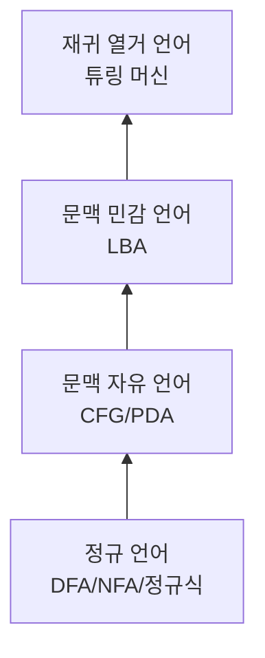

# 오토마타·계산이론 syllabus

기준 교과서: **Sipser** (Introduction to the Theory of Computation). 촘스키 위계를 따라 위로.

## 1. 정규 언어

- [ ] [[dfa-nfa]] - DFA/NFA 정의, NFA→DFA 부분집합 구성, 동치 증명
- [ ] [[regex-and-finite-automata]] - 정규식 ↔ NFA ↔ DFA 상호 변환 (Kleene 정리)
- [ ] [[regex-engines]] - 이론이 실제 엔진과 만나는 지점: DFA 계열(RE2) vs 백트래킹(PCRE), ReDoS
- [ ] [[pumping-lemma]] - 펌핑 보조정리로 비정규성 증명, {aⁿbⁿ}이 정규가 아닌 이유
- [ ] [[dfa-minimization]] - 상태 최소화, Myhill-Nerode

## 2. 문맥 자유 언어

- [ ] [[context-free-grammars]] - CFG, 유도, 파스 트리, 모호성
- [ ] [[pushdown-automata]] - PDA, CFG와의 동치
- [ ] [[cfl-pumping]] - CFL 펌핑 보조정리, {aⁿbⁿcⁿ}이 CFL 아닌 이유
- [ ] [[cfg-to-parsing]] - CFG가 파서가 되는 과정 → programming-languages/compilers/와 직결

## 3. 튜링 머신과 계산 가능성

- [ ] [[turing-machines]] - TM 정의, 변형들의 동치, Church-Turing 논제
- [ ] [[decidability]] - 결정 가능/인식 가능, 정지 문제 대각선 논법 증명
- [ ] [[reductions]] - 환원으로 결정 불가능성 증명, Rice 정리

## 4. 계산 복잡도

- [ ] [[complexity-classes]] - 시간 복잡도 클래스, P, NP, NP-완전성, Cook-Levin
- [ ] [[space-complexity]] - PSPACE, 로그 공간 (맛보기)

## 촘스키 위계 지도

