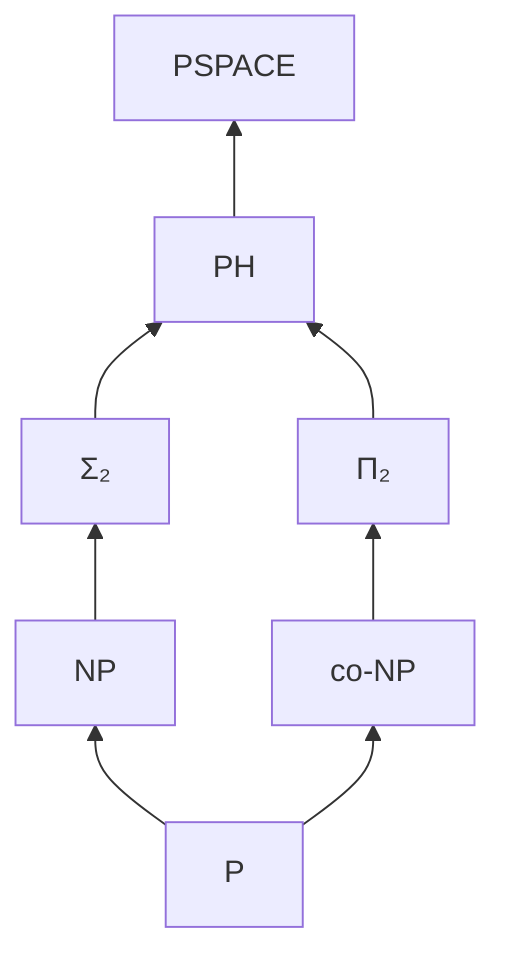

# NP를 넘어서 (Beyond NP)

## 한 줄 요약

NP 위에는 더 풍부한 세계가 있다 - 양화 교대를 층층이 쌓은 다항 계층(PH), 해의 개수를 세는 #P, 증명자·검증자가 대화하는 상호작용 증명(IP=PSPACE), 그리고 양자 다항 시간 BQP. 이 클래스들은 P·NP·PSPACE 사이 지형을 채우며, "검증"을 계수·교대·상호작용·양자로 확장하면 무엇이 가능한지 보여준다.

## 왜 필요한가

- NP·co-NP만으론 "∀∃ 교대", "해의 개수", "대화형 증명" 같은 자연스러운 문제를 못 담음
- 최적화의 "이게 **유일** 최적인가", 확률추론의 "해가 **몇 개**인가" 등은 NP 밖
- 양자 컴퓨팅의 능력(BQP)이 이 지형 어디에 놓이는지가 암호에 직결

## 다항 계층 (PH)

NP·co-NP를 양화 교대로 일반화. 층 k마다 `∃∀∃…`(k번 교대).

| 층 | 정의 | 예 |
|---|---|---|
| Σ₁ = NP | ∃w. V(x,w) | SAT |
| Π₁ = co-NP | ∀w. V(x,w) | TAUTOLOGY |
| Σ₂ | ∃u ∀v. V | 최소 회로 존재? |
| Π₂ | ∀u ∃v. V | |
| Σₖ / Πₖ | k번 교대 | |

```
PH = ⋃ₖ Σₖ ⊆ PSPACE
```

- **붕괴 정리**: 어떤 층에서 Σₖ = Πₖ이면 PH 전체가 그 층으로 붕괴. 특히 P=NP면 PH=P
- PH가 무한히 진짜 층을 이룬다고 **믿지만 미증명** (P vs NP보다 강한 가정)
- TQBF(무제한 교대)는 PSPACE-완전이라 PH를 삼킴 → [[space-classes]]



## #P와 세기 문제

**#P**(sharp-P): NP 검증자의 수용하는 증명서 **개수**를 세는 함수 클래스.

- NP가 "해가 **있나**?"라면 #P는 "해가 **몇 개**?"
- **#SAT**: 만족 할당의 수. **Permanent**(행렬 퍼머넌트) 계산
- **Valiant 정리**: Permanent는 #P-완전 - 항목이 0/1인 행렬조차. 결정판(이분매칭 존재)은 P인데 세기는 #P-완전이라는 극적 대비
- **Toda 정리**: PH ⊆ P^#P - 계수 능력이 다항 계층 전체를 다항으로 흡수. 세기가 교대보다도 강함
- 응용: 확률 그래프 모형 추론, 신뢰도 계산이 #P-hard → 근사(algorithms/[[approximation-and-heuristics]])로 우회

## 상호작용 증명 (IP)

증명자 Prover(무한 계산력)와 검증자 Verifier(다항·무작위)가 **여러 라운드 대화**. 검증자가 무작위 도전을 던지고 증명자가 답, 마지막에 수용/거부.

- yes면 정직한 증명자가 검증자를 확신시킴(완전성), no면 어떤 증명자도 못 속임(건전성, 오류 확률 낮음)
- **IP = PSPACE** (Shamir 1992): 대화형 증명의 힘이 정확히 다항 공간. 무작위성 없인 IP=NP인데, 무작위 도전이 능력을 PSPACE까지 끌어올림
- 증명 도구는 **산술화(arithmetization)** - 불리언 식을 다항식으로 올려 검증자가 랜덤 점에서 검사 (PCP와 같은 계보 → [[approximation-algorithms]])
- 다중 증명자 MIP = NEXP. 영지식(zero-knowledge) 증명의 이론적 뿌리 → cryptography/[[public-key-crypto]]

## BQP - 양자의 위치

**BQP**: 양자 컴퓨터가 다항 시간에 유계 오류로 푸는 문제 (BPP의 양자판).

```
P ⊆ BPP ⊆ BQP ⊆ PSPACE,   BQP ⊆ P^#P
```

- **인수분해·이산로그 ∈ BQP** (Shor) - RSA·Diffie-Hellman 위협 → cryptography/[[diffie-hellman]], cryptography/[[elliptic-curves]], security/[[crypto-basics]]
- 이 문제들은 NP-완전으로 안 알려짐(NP-중간 후보) → 양자가 NP-완전을 푼다는 뜻은 **아님**
- **BQP vs NP**: 포함 관계 양방향 모두 미해결. 양자가 NP-완전을 다항에 풀 근거 없음
- BQP는 PH 안에 있는지조차 불명 (오라클 분리 결과 존재)

## 지형 요약

| 클래스 | 확장 방향 | 상한 |
|---|---|---|
| PH | 양화 교대 | PSPACE |
| #P | 해 개수 세기 | Toda: PH ⊆ P^#P |
| IP | 무작위 상호작용 | = PSPACE |
| BQP | 양자 병렬 | ⊆ P^#P |

## 셀프 체크

> [!question]- 다항 계층의 붕괴 정리는 무엇을 말하며, P=NP는 PH에 어떤 영향을 주나?
> 어떤 층에서 Σₖ = Πₖ이면 PH 전체가 그 층으로 붕괴한다. 특히 P=NP면 Σ₁=Π₁이 되어 PH=P. PH가 무한히 진짜 층을 이룬다는 것은 믿지만 미증명이며, 이는 P≠NP보다 강한 가정이다.

> [!question]- #P가 NP와 다른 점, 그리고 Toda 정리가 주는 함의는?
> NP는 "해가 있나?"를 묻고 #P는 "해가 몇 개인가?"를 센다. Toda 정리는 PH ⊆ P^#P, 즉 계수 능력이 다항 계층 전체를 다항으로 흡수한다 - 세기가 교대보다도 강하다는 뜻.
> Permanent가 #P-완전(Valiant)인데 대응하는 결정 문제(이분매칭 존재)는 P라는 극적 대비도 핵심.

> [!question]- IP=PSPACE에서 무작위성이 없으면 왜 IP가 NP로 줄어드나?
> 무작위성 없는 상호작용 증명은 검증자가 결정적이라 증명자가 답을 미리 다 계산해 보낼 수 있어 결국 하나의 증명서(NP)와 같아진다. 무작위 도전이 있어야 증명자가 미리 대비 못 하고, 이것이 능력을 PSPACE까지 끌어올린다. 핵심 도구는 산술화.

> [!question]- BQP는 P, NP와 어떤 포함 관계에 있으며 인수분해의 위치는?
> P ⊆ BPP ⊆ BQP ⊆ PSPACE이고 BQP ⊆ P^#P. 인수분해·이산로그는 BQP에 있지만(Shor) NP-완전으로 알려지지 않았다(NP-중간 후보). 따라서 양자가 NP-완전을 다항에 푼다는 근거는 없고, BQP vs NP는 양방향 모두 미해결.

## 연습문제

> [!example]- #SAT ∈ #P임을 검증자 관점에서 논증하고, #SAT가 #P-완전인 이유를 3SAT와 연결해 설명하라
> **풀이**
> #P는 다항 시간 검증자 V가 x에 대해 수용하는 증명서 w의 개수를 세는 함수 클래스다. #SAT는 φ의 만족 할당 개수를 센다. 검증자 V(φ,w) = "w를 φ에 대입해 참인가"는 다항 시간이고, 수용하는 w의 수가 곧 만족 할당 수이므로 #SAT ∈ #P.
> #P-완전성: 임의의 #P 문제는 어떤 NP 검증자의 수용 경로 수 세기다. Cook-Levin 환원은 "M이 x를 수용하는 계산 경로"와 "φ의 만족 할당"을 일대일 대응시키는 parsimonious(개수 보존) 환원으로 만들 수 있어, 경로 수 = 만족 할당 수. 따라서 #SAT는 #P-완전. ∎

> [!example]- 문제의 클래스를 판정하라: "주어진 회로 C가 정확히 한 개의 만족 할당을 갖는가?" 이 문제는 어느 클래스에 자연히 속하는가?
> **풀이**
> "만족 할당이 정확히 1개"는 두 조건의 결합이다: (a) 적어도 하나 존재(∃w. C(w)=1), (b) 서로 다른 두 개는 없음(∀u∀v. u≠v → ¬(C(u)∧C(v))).
> (a)는 Σ₁=NP 형태, (b)는 Π₁=co-NP 형태. 둘의 결합은 ∃ 다음 ∀가 오는 구조로 볼 수 있어 다항 계층의 낮은 층에서 표현된다. 더 정밀하게는 이 문제(USAT류)는 US/DP 등 NP와 co-NP를 섞은 클래스에 놓이며, 명백히 P에 있지 않다면 NP∩co-NP 단순 표현으로는 안 잡히고 PH 안에 위치한다.
> 판정 요령: 양화가 ∃∀ 한 번 교대이면 Σ₂ 상한, 세기(정확히 k개)를 요구하면 #P와 얽힌다는 신호. ∎

## 파인만

> [!note]- 백지에 이 노트 핵심을 남에게 설명하듯 써보라. 막히면 그 부분만 다시.
> **점검 포인트**: (1) PH가 양화 교대로 NP를 일반화하는 방식과 붕괴 정리, (2) #P가 세는 문제이고 Toda 정리로 PH를 흡수한다는 것, (3) IP=PSPACE에서 무작위+상호작용이 힘을 주는 이유, (4) BQP의 포함 관계와 "양자≠NP-완전 해결"이라는 점.

## 연결

- 출발점 P, NP, co-NP → [[p-and-np]]
- 무작위성(BPP, BQP의 배경) → [[randomized-complexity]]
- PSPACE·TQBF·게임 → [[space-classes]]
- 산술화·PCP 계보 → [[approximation-algorithms]]
- 양자 위협받는 암호 → cryptography/[[diffie-hellman]], cryptography/[[elliptic-curves]], security/[[crypto-basics]]
- automata/ 맛보기(#P, BQP 언급) → automata/[[complexity-classes]]
- 인수분해·이산로그를 BQP에 넣는 양자 알고리즘 → quantum-computing/[[shor-algorithm]]
- 비정형 탐색 제곱 가속(BQP vs NP) → quantum-computing/[[grover-search]]

## 궁금한 것 (나중에)

- [ ] Toda 정리 PH ⊆ P^#P 증명 개요
- [ ] IP=PSPACE 산술화(sum-check protocol)
- [ ] PH 붕괴 정리의 정확한 조건
- [ ] BQP가 PH에 포함되는가 (오라클 분리 이후 진전)

## 출처

- Arora & Barak 5장(PH), 8장(IP), 9장(#P), 10장(양자)
- Sipser 10.4(상호작용 증명 맛보기)
