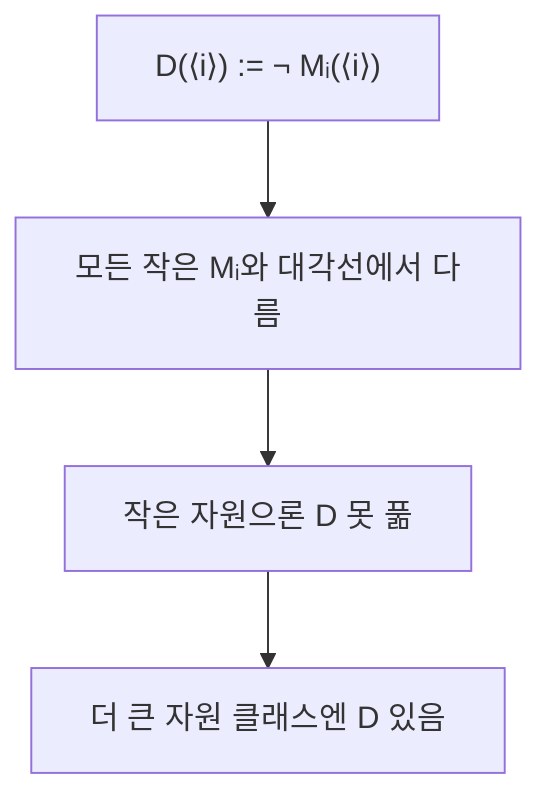

# 계층 정리 (Hierarchy Theorems)

## 한 줄 요약

계층 정리는 "자원을 더 주면 진짜로 더 많은 문제를 푼다"를 증명한다 - 시간 계층 정리로 TIME(n)⊊TIME(n³) 같은 진포함이, 공간 계층 정리로 SPACE 진포함이 성립한다. 증명 도구는 대각화(diagonalization) - 자기 참조로 "모든 작은 머신과 다르게 행동하는" 문제를 만든다. 이로써 P ⊊ EXPTIME 등 몇 안 되는 확실한 분리가 나온다.

## 왜 필요한가

- 복잡도 클래스 사슬(L⊆P⊆NP⊆PSPACE⊆EXPTIME) 중 **어디가 진짜 다른지** 대부분 미해결
- 계층 정리는 그중 확실히 분리되는 곳을 알려주는 거의 유일한 도구
- "자원 조금 더 = 능력 조금 더"라는 직관에 엄밀한 근거

## 대각화 아이디어

칸토어의 대각선 논법을 계산에 적용. automata/[[decidability]]의 정지문제 결정불가 증명과 같은 뼈대.

- 모든 머신을 M₁, M₂, …로 열거 (코드=문자열)
- "Mᵢ가 입력 ⟨i⟩에서 하는 것과 **반대로** 하는" 문제 D를 정의
- D는 어떤 Mᵢ와도 입력 ⟨i⟩에서 다름 → D를 그 자원으로 푸는 머신은 목록에 없음
- 핵심: D를 판정하려면 Mᵢ를 시뮬레이션해야 하는데, 그 **시뮬레이션 비용**이 계층의 간격을 결정



## 시간 계층 정리

f가 시간 구성가능(time-constructible)하고 적당한 간격이 있으면:

```
TIME(f(n)) ⊊ TIME(f(n) log f(n))     (결정적, 다중테이프)
```

- 로그 인수는 **시뮬레이션 오버헤드** - 범용 TM이 다른 TM 한 단계를 흉내 낼 때 드는 추가 비용
- 결과: `TIME(nᵃ) ⊊ TIME(nᵇ)` (a < b) → 다항 안에서도 차수가 실제로 능력을 가름
- 대각선 언어 D: "Mᵢ를 f(n)단계까지 시뮬, 멈추면 반대로 답". D ∈ TIME(f log f)지만 ∉ TIME(f)

## 공간 계층 정리

s가 공간 구성가능(space-constructible)하면:

```
SPACE(s(n)) ⊊ SPACE(s(n)·ω(1))     사실상 SPACE(o(s)) ⊊ SPACE(s)
```

- 공간은 시뮬레이션 오버헤드가 상수배뿐 → 시간보다 **더 촘촘한** 계층 (로그 인수 없음)
- 결과: `SPACE(log n) ⊊ SPACE(log²n)`, `SPACE(nᵃ) ⊊ SPACE(nᵇ)`

| 정리 | 간격 필요 | 오버헤드 근원 |
|---|---|---|
| 시간 계층 | f log f | 범용 시뮬레이션 로그 인수 |
| 공간 계층 | 임의의 초과분 | 상수배 (테이프 재사용) |

## P ⊊ EXPTIME 증명 아이디어

사슬에서 확실히 분리되는 대표 결과.

1. 시간 계층 정리로 `TIME(2ⁿ) ⊊ TIME(2^(n²))` 등 지수 사이 진포함 확보
2. P = ⋃ₖ TIME(nᵏ)는 전부 다항. 지수 시간에만 풀리는 대각선 언어 L을 구성
3. L ∈ EXPTIME 이지만 어떤 다항 TIME(nᵏ)에도 안 들어감 (대각화로 모든 다항 머신과 다름)
4. ⇒ **P ⊊ EXPTIME** (진포함, 등호 아님)

마찬가지로 **NL ⊊ PSPACE**, **L ⊊ PSPACE**도 공간 계층으로 나옴. 이것들이 사슬에서 "확실히 다른" 몇 안 되는 지점.

## 왜 P vs NP엔 안 통하나

- 계층 정리는 **같은 종류 자원의 양** 차이만 분리 (시간 대 시간, 공간 대 공간)
- P vs NP는 결정 대 비결정 - 대각화 논법이 **상대화(relativization)**에 막힘
- **Baker-Gill-Solovay**: 어떤 오라클 A엔 P^A=NP^A, 다른 B엔 P^B≠NP^B. 대각화는 오라클 있어도 통하는 기법이라 P vs NP를 못 가름 → [[beyond-np]]
- 그래서 P vs NP엔 비상대화 기법(회로 하한, 산술화)이 필요

## 구성가능성 조건

- 정리엔 f가 time/space-constructible이어야 함 (머신이 f(n)을 자기 자원 안에서 계산 가능)
- 없으면 **간격 정리(Gap Theorem)** 같은 반례: 어떤 이상한 f엔 TIME(f)=TIME(2^f)인 틈이 생김
- 실무의 다항·지수 함수는 다 구성가능이라 안심

## 연결

- 대각화 원류 → automata/[[decidability]]
- 분리되는 클래스들 → [[space-classes]], [[p-and-np]]
- 상대화 장벽·회로 하한 → [[beyond-np]]
- automata/ 맛보기(P⊊EXPTIME 언급) → automata/[[complexity-classes]]
- 대각선 논법·귀류법 → math/[[logic-and-proofs]], math/[[induction]]

## 궁금한 것 (나중에)

- [ ] 비결정 시간 계층 정리(NTIME, 더 까다로움)
- [ ] 간격 정리·속도향상 정리(Blum speedup)
- [ ] 상대화 장벽 이후 회로 복잡도 하한 진전
- [ ] time-constructible 함수의 정확한 정의와 예외

## 출처

- Sipser 9.1 (계층 정리)
- Arora & Barak 3장 (대각화), 3.4 (상대화 장벽)
