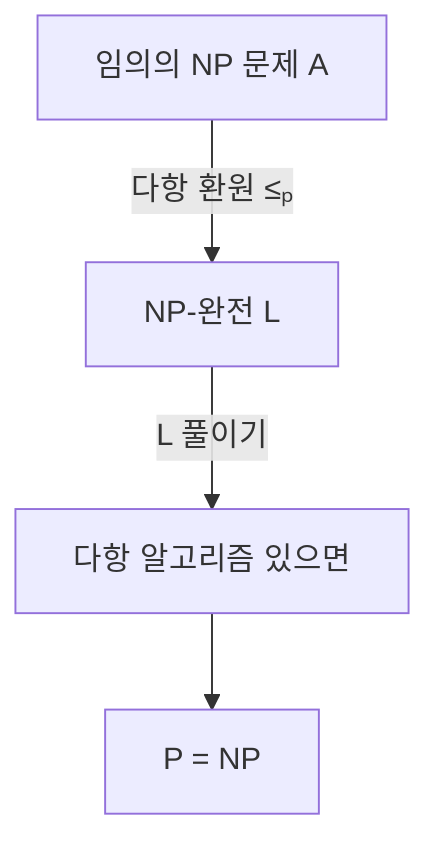

# NP-완전성 (NP-Completeness)

## 한 줄 요약

NP-완전 문제는 NP 안에서 "가장 어려운" 문제 - NP의 모든 문제가 다항 시간에 환원되고, 자신도 NP에 속한다. Cook-Levin 정리가 SAT를 최초의 NP-완전 문제로 세우고, 여기서 환원을 타고 3SAT·클리크·해밀턴 경로 등 수천 문제로 완전성이 퍼진다. 하나라도 P에 있으면 P=NP.

## 왜 필요한가

- "이 문제 왜 안 풀리지"의 답: NP-완전이면 다항 알고리즘이 P=NP를 함의
- 서로 무관해 보이는 문제들이 사실 같은 난이도임을 보여줌
- 새 문제를 만나면 NP-완전 여부부터 확인 → 접근 전략 결정

## 완전성과 어려움 정의

두 조건을 모두 만족하면 문제 L은 **NP-완전**:

| 조건 | 의미 |
|---|---|
| L ∈ NP | 다항 시간에 검증 가능 ([[p-and-np]]) |
| NP-hard | 모든 A ∈ NP에 대해 A ≤ₚ L (다항 환원) |

- **NP-hard**: 두 번째 조건만. NP만큼 어렵지만 NP에 속할 필요는 없음 → [[reductions-and-hardness]]
- 직관: L을 다항에 풀면 환원을 타고 NP 전부를 다항에 풀 수 있음

## Cook-Levin 정리

**SAT는 NP-완전** (1971, Cook / Levin 독립). 최초의 NP-완전 문제 - 환원의 출발점.

- SAT: 불리언 식이 참이 되는 변수 할당이 있는가?
- SAT ∈ NP는 쉬움 (할당을 대입해 검증)
- 핵심은 **NP-hard**: 임의의 비결정 TM M과 입력 x에 대해, "M이 x를 다항 시간에 수용" 여부를 판정하는 불리언 식을 다항 크기로 구성
- 식의 변수 = 계산 표(tableau)의 각 칸(시각 t, 위치 i의 테이프 기호·상태), 절(clause)들이 시작·전이·수용 조건을 강제
- 만족 할당 ⇔ 수용하는 계산 경로 존재. TM의 동작 자체를 논리식으로 인코딩한 것

## SAT → 3SAT

**3SAT**: 각 절이 정확히 리터럴 3개인 CNF의 SAT. 역시 NP-완전.

- 임의 CNF 절을 3-리터럴 절들로 변환 (긴 절은 보조변수로 쪼개고, 짧은 절은 리터럴 복제)
- `(a∨b∨c∨d)` → `(a∨b∨y)∧(ȳ∨c∨d)` 식으로 사슬 연결
- 3SAT는 구조가 단순해 다른 문제로 환원하는 **표준 출발점**으로 애용됨

## 대표 NP-완전 문제

Karp가 1972년 21개를 무더기로 증명, 이후 수천 개로 확장. 서로 다른 분야인데 전부 같은 난이도.

| 문제 | 질문 |
|---|---|
| 3SAT | 3-CNF 만족 가능? |
| CLIQUE | 크기 k 완전부분그래프 있나? |
| VERTEX-COVER | 크기 k 정점덮개 있나? |
| INDEPENDENT-SET | 크기 k 독립집합 있나? |
| HAM-PATH | 해밀턴 경로 있나? |
| TSP(결정판) | 길이 ≤ B 순회 있나? |
| SUBSET-SUM | 합이 t인 부분집합 있나? |
| 3-COLORING | 3색 칠 가능? |
| PARTITION | 두 부분합이 같게 분할? |

전형적 환원 사슬: `3SAT ≤ₚ CLIQUE ≤ₚ VERTEX-COVER`, `3SAT ≤ₚ 3-COLORING`, `SUBSET-SUM ≤ₚ PARTITION`. 각 환원은 [[reductions-and-hardness]]에서 상세.

## 완전성의 의미

- NP-완전 하나만 다항에 풀려도 **전부** 다항 → P=NP ([[p-and-np]])
- 반대로 NP-완전 하나가 지수 하한을 가지면 P≠NP
- 이들이 P와 (P≠NP 가정 하) NP\P를 가르는 "경계선" 문제
- 실무: 문제가 NP-완전이면 정확한 다항 해를 포기하고 근사/휴리스틱/특수구조로 우회 → approximation-algorithms

## NP-완전이 아닐 수도

- 모든 NP 문제가 P거나 NP-완전인 것은 **아님** - 중간이 있을 수 있음
- **Ladner 정리**: P≠NP이면 NP-중간(NP-intermediate) 문제가 존재
- 후보: 그래프 동형(graph isomorphism), 인수분해 - NP-완전으로도 P로도 증명 안 됨 → [[beyond-np]]

## 셀프 체크

> [!question]- 문제 L이 NP-완전이려면 만족해야 하는 두 조건은 무엇인가?
> (1) L ∈ NP - 증명서로 다항 시간 검증 가능, (2) L이 NP-hard - 모든 A∈NP에 대해 A ≤ₚ L. NP-hard만 만족하면 NP에 속할 필요는 없다.

> [!question]- Cook-Levin 정리에서 어려운 부분은 무엇이고 어떻게 증명하나?
> SAT ∈ NP는 쉽다(할당 대입 검증). 어려운 건 NP-hard: 임의의 비결정 TM M과 입력 x에 대해 "M이 x를 다항 시간에 수용"을 판정하는 불리언 식을 다항 크기로 구성한다. 변수는 계산 표(tableau)의 각 칸, 절들이 시작·전이·수용 조건을 강제해 만족 할당 ⇔ 수용 경로 존재가 된다.

> [!question]- NP-완전 문제 하나가 다항 시간에 풀리면 왜 P=NP가 되나?
> 그 문제 L이 NP-hard이므로 모든 A∈NP가 A ≤ₚ L. A를 풀려면 f로 변환 후 L의 다항 풀이기를 호출하면 되니 A도 다항 시간에 풀린다. 모든 NP 문제가 P에 들어가고 L∈NP였으므로 P=NP.

> [!question]- Ladner 정리는 무엇을 보장하며 어떤 문제가 후보인가?
> P≠NP이면 P에도 NP-완전에도 속하지 않는 NP-중간(NP-intermediate) 문제가 반드시 존재한다. 그래프 동형(GI)과 인수분해가 대표 후보로, NP-완전으로도 P로도 증명되지 않았다.

## 연습문제

> [!example]- 3SAT ≤ₚ CLIQUE 다항 시간 환원을 구성하고 정당성을 증명하라
> **풀이**
> 3-CNF φ = C₁∧…∧Cₘ, 각 절 Cᵢ = (ℓᵢ₁∨ℓᵢ₂∨ℓᵢ₃). 그래프 G 구성:
> - 정점: 각 절의 각 리터럴마다 정점 (절당 3개, 총 3m개), 절 번호로 라벨.
> - 간선: 서로 다른 절에 속하고 서로 모순이 아닌(x와 ¬x가 아닌) 두 리터럴 정점을 연결.
> - 목표 크기 k = m(절 개수).
> 정당성: φ가 만족 가능 ⇔ 각 절에서 참이 되는 리터럴을 하나씩 고를 수 있음. 고른 m개의 리터럴은 서로 다른 절 소속이고, 같은 할당 하에 모두 참이라 x와 ¬x가 동시에 뽑히지 않아 서로 모순 아님 → 전부 간선으로 연결된 크기 m 클리크. 역으로 크기 m 클리크는 절마다 정확히 하나의 정점을 포함하고(같은 절 내부엔 간선 없음) 모순 없는 리터럴 집합이므로 일관된 만족 할당을 준다.
> 구성은 O((3m)²) 시간이라 다항. ∎

> [!example]- 3-COLORING이 NP-완전임을 보이는 절차를 세우고 NP 소속을 논증하라
> **풀이**
> NP 소속: 각 정점의 색(3가지)을 증명서로 받아, 모든 간선의 양끝 색이 다른지 다항 시간에 검사 → 3-COLORING ∈ NP.
> NP-hard: 3SAT ≤ₚ 3-COLORING. 기준 삼각형(True/False/Base 세 색)을 두고, 각 변수 x에 대해 x와 ¬x를 Base와 연결한 가젯으로 둘 중 하나만 True 색이 되게 강제한다. 각 절마다 OR 가젯을 붙여, 절의 세 리터럴이 모두 False 색이면 3색 칠이 불가능하고 하나라도 True면 칠이 가능하도록 설계한다.
> 정당성: 유효한 3색칠 ⇔ 각 변수 가젯이 일관된 참/거짓을 주고 모든 절 가젯이 만족됨 ⇔ φ의 만족 할당 존재. 가젯 수가 변수·절에 선형이라 환원은 다항. NP-hard이고 NP에 속하므로 NP-완전. ∎

## 파인만

> [!note]- 백지에 이 노트 핵심을 남에게 설명하듯 써보라. 막히면 그 부분만 다시.
> **점검 포인트**: (1) NP-완전 = NP ∩ NP-hard이고 각 조건의 뜻, (2) Cook-Levin이 TM 계산을 tableau 불리언 식으로 인코딩하는 아이디어, (3) 알려진 NP-완전 문제에서 새 문제로 환원해 완전성을 전파하는 방향(3SAT→CLIQUE 등).

## 연결

- P, NP 정의 → [[p-and-np]]
- 환원 기법·NP-hard 상세 → [[reductions-and-hardness]]
- automata/ 맛보기 → automata/[[complexity-classes]], automata/[[reductions]]
- 실전 P vs NP → algorithms/[[p-vs-np]]
- 어려우니 근사 → [[approximation-algorithms]]
- 불리언 논리 기초 → math/[[logic-and-proofs]]
- CLIQUE·정점덮개·3색칠 등 그래프 환원 대상 → math/[[graph-theory]]

## 궁금한 것 (나중에)

- [ ] Cook-Levin의 tableau 구성 완전 전개
- [ ] Karp 21 문제 환원 각각
- [ ] 그래프 동형은 왜 NP-완전으로 안 밝혀지나
- [ ] 강한/약한 NP-완전(pseudo-polynomial, SUBSET-SUM DP)

## 출처

- Sipser 7.4-7.5 (NP-완전성, Cook-Levin)
- Garey & Johnson, *Computers and Intractability*
- Karp 1972, "Reducibility Among Combinatorial Problems"
