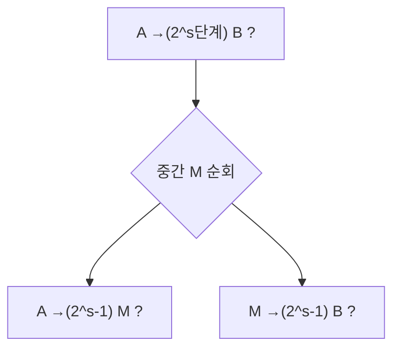

# 공간 복잡도 클래스 (Space Complexity Classes)

## 한 줄 요약

공간 복잡도는 사용하는 테이프 칸 수로 문제를 분류한다 - L(로그공간), NL(비결정 로그공간), PSPACE(다항 공간). Savitch 정리로 비결정 공간이 제곱 안에서 결정 공간에 흡수되어 PSPACE=NPSPACE가 성립하고(시간의 P vs NP와 대조), TQBF(양화 불리언 식)가 PSPACE-완전의 표준 문제다. automata/[[space-complexity]]의 정식 심화판.

## 왜 필요한가

- 시간과 별개로 "메모리로 얼마나 어려운가"의 척도
- 공간은 재사용 가능(시간은 불가) → 결정/비결정 관계가 시간과 딴판
- 게임·양화 논리가 자연히 PSPACE-완전으로 떨어짐

## 공간 측정과 클래스

읽기전용 입력 테이프 + 별도 작업(work) 테이프. **공간 = 작업 테이프 칸 수**만 셈 (그래야 로그공간이 의미 있음, 입력은 n칸이니까).

| 클래스 | 정의 |
|---|---|
| **L** | 결정적 `O(log n)` 공간 |
| **NL** | 비결정적 `O(log n)` 공간 |
| **PSPACE** | 결정적 `O(nᵏ)` 공간 |
| **NPSPACE** | 비결정적 다항 공간 |

- 로그공간 = 상수 개의 포인터/카운터만 (n을 가리키는 인덱스가 log n 비트)
- 예: L에 무방향 연결성(Reingold), NL에 방향 도달성(PATH/STCON)

## 시간·공간 관계

```
L ⊆ NL ⊆ P ⊆ NP ⊆ PSPACE ⊆ EXPTIME
```

- **공간 s ⇒ 시간 2^O(s)**: 구성(configuration) 수가 유한(상태×위치×내용)하니 반복 없이 그만큼만 감. 따라서 L,NL ⊆ P, PSPACE ⊆ EXPTIME
- **시간 t ⇒ 공간 t**: t단계면 t칸 이상 못 씀. 따라서 P ⊆ PSPACE
- 이 사슬에서 확실한 진포함은 L ⊊ PSPACE, P ⊊ EXPTIME 정도([[hierarchy-theorems]]), 나머지는 미해결

## Savitch 정리

**NSPACE(s) ⊆ DSPACE(s²)** (s ≥ log n). 따라서 **PSPACE = NPSPACE**, NL ⊆ DSPACE(log²n).

- 아이디어: 비결정 도달성 "s단계 구성 A→B 가능?"을 분할정복. 중간 구성 M을 두고 "A→M(t/2), M→B(t/2)"를 재귀
- 각 재귀 깊이 log(구성수)=O(s), 한 층에 구성 하나 O(s) 저장 → 총 O(s²) 공간 (M 후보를 순차 시도해 재사용)
- 시간은 지수로 늘지만 **공간은 제곱만** - 공간 재사용 덕분



시간에선 이런 흡수가 없음(P vs NP 미해결). 공간은 결판났고 시간은 안 났다는 게 핵심 대조.

## Immerman-Szelepcsényi

**NL = co-NL** (NSPACE(s)는 여집합에 닫힘, s≥log n). 비결정 로그공간이 "도달 불가"도 판정 가능 - 도달 가능 정점 수를 귀납적으로 세어 증명. 시간의 NP=co-NP는 여전히 미해결인데 공간판은 참.

## TQBF와 PSPACE-완전

**TQBF/QBF**(True Quantified Boolean Formula): `∀x∃y∀z… φ`가 참인가?

- SAT는 `∃`만(암묵적), TQBF는 `∀`,`∃` 교대 → 훨씬 강함
- **TQBF는 PSPACE-완전**: PSPACE ∈ (다항 공간 계산을 QBF로 인코딩), 재귀적으로 다항 공간에 평가 가능
- 평가: `∃x φ` = φ[x=0] OR φ[x=1] 재귀, `∀x φ` = AND 재귀. 깊이 변수 개수, 한 경로만 저장 → 다항 공간

| 문제 | 양화 구조 | 완전성 |
|---|---|---|
| SAT | ∃만 | NP-완전 |
| TQBF | ∀∃ 교대 | PSPACE-완전 |

## 게임과 PSPACE

- 2인 게임의 "선공이 이기는 수가 있나" = `∃수 ∀상대응수 ∃수 …` = 정확히 QBF 구조
- 일반화 체스·바둑·리버시 등 다수가 PSPACE-완전(또는 EXPTIME-완전)
- 교대 양화(alternation)가 공간 소모의 근원 → 교대 튜링 머신(ATM)으로 형식화, AP=PSPACE

## 연결

- automata/ 맛보기 → automata/[[space-complexity]], automata/[[complexity-classes]]
- 시간 클래스 → [[p-and-np]]
- 진포함은 계층 정리로 → [[hierarchy-theorems]]
- PSPACE-hard 환원 → [[reductions-and-hardness]]
- 상호작용 증명 IP=PSPACE → [[beyond-np]]
- 양화 논리 → math/[[logic-and-proofs]]

## 궁금한 것 (나중에)

- [ ] Savitch 재귀의 공간 회계 정밀 전개
- [ ] Immerman-Szelepcsényi 귀납적 계수법
- [ ] Reingold: 무방향 연결성 ∈ L (SL=L)
- [ ] 교대 튜링 머신과 AP=PSPACE, ATIME/ASPACE 관계

## 출처

- Sipser 8장 (공간 복잡도, Savitch, PSPACE-완전)
- Arora & Barak 4장
