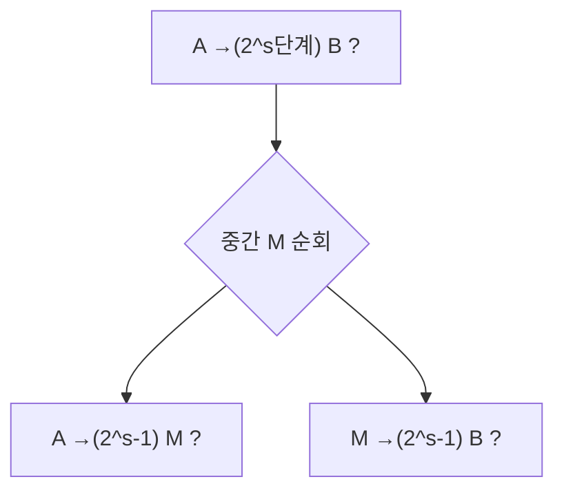

# 공간 복잡도 클래스 (Space Complexity Classes)

## 한 줄 요약

공간 복잡도는 사용하는 테이프 칸 수로 문제를 분류한다 - L(로그공간), NL(비결정 로그공간), PSPACE(다항 공간). Savitch 정리로 비결정 공간이 제곱 안에서 결정 공간에 흡수되어 PSPACE=NPSPACE가 성립하고(시간의 P vs NP와 대조), TQBF(양화 불리언 식)가 PSPACE-완전의 표준 문제다. automata/[[space-complexity]]의 정식 심화판.

## 왜 필요한가

- 시간과 별개로 "메모리로 얼마나 어려운가"의 척도
- 공간은 재사용 가능(시간은 불가) → 결정/비결정 관계가 시간과 딴판
- 게임·양화 논리가 자연히 PSPACE-완전으로 떨어짐

## 공간 측정과 클래스

읽기전용 입력 테이프 + 별도 작업(work) 테이프. **공간 = 작업 테이프 칸 수**만 셈 (그래야 로그공간이 의미 있음, 입력은 n칸이니까).

| 클래스 | 정의 |
|---|---|
| **L** | 결정적 `O(log n)` 공간 |
| **NL** | 비결정적 `O(log n)` 공간 |
| **PSPACE** | 결정적 `O(nᵏ)` 공간 |
| **NPSPACE** | 비결정적 다항 공간 |

- 로그공간 = 상수 개의 포인터/카운터만 (n을 가리키는 인덱스가 log n 비트)
- 예: L에 무방향 연결성(Reingold), NL에 방향 도달성(PATH/STCON)

## 시간·공간 관계

```
L ⊆ NL ⊆ P ⊆ NP ⊆ PSPACE ⊆ EXPTIME
```

- **공간 s ⇒ 시간 2^O(s)**: 구성(configuration) 수가 유한(상태×위치×내용)하니 반복 없이 그만큼만 감. 따라서 L,NL ⊆ P, PSPACE ⊆ EXPTIME
- **시간 t ⇒ 공간 t**: t단계면 t칸 이상 못 씀. 따라서 P ⊆ PSPACE
- 이 사슬에서 확실한 진포함은 L ⊊ PSPACE, P ⊊ EXPTIME 정도([[hierarchy-theorems]]), 나머지는 미해결

## Savitch 정리

**NSPACE(s) ⊆ DSPACE(s²)** (s ≥ log n). 따라서 **PSPACE = NPSPACE**, NL ⊆ DSPACE(log²n).

- 아이디어: 비결정 도달성 "s단계 구성 A→B 가능?"을 분할정복. 중간 구성 M을 두고 "A→M(t/2), M→B(t/2)"를 재귀
- 각 재귀 깊이 log(구성수)=O(s), 한 층에 구성 하나 O(s) 저장 → 총 O(s²) 공간 (M 후보를 순차 시도해 재사용)
- 시간은 지수로 늘지만 **공간은 제곱만** - 공간 재사용 덕분



시간에선 이런 흡수가 없음(P vs NP 미해결). 공간은 결판났고 시간은 안 났다는 게 핵심 대조.

## Immerman-Szelepcsényi

**NL = co-NL** (NSPACE(s)는 여집합에 닫힘, s≥log n). 비결정 로그공간이 "도달 불가"도 판정 가능 - 도달 가능 정점 수를 귀납적으로 세어 증명. 시간의 NP=co-NP는 여전히 미해결인데 공간판은 참.

## TQBF와 PSPACE-완전

**TQBF/QBF**(True Quantified Boolean Formula): `∀x∃y∀z… φ`가 참인가?

- SAT는 `∃`만(암묵적), TQBF는 `∀`,`∃` 교대 → 훨씬 강함
- **TQBF는 PSPACE-완전**: PSPACE ∈ (다항 공간 계산을 QBF로 인코딩), 재귀적으로 다항 공간에 평가 가능
- 평가: `∃x φ` = φ[x=0] OR φ[x=1] 재귀, `∀x φ` = AND 재귀. 깊이 변수 개수, 한 경로만 저장 → 다항 공간

| 문제 | 양화 구조 | 완전성 |
|---|---|---|
| SAT | ∃만 | NP-완전 |
| TQBF | ∀∃ 교대 | PSPACE-완전 |

## 게임과 PSPACE

- 2인 게임의 "선공이 이기는 수가 있나" = `∃수 ∀상대응수 ∃수 …` = 정확히 QBF 구조
- 일반화 체스·바둑·리버시 등 다수가 PSPACE-완전(또는 EXPTIME-완전)
- 교대 양화(alternation)가 공간 소모의 근원 → 교대 튜링 머신(ATM)으로 형식화, AP=PSPACE

## 셀프 체크

> [!question]- 공간 복잡도에서 왜 작업 테이프 칸 수만 세고 입력 테이프는 제외하나?
> 입력은 항상 n칸을 차지하므로 그것까지 세면 로그공간(log n) 같은 서브선형 클래스가 아예 정의될 수 없다. 읽기전용 입력 테이프와 별도 작업 테이프를 두고 작업 테이프만 세야 L이 의미를 갖는다.

> [!question]- 공간 s가 왜 시간 2^O(s) 상한을 주나?
> 구성(configuration) 수가 상태×헤드 위치×테이프 내용으로 유한한데 이것이 2^O(s)개다. 정지하는 계산은 같은 구성을 반복할 수 없으므로 그만큼의 단계 안에 끝난다. 따라서 L,NL ⊆ P, PSPACE ⊆ EXPTIME.

> [!question]- Savitch 정리는 무엇이고 왜 PSPACE=NPSPACE를 주나?
> NSPACE(s) ⊆ DSPACE(s²) (s≥log n). 비결정 도달성을 분할정복 재귀로 결정적으로 흉내 내되 공간을 재사용해 제곱만 쓴다. 다항의 제곱은 여전히 다항이라 PSPACE=NPSPACE. 시간에는 이런 흡수가 없어 P vs NP가 미해결인 것과 대조.

> [!question]- 시간의 NP=co-NP는 미해결인데 공간의 NL=co-NL은 왜 참인가?
> Immerman-Szelepcsényi 정리로 NSPACE(s)가 여집합에 닫힌다(s≥log n). 도달 가능한 정점 수를 귀납적으로 세는 기법(inductive counting)으로 "도달 불가"도 비결정 로그공간에 판정할 수 있음을 보였다. 시간에는 대응하는 계수 기법이 없다.

## 연습문제

> [!example]- TQBF ∈ PSPACE임을 재귀 평가로 증명하라(공간 회계 포함)
> **풀이**
> QBF `Q₁x₁ Q₂x₂ … Qₘxₘ φ`를 재귀로 평가한다.
> - `∃x ψ` = eval(ψ[x=0]) OR eval(ψ[x=1]).
> - `∀x ψ` = eval(ψ[x=0]) AND eval(ψ[x=1]).
> - 양화가 없으면 φ에 상수 대입해 O(|φ|) 공간으로 참거짓 평가.
> 공간 회계: 재귀 깊이는 변수 개수 m. 각 층은 어느 분기를 시도 중인지(비트 하나)와 현재 대입만 저장하면 되고, 한 번에 한 경로만 내려가며 돌아올 때 공간을 재사용한다. 총 공간 = O(m + |φ|) = 다항. 따라서 TQBF ∈ PSPACE. (완전성까지 더하면 PSPACE-완전.) ∎

> [!example]- 일반화 2인 게임 GG("현재 국면에서 선공에 필승 전략이 있는가")가 PSPACE에 속함을 논증하라
> **풀이**
> 필승 전략 존재는 `∃(선공 수) ∀(상대 응수) ∃(선공 수) … (종료 시 선공 승)` 구조로, 정확히 QBF의 교대 양화와 같다.
> 게임 트리를 재귀로 평가한다: WIN(국면 p) = "p가 선공 차례면 어떤 수로 WIN 후속에 도달 가능(∃), 상대 차례면 모든 응수가 WIN(∀)". 트리 깊이는 게임 길이(보드 크기에 다항)이고, 한 번에 한 경로만 스택에 유지하며 각 국면은 다항 공간에 저장·재사용된다.
> 따라서 다항 공간으로 판정 가능 → GG ∈ PSPACE. (일반화 체스·바둑 등 다수가 여기서 PSPACE-완전 또는 EXPTIME-완전으로 분류된다.) ∎

## 파인만

> [!note]- 백지에 이 노트 핵심을 남에게 설명하듯 써보라. 막히면 그 부분만 다시.
> **점검 포인트**: (1) L⊆NL⊆P⊆NP⊆PSPACE⊆EXPTIME 사슬과 공간→시간 상한 논리, (2) Savitch가 PSPACE=NPSPACE를 주는 이유와 시간과의 대조, (3) TQBF의 재귀 평가가 다항 공간에 들어가고 교대 양화가 게임·PSPACE-완전과 연결되는 방식.

## 연결

- automata/ 맛보기 → automata/[[space-complexity]], automata/[[complexity-classes]]
- 시간 클래스 → [[p-and-np]]
- 진포함은 계층 정리로 → [[hierarchy-theorems]]
- PSPACE-hard 환원 → [[reductions-and-hardness]]
- 상호작용 증명 IP=PSPACE → [[beyond-np]]
- 양화 논리 → math/[[logic-and-proofs]]
- Savitch 정리의 분할정복 재귀 → algorithms/[[divide-and-conquer]]
- 도달성(PATH/STCON) 그래프 문제 → math/[[graph-theory]]

## 궁금한 것 (나중에)

- [ ] Savitch 재귀의 공간 회계 정밀 전개
- [ ] Immerman-Szelepcsényi 귀납적 계수법
- [ ] Reingold: 무방향 연결성 ∈ L (SL=L)
- [ ] 교대 튜링 머신과 AP=PSPACE, ATIME/ASPACE 관계

## 출처

- Sipser 8장 (공간 복잡도, Savitch, PSPACE-완전)
- Arora & Barak 4장
