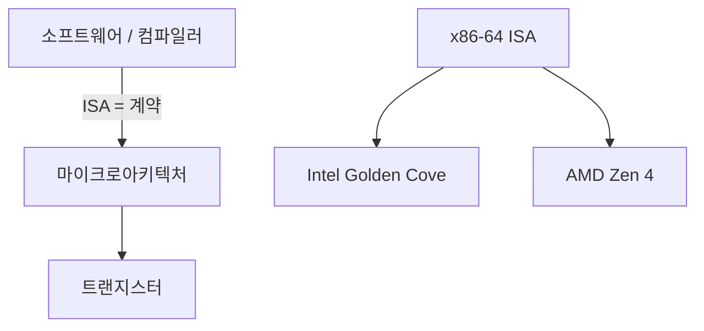

# ISA 설계 (Instruction Set Architecture)

## 한 줄 요약

ISA는 소프트웨어와 하드웨어 사이의 계약이다. 프로그래머(와 컴파일러)에게 보이는 CPU의 전부 - 명령어, 레지스터, 메모리 모델 - 를 정의하고, 그 아래 구현(마이크로아키텍처)은 자유롭게 바뀐다.

## 왜 필요한가

- 왜 하나의 `x86` 바이너리가 20년 된 CPU와 최신 CPU에서 다 도는가 → ISA가 안 바뀌어서
- RISC vs CISC 논쟁이 실제로 뭘 두고 싸운 것인지
- Apple이 x86에서 ARM으로 갈아탄 게 왜 큰일이었나 (ISA가 다르면 바이너리 호환 안 됨)
- [[assembly-basics]]에서 본 명령어들이 어디서 규정되는지

## ISA vs 마이크로아키텍처

핵심 구분:

- **ISA (아키텍처)**: 명령어 집합, 레지스터, 주소 지정, 메모리 모델. **소프트웨어에 보이는 것**. 예: x86-64, ARMv8, RISC-V
- **마이크로아키텍처**: ISA를 실제로 구현하는 회로. 파이프라인 깊이, 캐시 크기, 실행 유닛 개수. **소프트웨어에 안 보임**. 예: Intel의 Golden Cove, Apple의 Firestorm

같은 ISA를 여러 마이크로아키텍처가 구현 → 같은 바이너리가 다 돎. Intel과 AMD가 둘 다 x86-64를 구현하지만 내부는 완전히 다른 것과 같음.

## ISA가 규정하는 것

1. **명령어 집합**: 어떤 연산이 있나 (add, load, branch...)
2. **레지스터**: 개수, 폭, 용도 ([[assembly-basics]]의 x0~x30 / rax~r15)
3. **데이터 타입**: 정수 폭, 부동소수점 형식 ([[floating-point]])
4. **주소 지정 방식**: 메모리 주소를 만드는 법
5. **메모리 모델**: 멀티코어에서 메모리 접근 순서 보장 → [[multicore-and-numa]]
6. **명령어 인코딩**: 명령어가 비트로 어떻게 표현되나

## RISC vs CISC

역사적 두 철학:

| | CISC (x86) | RISC (ARM, RISC-V, MIPS) |
|---|---|---|
| 명령어 | 많고 복잡, 가변 길이 (1~15B) | 적고 단순, 고정 길이 (보통 4B) |
| 메모리 접근 | 산술 명령이 직접 (`add rax,[rbx]`) | load/store만 ([[assembly-basics]]) |
| 명령어당 작업 | 많음 (한 명령이 여러 단계) | 적음 (한 명령 = 한 작업) |
| 레지스터 | 적음 (16개) | 많음 (31개+) |
| 설계 시대 | 메모리 비싸던 시절 (코드 밀도 중시) | 컴파일러 성숙 후 (단순함이 빠름) |

### 논쟁의 실제 결말

"RISC가 이겼다"는 단순화. 실제로는 **수렴**:

- **CISC(x86)는 내부적으로 RISC**: 현대 x86 CPU는 복잡한 명령어를 내부에서 μop(마이크로 연산, 단순 RISC-유사 명령)으로 쪼개 실행. ISA만 CISC, 엔진은 RISC
- **RISC도 명령어가 늘어남**: ARM64는 초기 RISC보다 훨씬 명령어가 많음
- 진짜 승부처는 명령어 개수가 아니라 **전력 효율과 라이선스**. ARM이 모바일을 잡은 건 전력, RISC-V가 뜨는 건 오픈(무료 라이선스)

## 세 진영 현황 (2020년대)

- **x86-64**: 데스크톱/서버 데이터센터 지배. Intel + AMD. 40년 하위 호환의 짐과 자산
- **ARM (AArch64)**: 모바일 전부 + Apple Silicon + 서버 진출 (AWS Graviton). 전력 효율 우위
- **RISC-V**: 오픈 표준 ISA. 라이선스 무료 → 학계/임베디드/중국 급성장. 확장 가능한 모듈식 설계

## 하위 호환의 무게

x86이 여전히 16비트 시절 명령어를 실행할 수 있는 이유 = 하위 호환. 자산이자 짐:

- 자산: 수십 년 소프트웨어가 그대로 돎
- 짐: 디코더가 복잡해지고, 아무도 안 쓰는 명령어를 계속 지원. 이 복잡도가 전력을 먹음

ARM은 32→64비트 전환 때 옛 모드를 정리(AArch64는 새 인코딩) → 더 가벼운 출발. Apple은 아예 x86 호환을 버리고 Rosetta(동적 번역)로 과도기만 커버.

## 연결

- ISA가 규정하는 명령어의 실제 모습 → [[assembly-basics]]
- ISA를 구현하는 파이프라인 → [[pipelining]]
- 메모리 모델과 멀티코어 순서 보장 → [[multicore-and-numa]]
- 명령어를 병렬 실행하는 마이크로아키텍처 기법 → [[instruction-level-parallelism]]

## 궁금한 것 (나중에)

- [ ] μop 캐시란 무엇이고 왜 성능에 중요한가
- [ ] RISC-V의 확장(RV32I, M, A, F...) 모듈 구조
- [ ] Rosetta 2가 x86 바이너리를 어떻게 빠르게 번역하나 (TSO 메모리 모델 문제)
- [ ] ARM의 조건부 실행(predication)이 RISC 원칙과 충돌하지 않나

## 출처

- P&H 2장 (명령어), CS:APP 3장 도입
- Patterson & Ditzel, "The Case for RISC" (1980, 원전)
