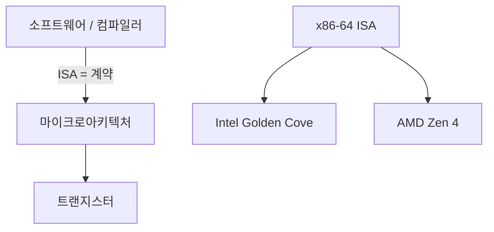

# ISA 설계 (Instruction Set Architecture)

## 한 줄 요약

ISA는 소프트웨어와 하드웨어 사이의 계약이다. 프로그래머(와 컴파일러)에게 보이는 CPU의 전부 - 명령어, 레지스터, 메모리 모델 - 를 정의하고, 그 아래 구현(마이크로아키텍처)은 자유롭게 바뀐다.

## 왜 필요한가

- 왜 하나의 `x86` 바이너리가 20년 된 CPU와 최신 CPU에서 다 도는가 → ISA가 안 바뀌어서
- RISC vs CISC 논쟁이 실제로 뭘 두고 싸운 것인지
- Apple이 x86에서 ARM으로 갈아탄 게 왜 큰일이었나 (ISA가 다르면 바이너리 호환 안 됨)
- [[assembly-basics]]에서 본 명령어들이 어디서 규정되는지

## ISA vs 마이크로아키텍처

핵심 구분:

- **ISA (아키텍처)**: 명령어 집합, 레지스터, 주소 지정, 메모리 모델. **소프트웨어에 보이는 것**. 예: x86-64, ARMv8, RISC-V
- **마이크로아키텍처**: ISA를 실제로 구현하는 회로. 파이프라인 깊이, 캐시 크기, 실행 유닛 개수. **소프트웨어에 안 보임**. 예: Intel의 Golden Cove, Apple의 Firestorm

같은 ISA를 여러 마이크로아키텍처가 구현 → 같은 바이너리가 다 돎. Intel과 AMD가 둘 다 x86-64를 구현하지만 내부는 완전히 다른 것과 같음.



## ISA가 규정하는 것

1. **명령어 집합**: 어떤 연산이 있나 (add, load, branch...)
2. **레지스터**: 개수, 폭, 용도 ([[assembly-basics]]의 x0~x30 / rax~r15)
3. **데이터 타입**: 정수 폭, 부동소수점 형식 ([[floating-point]])
4. **주소 지정 방식**: 메모리 주소를 만드는 법
5. **메모리 모델**: 멀티코어에서 메모리 접근 순서 보장 → [[multicore-and-numa]]
6. **명령어 인코딩**: 명령어가 비트로 어떻게 표현되나

## RISC vs CISC

역사적 두 철학:

| | CISC (x86) | RISC (ARM, RISC-V, MIPS) |
|---|---|---|
| 명령어 | 많고 복잡, 가변 길이 (1~15B) | 적고 단순, 고정 길이 (보통 4B) |
| 메모리 접근 | 산술 명령이 직접 (`add rax,[rbx]`) | load/store만 ([[assembly-basics]]) |
| 명령어당 작업 | 많음 (한 명령이 여러 단계) | 적음 (한 명령 = 한 작업) |
| 레지스터 | 적음 (16개) | 많음 (31개+) |
| 설계 시대 | 메모리 비싸던 시절 (코드 밀도 중시) | 컴파일러 성숙 후 (단순함이 빠름) |

### 논쟁의 실제 결말

"RISC가 이겼다"는 단순화. 실제로는 **수렴**:

- **CISC(x86)는 내부적으로 RISC**: 현대 x86 CPU는 복잡한 명령어를 내부에서 μop(마이크로 연산, 단순 RISC-유사 명령)으로 쪼개 실행. ISA만 CISC, 엔진은 RISC
- **RISC도 명령어가 늘어남**: ARM64는 초기 RISC보다 훨씬 명령어가 많음
- 진짜 승부처는 명령어 개수가 아니라 **전력 효율과 라이선스**. ARM이 모바일을 잡은 건 전력, RISC-V가 뜨는 건 오픈(무료 라이선스)

## 세 진영 현황 (2020년대)

- **x86-64**: 데스크톱/서버 데이터센터 지배. Intel + AMD. 40년 하위 호환의 짐과 자산
- **ARM (AArch64)**: 모바일 전부 + Apple Silicon + 서버 진출 (AWS Graviton). 전력 효율 우위
- **RISC-V**: 오픈 표준 ISA. 라이선스 무료 → 학계/임베디드/중국 급성장. 확장 가능한 모듈식 설계

## 하위 호환의 무게

x86이 여전히 16비트 시절 명령어를 실행할 수 있는 이유 = 하위 호환. 자산이자 짐:

- 자산: 수십 년 소프트웨어가 그대로 돎
- 짐: 디코더가 복잡해지고, 아무도 안 쓰는 명령어를 계속 지원. 이 복잡도가 전력을 먹음

ARM은 32→64비트 전환 때 옛 모드를 정리(AArch64는 새 인코딩) → 더 가벼운 출발. Apple은 아예 x86 호환을 버리고 Rosetta(동적 번역)로 과도기만 커버.

## 셀프 체크

> [!question]- ISA와 마이크로아키텍처의 차이, 그리고 같은 바이너리가 Intel과 AMD에서 도는 이유는?
> ISA는 소프트웨어에 보이는 계약(명령어·레지스터·메모리 모델)이고, 마이크로아키텍처는 그것을 구현하는 회로(파이프라인 깊이, 캐시, 실행 유닛)로 소프트웨어에 안 보인다. Intel과 AMD는 내부 회로가 완전히 다르지만 둘 다 같은 x86-64 ISA를 구현하므로 같은 바이너리가 양쪽에서 실행된다.

> [!question]- "RISC가 이겼다"가 왜 단순화이고, 실제 결말은 무엇인가?
> 실제로는 수렴이다. 현대 x86(CISC)은 복잡한 명령어를 내부에서 μop이라는 RISC-유사 단순 연산으로 쪼개 실행하고, ARM64(RISC)는 초기보다 명령어가 훨씬 늘었다. 진짜 승부처는 명령어 개수가 아니라 전력 효율과 라이선스였다.

> [!question]- x86의 하위 호환이 왜 자산이자 짐인가?
> 자산: 수십 년치 소프트웨어와 심지어 16비트 시절 명령어까지 그대로 실행된다. 짐: 아무도 안 쓰는 옛 명령어를 계속 지원하느라 디코더가 복잡해지고, 그 복잡도가 전력을 먹는다.

> [!question]- RISC-V가 급성장하는 진짜 이유는?
> 성능 철학이 아니라 오픈 표준이라는 점이다. 라이선스가 무료여서 학계·임베디드·중국이 자유롭게 채택할 수 있고, 모듈식(기본 + 확장) 설계로 필요한 만큼만 구현할 수 있다.

> [!question]- 현대 x86이 "내부적으로 RISC"라는 말의 의미는?
> ISA 수준에서는 여전히 복잡한 가변 길이 CISC 명령어를 노출하지만, 디코더가 그것을 단순하고 규칙적인 μop으로 변환해 실제 실행 엔진은 RISC처럼 동작한다. 즉 계약(ISA)은 CISC, 엔진은 RISC다.

## 연습문제

> [!example]- 문제: 메모리 값을 레지스터에 더하는 연산의 CISC vs RISC 코드 밀도를 계산하라
> **풀이**
> CISC(x86): `add rax, [rbx]` - 산술 명령이 메모리를 직접 접근. 1명령, 약 3바이트.
> RISC(ARM): load/store만 메모리 접근하므로 두 명령 필요.
> ```asm
> ldr x9, [x1]        ; 4바이트
> add x0, x0, x9      ; 4바이트
> ```
> 2명령, 4B 고정 × 2 = 8바이트.
> 이 연산을 100만 번 담은 코드라면 - 코드 크기: CISC 약 3MB vs RISC 약 8MB, 명령어 개수: CISC 100만 vs RISC 200만.
> 결론: CISC가 코드 밀도(메모리 비싸던 시절 강점)에서 유리하지만, RISC는 고정 길이라 디코더가 단순해 파이프라인·병렬 발행에 유리하다. 코드 밀도와 디코드 단순성의 트레이드오프다.

> [!example]- 문제: 친구가 x86 바이너리를 Apple Silicon(ARM)에서 실행하려 한다. 왜 그냥 안 되고, Rosetta는 무엇을 하나?
> **풀이**
> ISA가 다르면 바이너리 호환이 안 된다. x86 바이너리에 담긴 명령어 인코딩·레지스터·주소 지정 방식은 x86-64 ISA의 계약이고, ARM(AArch64) CPU는 그 인코딩을 해독하는 회로가 없다. 한 줄도 실행할 수 없다.
> Rosetta 2는 동적 번역(dynamic binary translation)을 한다. 실행 시점에 x86-64 명령어를 AArch64 명령어로 변환해 돌린다. 여기서 까다로운 부분은 x86의 강한 메모리 순서(TSO) 모델을 ARM의 약한 모델 위에서 재현하는 것이라, Apple은 하드웨어에 TSO 지원 모드를 넣어 도왔다. Rosetta는 과도기용이고, 네이티브 ARM 빌드가 나오면 필요 없어진다.

## 파인만

> [!note]- 백지에 이 노트 핵심을 남에게 설명하듯 써보라. 막히면 그 부분만 다시.
> **점검 포인트**: 이해했다면 답할 수 있어야 하는 핵심 3가지.
> 1. ISA와 마이크로아키텍처의 경계를 예(x86-64를 구현하는 Intel/AMD)로 설명할 수 있는가.
> 2. RISC vs CISC의 수렴(x86의 μop, ARM64의 명령어 증가)과 진짜 승부처(전력·라이선스)를 말할 수 있는가.
> 3. ISA가 다르면 바이너리가 왜 호환 안 되는지, Apple의 x86→ARM 전환에서 Rosetta가 왜 필요했는지 설명할 수 있는가.

## 연결

- ISA가 규정하는 명령어의 실제 모습 → [[assembly-basics]]
- ISA를 구현하는 파이프라인 → [[pipelining]]
- 메모리 모델과 멀티코어 순서 보장 → [[multicore-and-numa]]
- 명령어를 병렬 실행하는 마이크로아키텍처 기법 → [[instruction-level-parallelism]]

## 궁금한 것 (나중에)

- [ ] μop 캐시란 무엇이고 왜 성능에 중요한가
- [ ] RISC-V의 확장(RV32I, M, A, F...) 모듈 구조
- [ ] Rosetta 2가 x86 바이너리를 어떻게 빠르게 번역하나 (TSO 메모리 모델 문제)
- [ ] ARM의 조건부 실행(predication)이 RISC 원칙과 충돌하지 않나

## 출처

- P&H 2장 (명령어), CS:APP 3장 도입
- Patterson & Ditzel, "The Case for RISC" (1980, 원전)
