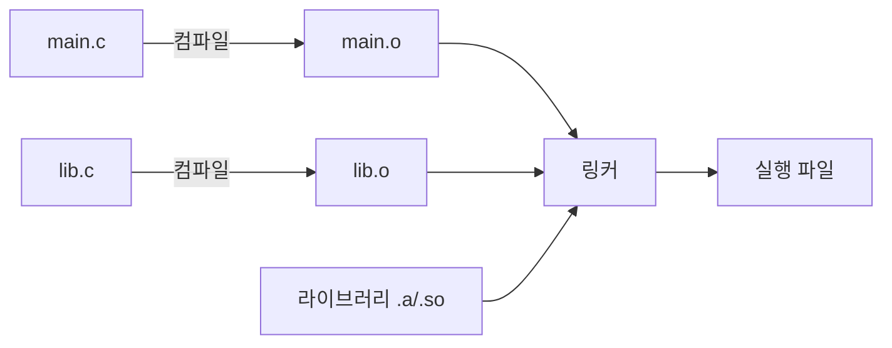

# 링킹 (Linking)

## 한 줄 요약

여러 .o 파일과 라이브러리를 하나의 실행 파일로 합치는 과정. 심볼(함수/변수 이름)을 주소로 해석하고 재배치한다. 정적이면 실행 파일에 코드를 넣고, 동적이면 실행 시점에 연결한다.

## 왜 필요한가

- "undefined reference to X" / "symbol not found" 오류의 정체
- 라이브러리가 실제로 어떻게 붙나 (`.a` vs `.so`/`.dylib`)
- 왜 어떤 프로그램은 실행 시 "라이브러리 없음"으로 죽나
- 헤더/선언과 정의의 분리가 왜 필요한가

## 컴파일 파이프라인에서 링커의 자리



각 .c는 독립 컴파일 → .o(오브젝트 파일). .o는 자기가 정의한 심볼과 **아직 모르는 심볼(undefined)**을 가짐. 링커가 이들을 이어붙임.

## 심볼: 정의와 참조

각 .o의 심볼 테이블을 `nm`으로 볼 수 있다. `main.c`가 다른 파일의 `shared_add`를 부르면:

```
$ nm main.o
0000000000000000 T _main          ← 이 파일이 정의(T=text)
                 U _shared_add     ← undefined, 링커가 채워야 함
```

`U`(undefined)가 핵심. 링커의 첫 임무 = 모든 U를 어딘가의 정의와 짝지음. 못 찾으면 **"undefined symbol"** 오류. 두 곳에서 정의하면 **"duplicate symbol"** 오류.

## 링커의 두 작업

1. **심볼 해석 (resolution)**: 각 참조(U)를 정확히 하나의 정의에 연결
2. **재배치 (relocation)**: 각 .o의 코드/데이터를 최종 주소에 배치하고, 심볼 참조를 그 실제 주소로 수정. 컴파일 시점엔 주소를 몰라 빈칸으로 뒀던 것을 채움

## 정적 링킹 (static)

라이브러리(`.a` = .o들의 아카이브)에서 **필요한 코드를 실행 파일 안에 복사**해 넣음.

```bash
gcc main.o lib.o -o prog          # .o 직접
gcc main.o -L. -lfoo -static      # libfoo.a에서 복사
```

- 장점: 실행 파일 하나로 자족. 실행 시 의존성 없음. 배포 간단
- 단점: 실행 파일 커짐. 같은 라이브러리를 여러 프로그램이 각자 복사(메모리/디스크 낭비). 라이브러리 보안 패치 시 전부 재링크 필요

## 동적 링킹 (dynamic)

라이브러리(`.so` 리눅스 / `.dylib` macOS / `.dll` 윈도우)를 **실행 파일에 넣지 않고, 실행 시점에 연결**.

```bash
gcc -dynamiclib lib.c -o libshared.dylib
gcc main.c -L. -lshared -o prog     # 참조만 기록
```

- 실행 파일엔 "libshared에서 shared_add를 쓴다"는 참조만 저장
- 프로그램 시작 시 **동적 링커/로더**(`ld.so`, `dyld`)가 라이브러리를 찾아 메모리에 매핑하고 심볼을 연결
- 장점: 실행 파일 작음. 여러 프로그램이 라이브러리 한 벌을 **공유**(메모리 절약). 라이브러리만 업데이트하면 전부 반영
- 단점: 실행 시 라이브러리 필요 → 없거나 버전 안 맞으면 실행 실패 ("dependency hell", DLL 지옥)

## 실행 시 무슨 일이

동적 링크 프로그램 실행:

1. 로더가 실행 파일을 메모리에 매핑
2. 필요한 공유 라이브러리 목록 확인 (`otool -L` / `ldd`)
3. 각 라이브러리를 찾아(검색 경로) 주소 공간에 매핑 → [[virtual-memory]]
4. 심볼 해석: 참조를 라이브러리의 실제 주소로 연결 (PLT/GOT 통해 지연 바인딩 가능)
5. main 진입

라이브러리는 **위치 독립 코드(PIC)**로 컴파일 → 어느 주소에 매핑돼도 동작 (ASLR과도 맞물림, [[buffer-overflow]]).

## 관련 도구

| 도구 | 용도 |
|---|---|
| `nm` | 심볼 테이블 보기 (T/U/D...) |
| `otool -L` (mac) / `ldd` (linux) | 동적 의존성 목록 |
| `objdump -d` / `otool -tv` | 역어셈블 |
| `LTO` (링크 타임 최적화) | 링크 단계에서 파일 경계 넘는 최적화 → [[compiler-optimization-limits]] |

## 연결

- 심볼이 가리키는 기계어 → [[assembly-basics]]
- 라이브러리 매핑과 PIC/ASLR → [[virtual-memory]], [[buffer-overflow]]
- LTO가 여는 최적화 → [[compiler-optimization-limits]]
- 실행 시 로딩은 OS의 일 → [[process]]

## 궁금한 것 (나중에)

- [ ] PLT/GOT와 지연 바인딩(lazy binding)의 구체적 동작
- [ ] 심볼 인터포지션(LD_PRELOAD)으로 함수 가로채기
- [ ] static과 dynamic을 섞을 때 규칙 (부분 정적 링크)
- [ ] 왜 C++ 심볼은 mangling되나, extern "C"는 뭘 바꾸나

## 출처

- CS:APP 7장
