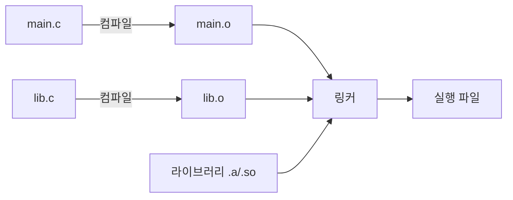

# 링킹 (Linking)

## 한 줄 요약

여러 .o 파일과 라이브러리를 하나의 실행 파일로 합치는 과정. 심볼(함수/변수 이름)을 주소로 해석하고 재배치한다. 정적이면 실행 파일에 코드를 넣고, 동적이면 실행 시점에 연결한다.

## 왜 필요한가

- "undefined reference to X" / "symbol not found" 오류의 정체
- 라이브러리가 실제로 어떻게 붙나 (`.a` vs `.so`/`.dylib`)
- 왜 어떤 프로그램은 실행 시 "라이브러리 없음"으로 죽나
- 헤더/선언과 정의의 분리가 왜 필요한가

## 컴파일 파이프라인에서 링커의 자리



각 .c는 독립 컴파일 → .o(오브젝트 파일). .o는 자기가 정의한 심볼과 **아직 모르는 심볼(undefined)**을 가짐. 링커가 이들을 이어붙임.

## 심볼: 정의와 참조

각 .o의 심볼 테이블을 `nm`으로 볼 수 있다. `main.c`가 다른 파일의 `shared_add`를 부르면:

```
$ nm main.o
0000000000000000 T _main          ← 이 파일이 정의(T=text)
                 U _shared_add     ← undefined, 링커가 채워야 함
```

`U`(undefined)가 핵심. 링커의 첫 임무 = 모든 U를 어딘가의 정의와 짝지음. 못 찾으면 **"undefined symbol"** 오류. 두 곳에서 정의하면 **"duplicate symbol"** 오류.

## 링커의 두 작업

1. **심볼 해석 (resolution)**: 각 참조(U)를 정확히 하나의 정의에 연결
2. **재배치 (relocation)**: 각 .o의 코드/데이터를 최종 주소에 배치하고, 심볼 참조를 그 실제 주소로 수정. 컴파일 시점엔 주소를 몰라 빈칸으로 뒀던 것을 채움

## 정적 링킹 (static)

라이브러리(`.a` = .o들의 아카이브)에서 **필요한 코드를 실행 파일 안에 복사**해 넣음.

```bash
gcc main.o lib.o -o prog          # .o 직접
gcc main.o -L. -lfoo -static      # libfoo.a에서 복사
```

- 장점: 실행 파일 하나로 자족. 실행 시 의존성 없음. 배포 간단
- 단점: 실행 파일 커짐. 같은 라이브러리를 여러 프로그램이 각자 복사(메모리/디스크 낭비). 라이브러리 보안 패치 시 전부 재링크 필요

## 동적 링킹 (dynamic)

라이브러리(`.so` 리눅스 / `.dylib` macOS / `.dll` 윈도우)를 **실행 파일에 넣지 않고, 실행 시점에 연결**.

```bash
gcc -dynamiclib lib.c -o libshared.dylib
gcc main.c -L. -lshared -o prog     # 참조만 기록
```

- 실행 파일엔 "libshared에서 shared_add를 쓴다"는 참조만 저장
- 프로그램 시작 시 **동적 링커/로더**(`ld.so`, `dyld`)가 라이브러리를 찾아 메모리에 매핑하고 심볼을 연결
- 장점: 실행 파일 작음. 여러 프로그램이 라이브러리 한 벌을 **공유**(메모리 절약). 라이브러리만 업데이트하면 전부 반영
- 단점: 실행 시 라이브러리 필요 → 없거나 버전 안 맞으면 실행 실패 ("dependency hell", DLL 지옥)

## 실행 시 무슨 일이

동적 링크 프로그램 실행:

1. 로더가 실행 파일을 메모리에 매핑
2. 필요한 공유 라이브러리 목록 확인 (`otool -L` / `ldd`)
3. 각 라이브러리를 찾아(검색 경로) 주소 공간에 매핑 → [[virtual-memory]]
4. 심볼 해석: 참조를 라이브러리의 실제 주소로 연결 (PLT/GOT 통해 지연 바인딩 가능)
5. main 진입

라이브러리는 **위치 독립 코드(PIC)**로 컴파일 → 어느 주소에 매핑돼도 동작 (ASLR과도 맞물림, [[buffer-overflow]]).

## 관련 도구

| 도구 | 용도 |
|---|---|
| `nm` | 심볼 테이블 보기 (T/U/D...) |
| `otool -L` (mac) / `ldd` (linux) | 동적 의존성 목록 |
| `objdump -d` / `otool -tv` | 역어셈블 |
| `LTO` (링크 타임 최적화) | 링크 단계에서 파일 경계 넘는 최적화 → [[compiler-optimization-limits]] |

## 셀프 체크

> [!question]- "undefined symbol"과 "duplicate symbol" 오류는 각각 왜 나나?
> 링커의 첫 임무는 각 참조(nm의 U)를 정확히 하나의 정의에 짝짓는 것이다. 어떤 U를 어느 .o/라이브러리에서도 정의를 못 찾으면 "undefined symbol", 반대로 같은 심볼이 두 곳 이상에서 정의되면 "duplicate symbol" 오류가 난다.

> [!question]- 정적 링킹과 동적 링킹의 핵심 장단점은?
> 정적: 필요한 코드를 실행 파일 안에 복사. 자족적이라 배포는 간단하지만 파일이 커지고 여러 프로그램이 같은 코드를 각자 복사한다. 동적: 실행 시점에 연결. 파일이 작고 라이브러리 한 벌을 공유하며 업데이트가 전체 반영되지만, 실행 시 라이브러리가 없거나 버전이 안 맞으면 실패한다.

> [!question]- 링커의 두 작업은 무엇인가?
> 심볼 해석(resolution): 각 참조 U를 정확히 하나의 정의에 연결. 재배치(relocation): 각 .o의 코드/데이터를 최종 주소에 배치하고, 컴파일 때 몰라서 빈칸으로 뒀던 심볼 참조를 그 실제 주소로 채운다.

> [!question]- 공유 라이브러리를 위치 독립 코드(PIC)로 컴파일하는 이유는?
> 같은 라이브러리가 프로세스마다 다른 주소에 매핑될 수 있고, ASLR은 매핑 주소를 일부러 무작위화한다. PIC는 절대 주소에 의존하지 않고 상대 주소로 동작하므로 어느 주소에 실려도 그대로 작동한다.

> [!question]- nm 출력에서 T와 U는 각각 무엇을 뜻하나?
> T는 이 오브젝트 파일이 text(코드) 섹션에 그 심볼을 정의했다는 뜻이고, U는 undefined - 이 파일이 참조만 하고 정의는 다른 곳에 있어 링커가 채워야 한다는 뜻이다.

## 연습문제

> [!example]- 문제: 정적 vs 동적 링킹의 디스크 사용량을 계산하라
> **풀이**
> 조건: 공유 라이브러리 코드 1MB. 이를 쓰는 프로그램 20개.
> 정적 링킹: 각 실행 파일이 라이브러리 코드를 자기 안에 복사 → 추가 디스크 = 1MB × 20 = **20MB**. 실행 중 물리 메모리도 프로그램마다 각자 1MB를 올린다.
> 동적 링킹: 라이브러리는 `.so`/`.dylib` 한 벌(1MB)만 디스크에 두고, 각 실행 파일엔 참조만 기록(무시할 수준). 추가 디스크 ≈ **1MB**. 물리 메모리도 공유 라이브러리 한 벌을 여러 프로세스가 매핑해 공유.
> 절감: 디스크 20MB → 1MB. 다만 실행 시 그 1MB 라이브러리가 반드시 있어야 한다는 의존성이 대가다.

> [!example]- 문제: 다음 링크 실패를 진단하고 고쳐라
> **풀이**
> 상황:
> ```
> $ nm main.o
> 0000000000000000 T _main
>                  U _sqrt
> $ gcc main.o -o prog
> Undefined symbols: _sqrt
> ```
> 진단: `main.o`가 `sqrt`를 참조(U)하지만, 링크 명령에 `sqrt`의 정의를 담은 라이브러리를 주지 않았다. `sqrt`는 수학 라이브러리(libm)에 있다. 링커가 U를 채울 정의를 못 찾아 undefined symbol.
> 해결: 수학 라이브러리를 링크에 추가.
> ```
> gcc main.o -o prog -lm
> ```
> `-lm`이 libm에서 `sqrt` 정의를 찾아 U를 해석한다. (라이브러리는 이를 참조하는 오브젝트 뒤에 와야 링커가 심볼을 당겨온다.)

## 파인만

> [!note]- 백지에 이 노트 핵심을 남에게 설명하듯 써보라. 막히면 그 부분만 다시.
> **점검 포인트**: 이해했다면 답할 수 있어야 하는 핵심 3가지.
> 1. 링커의 두 작업(심볼 해석, 재배치)을 각각 무엇을 하는지 설명할 수 있는가.
> 2. 정적 vs 동적 링킹의 장단점을 디스크/메모리/배포/의존성 관점에서 비교할 수 있는가.
> 3. 동적 링크 프로그램이 실행될 때 로더가 하는 단계와 PIC가 왜 필요한지 말할 수 있는가.

## 연결

- 심볼이 가리키는 기계어 → [[assembly-basics]]
- 라이브러리 매핑과 PIC/ASLR → [[virtual-memory]], [[buffer-overflow]]
- LTO가 여는 최적화 → [[compiler-optimization-limits]]
- 실행 시 로딩은 OS의 일 → [[process]]
- 컴파일 툴체인 관점의 링킹 단계 → compilers/[[linking]]

## 궁금한 것 (나중에)

- [ ] PLT/GOT와 지연 바인딩(lazy binding)의 구체적 동작
- [ ] 심볼 인터포지션(LD_PRELOAD)으로 함수 가로채기
- [ ] static과 dynamic을 섞을 때 규칙 (부분 정적 링크)
- [ ] 왜 C++ 심볼은 mangling되나, extern "C"는 뭘 바꾸나

## 출처

- CS:APP 7장
