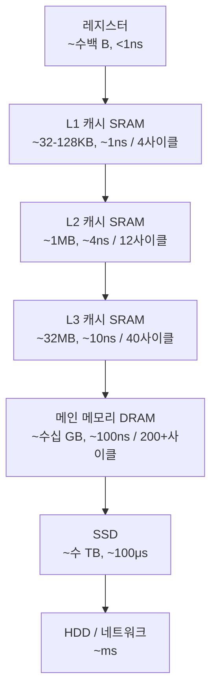

# 메모리 계층 (Memory Hierarchy)

## 한 줄 요약

빠른 메모리는 비싸고 작다. 그래서 속도별로 계층을 쌓고, 자주 쓰는 데이터를 위쪽(빠른 쪽)에 둔다.

## 왜 필요한가

CPU 속도는 수십 년간 폭발적으로 빨라졌는데 메모리(DRAM) 속도는 그만큼 못 따라갔다 (processor-memory gap). 계층 없이 CPU가 매번 RAM까지 가면 명령어 하나에 수백 사이클을 기다려야 한다.

**그럼 전부 빠른 메모리로 만들면 안 되나?** 물리적으로 비싸다:

- **SRAM** (캐시): 비트당 트랜지스터 6개. 빠르지만 밀도 낮고 비쌈. 전원 있으면 값 유지
- **DRAM** (메인 메모리): 비트당 트랜지스터 1개 + 커패시터 1개. 싸고 밀도 높지만 느림. 커패시터 전하가 새서 주기적 refresh 필요 (이름의 D = Dynamic)

빠른 것과 큰 것을 동시에 가질 수 없으니, 계층으로 타협한 것.

## 계층 구조



| 계층 | 용량 (대략) | 지연시간 (대략) | 관리 주체 |
|---|---|---|---|
| 레지스터 | ~수백 B | <1ns | 컴파일러 |
| L1 캐시 | 32-128KB (코어당, 명령/데이터 분리) | ~1ns | 하드웨어 |
| L2 캐시 | ~1MB (코어당) | ~4ns | 하드웨어 |
| L3 캐시 | ~32MB (전체 코어 공유) | ~10ns | 하드웨어 |
| RAM | ~수십 GB | ~100ns | OS + 하드웨어 |
| SSD | ~수 TB | ~100μs | OS |

체감 스케일: L1이 1초라면 RAM은 약 2분, SSD는 약 1일.

각 계층은 아래 계층의 캐시다. 레지스터는 L1의, L1은 L2의, ... RAM은 디스크의 캐시 (→ OS 페이지 캐시, [[page-cache]]).

## 핵심 원리: 지역성 (Locality)

캐시가 작동하는 이유. 프로그램은 메모리를 무작위로 안 쓰고 패턴이 있다.

- **시간 지역성 (temporal locality)**: 방금 쓴 데이터는 곧 또 쓴다. 예: 루프 변수, 자주 호출되는 함수
- **공간 지역성 (spatial locality)**: 방금 쓴 데이터의 근처를 곧 쓴다. 예: 배열 순차 순회, 명령어 순차 실행

캐시는 이 가정 위에 설계됨:
- 한 번 가져온 데이터를 캐시에 유지 → 시간 지역성 활용
- 데이터를 1바이트가 아니라 **캐시 라인(보통 64B, Apple Silicon은 128B) 단위**로 가져옴 → 공간 지역성 활용

## 캐시 내부 동작

### 주소가 캐시 위치로 변환되는 방식

캐시는 **집합(set)** 들의 배열이고, 각 집합은 **라인(line)** 을 E개 가진다 (E-way). 메모리 주소는 세 부분으로 쪼개져 해석된다:

```
주소 = [   tag   |  set index  |  block offset  ]
```

- **block offset**: 라인 안에서 몇 번째 바이트인지. 라인 64B → 6비트
- **set index**: 몇 번째 집합에 들어갈지. 집합 64개 → 6비트
- **tag**: 나머지 전부. 같은 집합에 매핑되는 수많은 주소들 중 지금 캐시에 있는 게 누구인지 구별

예: 32KB L1, 64B 라인, 8-way라면 → 라인 512개 / 8 = 집합 64개. 주소에서 하위 6비트 = offset, 다음 6비트 = index, 나머지 = tag.

조회 과정: index로 집합 찾기 → 집합 안 8개 라인의 tag 비교 → 일치하고 valid하면 **히트**, 아니면 **미스** (아래 계층에서 라인 통째로 가져와 교체).

### 연관도 (associativity)

| 방식 | 구조 | 트레이드오프 |
|---|---|---|
| 직접 매핑 (direct-mapped) | 집합당 라인 1개 (1-way) | 회로 단순·빠름. 두 주소가 같은 집합 다투면 서로 계속 쫓아냄 (conflict miss) |
| 집합 연관 (set-associative) | 집합당 라인 E개 | 현실 표준 (L1은 보통 8-way). conflict 완화, 비교 회로 비용 증가 |
| 완전 연관 (fully associative) | 아무 데나 배치 | conflict 없음. 전체 tag 병렬 비교 비용 커서 작은 캐시(TLB)에만 사용 |

집합이 꽉 찼을 때 누굴 쫓아낼지: 보통 **LRU 근사** (가장 오래 안 쓴 라인 교체).

### 쓰기 정책

읽기만이 아니라 쓰기도 캐시를 거친다:

- **write-back** (표준): 일단 캐시에만 쓰고 dirty 비트 표시. 라인이 쫓겨날 때만 아래 계층에 반영. 쓰기 트래픽 최소화
- **write-through**: 쓸 때마다 아래 계층에도 즉시 반영. 단순하지만 느림
- 미스 시: **write-allocate** (라인 먼저 가져온 뒤 씀, write-back과 짝) vs no-write-allocate

## 캐시 미스 3종 (3 Cs)

1. **Cold (compulsory) miss**: 처음 접근이라 캐시에 있을 수가 없음. 불가피
2. **Capacity miss**: working set이 캐시 크기보다 큼. 예: 8MB 배열을 32KB L1에서 반복 순회
3. **Conflict miss**: 캐시엔 자리 남는데 같은 집합에 매핑된 것들끼리 다툼. 예: stride가 2의 거듭제곱(4096 등)이면 접근들이 전부 같은 집합에 몰림 → 행렬 크기가 2^n일 때 성능이 뚝 떨어지는 이유

상세 → [[cache-misses]]

## 코드로 확인

### 1. 순회 방향 (공간 지역성)

```c
#include <stdio.h>
#include <time.h>

#define N 8192
static int a[N][N];

int main(void) {
    long sum = 0;
    clock_t t;

    // 런타임에 채워야 함. 안 쓰면 배열이 전부 0인 걸 컴파일러가 알아채고
    // 루프를 통째로 상수 접기로 제거해서 0.000s가 나온다 (직접 당해봄)
    for (int i = 0; i < N; i++)
        for (int j = 0; j < N; j++)
            a[i][j] = i ^ j;

    // 행 우선: a[i][0], a[i][1], ... 메모리상 연속 → 라인 64B당 int 16개 알뜰 사용
    t = clock();
    for (int i = 0; i < N; i++)
        for (int j = 0; j < N; j++)
            sum += a[i][j];
    printf("row-major:    %.3fs\n", (double)(clock() - t) / CLOCKS_PER_SEC);

    // 열 우선: 매번 N*4 = 32KB 점프 → 라인당 int 1개만 쓰고 버림, 거의 매번 미스
    t = clock();
    for (int j = 0; j < N; j++)
        for (int i = 0; i < N; i++)
            sum += a[i][j];
    printf("column-major: %.3fs\n", (double)(clock() - t) / CLOCKS_PER_SEC);

    return (int)sum;
}
```

```bash
gcc -O1 locality.c -o locality && ./locality
```

실측 (Apple M계열, 2026-07):

```
row-major:    0.032s
column-major: 0.238s   # 같은 연산, 7배 차이
```

### 2. False sharing (멀티스레드에서 캐시 라인 공유)

서로 다른 스레드가 **다른 변수**를 써도, 두 변수가 **같은 캐시 라인**에 있으면 코어들이 라인 소유권을 계속 뺏고 뺏긴다 (캐시 일관성 프로토콜, → [[cache-coherence]]). 논리적 공유 없는데 물리적 공유로 느려지는 것.

```c
#include <pthread.h>
#include <stdio.h>
#include <time.h>

#define ITER 100000000

// volatile 필수: 없으면 컴파일러가 루프를 counter += ITER 한 줄로
// 최적화해서 메모리 접근 자체가 사라진다 (역시 직접 당해봄)

// 같은 라인: 두 카운터가 붙어 있음 (8B 간격)
volatile long counters_shared[2];

// 다른 라인: 128B 정렬로 라인 분리
struct { volatile long v; char pad[120]; } counters_padded[2];

void *work_shared(void *arg) {
    long i, idx = (long)arg;
    for (i = 0; i < ITER; i++) counters_shared[idx]++;
    return NULL;
}

void *work_padded(void *arg) {
    long i, idx = (long)arg;
    for (i = 0; i < ITER; i++) counters_padded[idx].v++;
    return NULL;
}

double run(void *(*fn)(void *)) {
    pthread_t t1, t2;
    struct timespec s, e;
    clock_gettime(CLOCK_MONOTONIC, &s);
    pthread_create(&t1, NULL, fn, (void *)0);
    pthread_create(&t2, NULL, fn, (void *)1);
    pthread_join(t1, NULL);
    pthread_join(t2, NULL);
    clock_gettime(CLOCK_MONOTONIC, &e);
    return (e.tv_sec - s.tv_sec) + (e.tv_nsec - s.tv_nsec) / 1e9;
}

int main(void) {
    printf("same line (false sharing): %.3fs\n", run(work_shared));
    printf("padded (separate lines):   %.3fs\n", run(work_padded));
    return 0;
}
```

```bash
gcc -O1 -pthread false-sharing.c -o fs && ./fs
```

실측 (Apple M계열, 2026-07):

```
same line (false sharing): 0.221s
padded (separate lines):   0.035s   # padding만으로 6배
```

### 3. 내 머신 캐시 스펙 확인 (macOS)

```bash
sysctl hw.cachelinesize hw.l1dcachesize hw.l2cachesize hw.perflevel0.l1dcachesize
```

Apple Silicon은 P-코어 L1d 128KB, 캐시 라인 128B로 x86(64B)과 다름. 위 코드들의 pad 크기가 128B인 이유.

## 하드웨어 프리페처

CPU는 접근 패턴을 감시하다가 순차/일정 stride 접근을 감지하면 **다음 라인을 미리 가져온다**. 순차 순회가 이론 예상보다도 더 빠른 이유. 반대로 링크드 리스트·해시 테이블처럼 다음 주소를 예측할 수 없는 포인터 추적(pointer chasing)은 프리페처가 못 도와줘서 매 접근이 RAM 지연시간을 그대로 맞는다. 배열이 링크드 리스트보다 빠른 진짜 이유 중 하나.

## 실전 규칙 요약

1. **순차 접근** - 프리페처와 캐시 라인을 최대 활용. 배열 > 링크드 리스트
2. **작은 stride** - 2차원 배열은 메모리 배치 순서대로 순회
3. **hot 데이터끼리 모으기** - 자주 같이 쓰는 필드는 구조체에서 인접 배치. 크고 차가운 필드는 분리 (AoS vs SoA 문제)
4. **2의 거듭제곱 stride 회피** - conflict miss 유발
5. **스레드별 쓰기 데이터는 라인 분리** - false sharing 방지 (padding 또는 `alignas`)
6. **working set을 캐시에 맞추기** - 큰 데이터는 블록 단위로 쪼개 처리 (blocking/tiling, 행렬곱 최적화의 핵심)

## 셀프 체크

> [!question]- SRAM과 DRAM의 구조적 차이는 무엇이고, 왜 DRAM만 주기적 refresh가 필요한가?
> SRAM은 비트당 트랜지스터 6개로 셀을 구성해 전원만 있으면 값을 유지한다. 빠르지만 밀도가 낮고 비싸서 캐시에 쓴다. DRAM은 비트당 트랜지스터 1개 + 커패시터 1개로 밀도가 높고 싸지만 느리다. 커패시터에 저장한 전하가 시간이 지나면 새어나가기 때문에 주기적으로 다시 채워주는 refresh가 필요하며, 이 Dynamic 특성이 이름의 D다.

> [!question]- 32KB, 64B 라인, 8-way 집합 연관 캐시에서 주소가 tag / set index / block offset으로 나뉘는 비트 수를 구하는 과정은?
> 라인 크기 64B → block offset = log2(64) = 6비트. 전체 라인 수 = 32KB / 64B = 512개, 8-way이므로 집합 수 = 512 / 8 = 64개 → set index = log2(64) = 6비트. 나머지 상위 비트 전부가 tag다. tag는 같은 집합에 매핑되는 여러 주소 중 지금 캐시에 있는 것이 누구인지 구별하는 역할을 한다.

> [!question]- 3 Cs 미스(cold, capacity, conflict)를 각각 구별하고, conflict miss가 2의 거듭제곱 stride에서 심해지는 이유는?
> cold(compulsory)는 처음 접근이라 캐시에 있을 수 없는 불가피한 미스, capacity는 working set이 캐시 용량보다 커서 발생, conflict는 캐시에 빈 자리가 있는데도 같은 집합에 매핑된 주소들끼리 다퉈서 발생한다. stride가 4096처럼 2의 거듭제곱이면 set index 비트가 항상 같은 값이 되어 접근들이 전부 같은 집합에 몰리므로 conflict miss가 폭증한다.

> [!question]- write-back과 write-through의 차이, 그리고 write-back에서 dirty 비트의 역할은?
> write-through는 쓸 때마다 아래 계층에도 즉시 반영해 단순하지만 쓰기 트래픽이 많아 느리다. write-back은 일단 캐시에만 쓰고 dirty 비트로 "이 라인은 아래 계층과 다르다"고 표시한 뒤, 라인이 쫓겨날 때만 반영한다. dirty 비트 덕분에 수정되지 않은 라인은 교체 시 그냥 버릴 수 있어 불필요한 쓰기를 피한다.

> [!question]- false sharing은 무엇이며, 논리적 공유가 없는데도 성능이 떨어지는 이유는?
> 서로 다른 스레드가 서로 다른 변수를 쓰는데도 두 변수가 같은 캐시 라인(64B/128B)에 있으면, 한 코어가 쓸 때마다 캐시 일관성 프로토콜이 다른 코어의 라인을 무효화해 소유권이 코어 사이를 핑퐁한다. 데이터상 공유는 없지만 물리적으로 같은 라인을 공유하기 때문에 느려진다. padding이나 `alignas`로 변수를 다른 라인에 분리하면 해결된다.

## 연습문제

> [!example]- 문제: L1 히트율 95%(히트 1사이클), L1 미스 시 L2 접근 15사이클(L2 히트율 90%), L2 미스 시 RAM 200사이클일 때 AMAT(평균 메모리 접근 시간)를 사이클 단위로 계산하라.
> **풀이**
> AMAT는 안쪽 계층부터 재귀적으로 계산한다.
> L2 관점 AMAT_L2 = L2 히트시간 + L2 미스율 × RAM 페널티 = 15 + 0.10 × 200 = 15 + 20 = 35사이클.
> L1 관점 AMAT = L1 히트시간 + L1 미스율 × AMAT_L2 = 1 + 0.05 × 35 = 1 + 1.75 = 2.75사이클.
> 즉 히트율이 높아도 미스 페널티가 크면 평균 접근 시간이 히트시간의 몇 배가 된다. 미스율을 5%에서 2%로 줄이면 AMAT = 1 + 0.02 × 35 = 1.7사이클로 크게 개선된다.

> [!example]- 문제: 64B 캐시 라인에 int(4B)가 담긴 배열을 순차 순회(stride 1)할 때, 요소당 평균 캐시 미스율을 구하고, stride 16(4바이트 × 16 = 64B 점프)으로 순회하면 어떻게 달라지는지 설명하라.
> **풀이**
> 라인 하나에 int가 64B / 4B = 16개 들어간다.
> stride 1: 라인의 첫 요소 접근에서만 미스(cold), 나머지 15개는 히트 → 미스율 = 1/16 ≈ 6.25%. 공간 지역성을 알뜰히 활용한다.
> stride 16: 매 접근이 새 라인의 첫 바이트를 건드리므로 라인당 요소 1개만 쓰고 버린다 → 미스율 ≈ 100%. 같은 요소 수를 읽어도 필요한 라인 수가 16배가 되어 메모리 트래픽과 시간이 급증한다. 이것이 열 우선 순회가 느린 이유의 정량적 형태다.

> [!example]- 문제: 128B 라인 머신에서 두 스레드가 각각 `long`(8B) 카운터를 증가시킨다. 두 카운터가 같은 라인에 있을 때와 128B padding으로 분리했을 때 캐시 일관성 관점에서 무슨 일이 벌어지는지 설명하라.
> **풀이**
> 같은 라인: 스레드 A가 자기 카운터를 쓰면 그 라인 전체가 dirty가 되고, 코어 B의 캐시에 있던 같은 라인은 무효화된다. 코어 B가 자기 카운터를 쓰려면 라인을 다시 가져와야 하고, 이 과정이 매 증가마다 반복되어 라인이 두 코어 사이를 핑퐁한다(false sharing). 각 쓰기가 실질적으로 원격 캐시/메모리 왕복 비용을 낸다.
> 128B padding 분리: 두 카운터가 서로 다른 라인에 있으므로 각 코어가 자기 라인을 배타적(Exclusive/Modified) 상태로 계속 보유한 채 로컬 캐시에서만 갱신한다. 무효화 트래픽이 사라져 실측상 수 배 빨라진다.

## 파인만

> [!note]- 백지에 이 노트 핵심을 남에게 설명하듯 써보라. 막히면 그 부분만 다시.
> **점검 포인트**: 이해했다면 답할 수 있어야 하는 핵심 3가지. (1) 왜 전부 빠른 메모리로 안 만들고 계층을 쌓는가 - SRAM/DRAM 비용·밀도 트레이드오프와 지역성 가정. (2) 주소 하나가 tag/index/offset으로 쪼개져 캐시 위치로 변환되고 히트/미스가 판정되는 전 과정. (3) 3 Cs 미스와 false sharing이 각각 어떤 코드 패턴에서 나오고 어떻게 완화하는가.

## 연결

- 캐시 미스 상세와 측정 → [[cache-misses]]
- 캐시 일관성 (MESI, false sharing의 근본 원인) → [[cache-coherence]]
- OS 페이지 캐시 (같은 원리, RAM = 디스크의 캐시) → [[page-cache]]
- 가상 메모리와 TLB (주소 변환에도 캐시가 있다) → [[virtual-memory]]
- 포인터 추적이라 프리페처가 못 돕는 자료구조 → data-structures/[[linked-lists]]

## 궁금한 것 (나중에)

- [ ] MESI 프로토콜 상태 전이 구체적으로 어떻게 동작?
- [ ] NUMA - 멀티소켓에서 "RAM 접근 비용이 코어마다 다르다"는 게 뭘 바꾸나?
- [ ] cache-oblivious 알고리즘 - 캐시 크기를 모르고도 최적인 알고리즘이 어떻게 가능?
- [ ] 행렬곱 blocking 직접 구현해서 GFLOPS 측정

## 출처

- CS:APP (Computer Systems: A Programmer's Perspective) 6장
- Latency Numbers Every Programmer Should Know
- Ulrich Drepper, "What Every Programmer Should Know About Memory"
