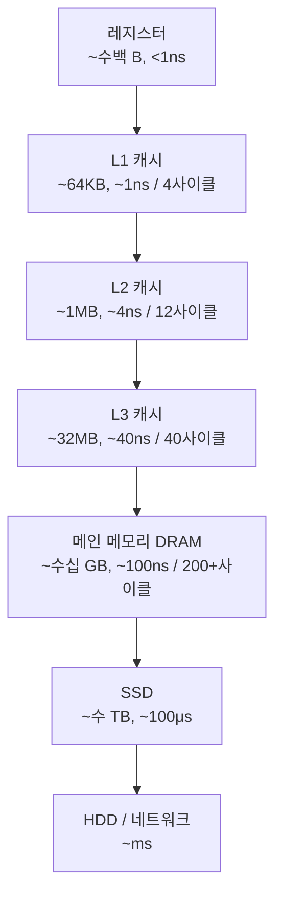

# 메모리 계층 (Memory Hierarchy)

## 한 줄 요약

빠른 메모리는 비싸고 작다. 그래서 속도별로 계층을 쌓고, 자주 쓰는 데이터를 위쪽(빠른 쪽)에 둔다.

## 왜 필요한가

CPU 속도는 수십 년간 폭발적으로 빨라졌는데 메모리(DRAM) 속도는 그만큼 못 따라갔다 (processor-memory gap). 계층 없이 CPU가 매번 RAM까지 가면 명령어 하나 실행할 때마다 수백 사이클을 기다려야 한다. CPU가 일하는 시간보다 기다리는 시간이 길어지는 것이다.

해결책: 작고 빠른 메모리(캐시)를 CPU 가까이에 두고, 자주 쓰는 데이터를 거기에 복사해둔다.

## 계층 구조



| 계층 | 용량 (대략) | 지연시간 (대략) | 관리 주체 |
|---|---|---|---|
| 레지스터 | ~수백 B | <1ns | 컴파일러 |
| L1 캐시 | ~64KB (코어당) | ~1ns | 하드웨어 |
| L2 캐시 | ~1MB (코어당) | ~4ns | 하드웨어 |
| L3 캐시 | ~32MB (공유) | ~40ns | 하드웨어 |
| RAM | ~수십 GB | ~100ns | OS + 하드웨어 |
| SSD | ~수 TB | ~100μs | OS |

체감 스케일: L1이 1초라면 RAM은 약 2분, SSD는 약 1일.

## 핵심 원리: 지역성 (Locality)

캐시가 작동하는 이유. 프로그램은 메모리를 무작위로 안 쓰고 패턴이 있다.

- **시간 지역성 (temporal locality)**: 방금 쓴 데이터는 곧 또 쓴다. 예: 루프 변수, 자주 호출되는 함수
- **공간 지역성 (spatial locality)**: 방금 쓴 데이터의 근처를 곧 쓴다. 예: 배열 순차 순회, 명령어 순차 실행

캐시는 이 가정 위에 설계됨:
- 한 번 가져온 데이터를 캐시에 유지 → 시간 지역성 활용
- 데이터를 1바이트가 아니라 **캐시 라인(보통 64B) 단위**로 가져옴 → 공간 지역성 활용

## 코드로 확인

2차원 배열 순회 방향만 바꿔도 성능이 수 배 차이 난다.

```c
#include <stdio.h>
#include <stdlib.h>
#include <time.h>

#define N 8192
static int a[N][N];

int main(void) {
    long sum = 0;
    clock_t t;

    // 행 우선: a[i][0], a[i][1], ... 메모리상 연속 → 캐시 라인 알뜰하게 사용
    t = clock();
    for (int i = 0; i < N; i++)
        for (int j = 0; j < N; j++)
            sum += a[i][j];
    printf("row-major:    %.3fs\n", (double)(clock() - t) / CLOCKS_PER_SEC);

    // 열 우선: a[0][j], a[1][j], ... 매번 N*4바이트씩 점프 → 거의 매번 캐시 미스
    t = clock();
    for (int j = 0; j < N; j++)
        for (int i = 0; i < N; i++)
            sum += a[i][j];
    printf("column-major: %.3fs\n", (double)(clock() - t) / CLOCKS_PER_SEC);

    return (int)sum;
}
```

```bash
gcc -O1 locality.c -o locality && ./locality
```

같은 연산인데 열 우선이 수 배 느리다. 접근 순서가 공간 지역성을 깨서 캐시 라인을 낭비하기 때문.

## 연결

- 캐시 미스 종류 (cold/capacity/conflict) → [[cache-misses]]
- 캐시 구조 (직접 매핑, 집합 연관) → [[cpu-cache-structure]]
- OS 페이지 캐시도 같은 원리 (RAM을 디스크의 캐시로 사용) → [[page-cache]]
- 가상 메모리와 TLB → [[virtual-memory]]

## 궁금한 것 (나중에)

- [ ] false sharing이 멀티스레드 성능을 죽이는 이유? (캐시 라인 공유 문제)
- [ ] 캐시 일관성(cache coherence) 프로토콜 MESI는 어떻게 동작?
- [ ] 실제 내 맥(Apple Silicon)의 캐시 크기와 라인 크기는? (`sysctl hw.cachelinesize`)

## 출처

- CS:APP (Computer Systems: A Programmer's Perspective) 6장
- Latency Numbers Every Programmer Should Know
