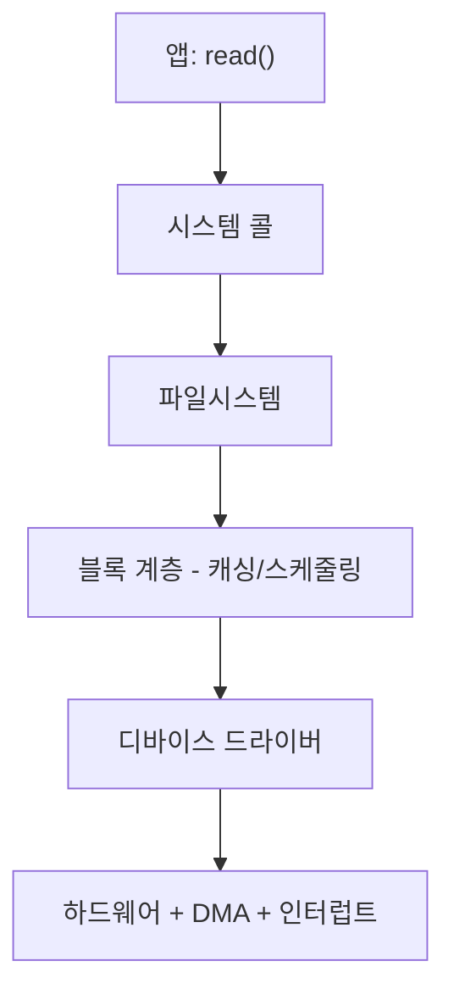

# I/O 디바이스 (I/O Devices)

## 한 줄 요약

CPU가 디스크·네트워크 같은 느린 장치와 어떻게 대화하나. 폴링은 CPU를 낭비하고 인터럽트는 이를 아끼며, DMA는 데이터 전송 자체를 CPU에서 떼어낸다. 드라이버가 이 하드웨어 차이를 추상화한다.

## 왜 필요한가

- 프로그램의 `read()`가 실제 하드웨어까지 어떻게 가나
- CPU(ns)와 디스크(ms)의 속도 격차를 어떻게 다루나
- 인터럽트/DMA가 왜 성능에 결정적인가

## 장치와 대화하는 법

각 I/O 장치는 **레지스터**를 노출: 상태(status), 명령(command), 데이터(data). CPU가 이 레지스터를 읽고 써서 제어:

```
1. 상태 레지스터를 폴링: 장치가 준비됐나?
2. 데이터 레지스터에 데이터 씀
3. 명령 레지스터에 명령 씀 (예: "쓰기 시작")
4. 완료를 기다림
```

레지스터 접근 방식: **포트 매핑 I/O**(전용 명령) 또는 **메모리 매핑 I/O**(특정 주소를 장치에 매핑, 일반 load/store로 접근).

## 폴링 vs 인터럽트

느린 장치의 완료를 어떻게 기다리나:

### 폴링 (polling)

상태 레지스터를 **반복해서 읽으며** 대기:

```c
while (STATUS == BUSY) ;   // 계속 확인 - CPU 태움
```

- 장치가 ms 걸리는데 CPU가 ns마다 확인 → 수백만 사이클 낭비
- 장점: 지연 낮음, 단순. **아주 빠른 장치**(NVMe)엔 오히려 유리 (인터럽트 오버헤드보다 쌈)

### 인터럽트 (interrupt)

I/O 요청 후 **다른 일 하다가**, 완료되면 장치가 인터럽트로 CPU를 부름 ([[exceptions-and-interrupts]]):

```
1. I/O 시작
2. 이 프로세스를 blocked로, CPU는 다른 프로세스 실행 ([[cpu-scheduling]])
3. I/O 완료 → 장치가 인터럽트 발생
4. 핸들러가 프로세스를 ready로 깨움
```

- 느린 장치에 최적: 기다리는 동안 CPU를 딴 데 씀
- 대가: 인터럽트당 컨텍스트 스위치 오버헤드. 인터럽트 폭주(고속 네트워크)면 **인터럽트 병합(coalescing)**이나 폴링으로 전환(NAPI)

**규칙**: 느리면 인터럽트, 아주 빠르면 폴링, 중간이면 하이브리드.

## DMA (Direct Memory Access)

문제: 인터럽트를 써도 **데이터 복사**는 CPU가 함 (메모리 ↔ 장치, 바이트마다). 큰 전송이면 이것도 낭비.

DMA: **전용 하드웨어(DMA 컨트롤러)가 데이터 전송을 대신**:

```
1. CPU: DMA에게 "이 메모리 영역을 디스크로" 지시
2. DMA가 CPU 없이 전송 수행
3. 전송 완료 시 DMA가 인터럽트로 CPU에 알림
```

CPU는 전송 중 자유 → 다른 계산. 대용량 I/O(디스크, 네트워크, GPU)에 필수. CPU는 "지시하고 결과만 받음".

## 디바이스 드라이버: 추상화 계층

디스크마다, 네트워크 카드마다 레지스터·프로토콜이 다름. **드라이버**가 이 차이를 감추고 OS에 통일된 인터페이스 제공:

```
파일시스템 → 블록 장치 인터페이스 (read block N)
             → 드라이버 (이 특정 SSD의 프로토콜로 변환)
             → 하드웨어
```

- OS의 대부분 코드(파일시스템)는 "블록 장치"라는 추상만 알면 됨
- 드라이버가 커널 코드의 큰 비중 (하드웨어 종류만큼)
- 계층화 덕에 새 장치는 드라이버만 추가하면 됨

## I/O 스택 전체 그림



앞으로: 파일시스템([[file-system-basics]])이 블록을 파일로, 페이지 캐시([[page-cache]])가 블록을 메모리에 캐싱.

## 셀프 체크

> [!question]- 폴링과 인터럽트는 각각 언제 유리한가?
> 폴링은 상태 레지스터를 반복해 읽으며 대기하므로 느린 장치에선 수백만 사이클을 낭비하지만, 지연이 낮고 단순해 NVMe처럼 아주 빠른 장치엔 오히려 유리하다(인터럽트 오버헤드보다 쌈). 인터럽트는 대기 중 CPU를 다른 프로세스에 쓸 수 있어 느린 장치에 최적이지만, 인터럽트당 컨텍스트 스위치 비용이 든다. 규칙: 느리면 인터럽트, 아주 빠르면 폴링, 중간이면 하이브리드.

> [!question]- 인터럽트를 써도 DMA가 여전히 필요한 이유는?
> 인터럽트는 "완료를 기다리는 낭비"만 없앨 뿐, 데이터 복사(메모리 ↔ 장치, 바이트마다)는 여전히 CPU가 한다. 큰 전송이면 이 복사가 CPU를 낭비한다. DMA는 전용 컨트롤러가 전송 자체를 대신 수행하고 끝나면 인터럽트로 알리므로, CPU는 지시만 하고 전송 중 다른 계산을 할 수 있다.

> [!question]- 디바이스 드라이버는 왜 필요한가?
> 디스크마다, 네트워크 카드마다 레지스터와 프로토콜이 달라서다. 드라이버가 이 하드웨어 차이를 감추고 "블록 장치(read block N)" 같은 통일된 인터페이스를 OS에 제공한다. 덕분에 파일시스템 같은 상위 코드는 추상만 알면 되고, 새 장치는 드라이버만 추가하면 지원된다.

> [!question]- 고속 네트워크에서 인터럽트가 오히려 문제가 되는 이유와 대응은?
> 패킷이 몰리면 인터럽트가 폭주해 인터럽트당 컨텍스트 스위치 오버헤드가 CPU를 잡아먹는다(인터럽트 폭주). 대응으로 여러 완료를 묶어 한 번에 알리는 인터럽트 병합(coalescing)이나, 부하가 높을 때 폴링으로 전환하는 방식(NAPI)을 쓴다.

## 연습문제

> [!example]- 문제: 4KB 블록을 디스크에서 읽는 시나리오를 폴링·인터럽트·DMA 세 방식으로 비교하라
> **풀이**
> - 폴링: I/O 시작 후 CPU가 `while(STATUS==BUSY)`로 계속 상태를 확인. 장치가 ms 걸리는데 CPU는 ns마다 확인 → 수백만 사이클 낭비. 게다가 데이터 복사도 CPU가 함.
> - 인터럽트: I/O 시작 후 프로세스를 blocked로 두고 CPU는 다른 프로세스 실행. 완료 시 인터럽트로 깨움 → 대기 낭비는 없앰. 하지만 메모리↔장치 데이터 복사는 여전히 CPU 몫이고 컨텍스트 스위치 비용 발생.
> - DMA: CPU가 DMA에 "이 영역을 디스크로/에서" 지시만 하고 자유. DMA가 전송을 수행하고 완료 시 인터럽트로 알림 → 대기와 복사 둘 다 CPU에서 분리. 대용량 전송에 최적.

> [!example]- 문제: 앱의 `read()` 한 번이 하드웨어에 닿기까지 I/O 스택을 위에서 아래로 짚어라
> **풀이**
> 1. 앱: `read()` 호출 → 시스템 콜로 커널 진입.
> 2. 파일시스템: 읽을 파일을 블록 번호로 변환.
> 3. 블록 계층: 캐싱(있으면 바로 반환)과 요청 스케줄링.
> 4. 디바이스 드라이버: 그 특정 장치의 레지스터·프로토콜로 명령 변환.
> 5. 하드웨어: DMA로 데이터 전송, 완료 시 인터럽트로 상위에 알림 → 결과가 앱까지 거슬러 올라감.

## 파인만

> [!note]- 백지에 이 노트 핵심을 남에게 설명하듯 써보라. 막히면 그 부분만 다시.
> **점검 포인트**: 이해했다면 답할 수 있어야 하는 핵심 3가지.
> 1. CPU가 장치와 대화하는 기본 메커니즘(상태/명령/데이터 레지스터, 포트/메모리 매핑 I/O)을 설명할 수 있는가.
> 2. 폴링 → 인터럽트 → DMA가 각각 "무슨 낭비"를 없애는지 단계적으로 구분할 수 있는가(대기 낭비 vs 복사 낭비).
> 3. 드라이버가 제공하는 추상화가 왜 OS 상위 계층을 하드웨어 독립적으로 만드는지 말할 수 있는가.

## 연결

- 인터럽트 메커니즘 → [[exceptions-and-interrupts]]
- I/O 대기 중 다른 프로세스 실행 → [[cpu-scheduling]]
- 블록을 파일로 → [[file-system-basics]]
- 블록 캐싱 → [[page-cache]]
- 고속 I/O와 폴링 (io_uring) → [[io-multiplexing]]

## 궁금한 것 (나중에)

- [ ] NVMe가 폴링을 쓰는 이유와 io_uring 연계
- [ ] 인터럽트 병합(coalescing)의 지연-처리량 트레이드오프
- [ ] 메모리 매핑 I/O에서 캐싱을 끄는 이유 (일관성)
- [ ] GPU와의 DMA (zero-copy)

## 출처

- OSTEP 36장 (I/O 장치)
