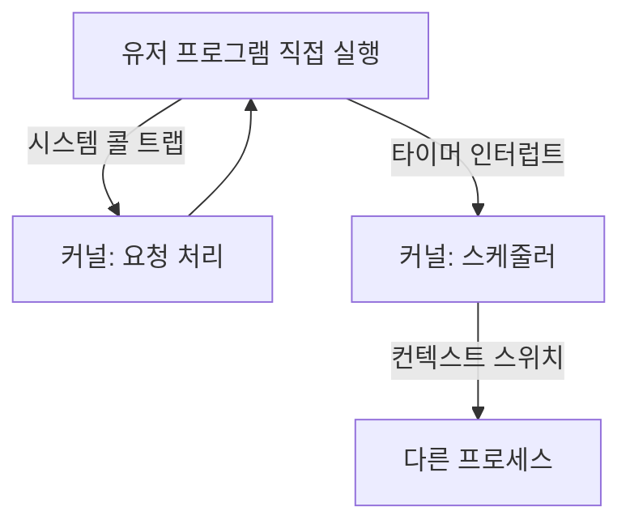

# 제한적 직접 실행 (Limited Direct Execution)

## 한 줄 요약

OS는 프로그램을 CPU에서 직접(빠르게) 돌리되, 위험한 일은 못 하게 제한한다. 이 "직접 실행 + 제한"의 두 축이 유저/커널 모드와 시스템 콜, 그리고 타이머 인터럽트다. 시스템 콜은 공짜가 아니라 실측 100배 비싸다.

## 왜 필요한가

- OS가 어떻게 성능(직접 실행)과 통제(제한)를 동시에 잡나
- 시스템 콜이 함수 호출보다 왜, 얼마나 비싼가
- OS가 어떻게 폭주하는 프로그램에서 제어권을 되찾나

## 딜레마: 빠르게 vs 안전하게

- 프로그램을 CPU에서 그냥 직접 돌리면 빠름. 하지만 아무 짓이나 할 수 있음 (디스크 포맷, 남의 메모리 접근)
- 매 명령을 OS가 검사하면 안전하지만 느려터짐

**해법 = 제한적 직접 실행**: 평소엔 직접(빠름), 위험한 순간에만 OS가 개입(안전). 두 메커니즘으로 구현:

## 제한 1: 유저 모드 vs 커널 모드

CPU가 두 특권 레벨을 하드웨어로 강제 ([[exceptions-and-interrupts]]):

- **유저 모드**: 일반 프로그램. 특권 명령(I/O, 페이지 테이블 변경) 금지
- **커널 모드**: OS. 전부 가능

유저 프로그램이 하드웨어를 쓰려면 커널에 요청 → **시스템 콜**(트랩). 정해진 진입점으로만 커널 진입 → 커널이 요청을 검증. 이 격리가 보호의 핵심.

### 시스템 콜은 비싸다 - 실측

시스템 콜은 모드 전환 + 커널 진입/복귀 오버헤드가 있음. 이 머신에서 실제 트랩하는 시스템 콜 vs 유저공간 처리:

```
raw syscall(getpid): 127.4 ns   ← 실제 커널 트랩
libc getpid()      :   1.3 ns   ← macOS가 유저공간에 캐시 (트랩 안 함)
```

**약 100배 차이.** 두 교훈:

1. 실제 시스템 콜(모드 전환)은 함수 호출(~1ns)보다 두 자릿수 비쌈 → 잦은 시스템 콜은 성능 킬러 (버퍼링, 배치로 줄임)
2. OS는 자주 쓰는 무해한 콜(getpid, gettimeofday)을 **유저공간에서 처리**해 트랩을 회피 (macOS commpage, 리눅스 vDSO). 그래서 libc getpid가 100배 빠름

이게 파일 I/O에서 `read`를 1바이트씩 부르지 말고 버퍼링하라는 이유. `printf`가 내부 버퍼에 모았다가 `write` 한 번으로 내보내는 이유도 이것.

## 제한 2: 타이머 인터럽트로 제어권 회복

문제: 프로그램이 무한 루프에 빠지거나 CPU를 안 놓으면? 협조에만 기대면 악성/버그 프로그램이 시스템을 독점.

해법: **타이머 인터럽트**. 하드웨어 타이머가 주기적(예: 1ms)으로 인터럽트 발생 → 강제로 커널 진입 → 스케줄러가 다른 프로세스로 전환 가능 ([[cpu-scheduling]]).

- 프로그램이 자발적으로 양보 안 해도 OS가 CPU를 되찾음 = **선점형(preemptive)** 멀티태스킹
- 협조형(cooperative)은 프로그램이 양보해야만 전환 → 옛 시스템, 하나가 멈추면 전체 멈춤

## 컨텍스트 스위치

제어권을 얻은 커널이 프로세스 A → B로 바꾸는 과정:

```
1. A의 레지스터 상태를 A의 커널 스택/PCB에 저장
2. B의 저장된 상태를 복원
3. B로 복귀 (유저 모드로)
```

비용:
- **직접 비용**: 레지스터 저장/복원 (수 μs)
- **간접 비용**: 캐시·TLB가 B의 데이터로 채워지며 A의 것 밀려남 → 스위치 후 캐시 미스 폭발 ([[cache-misses]], [[virtual-memory]]). 실제로 이게 더 클 수 있음

컨텍스트 스위치가 잦으면(스레드 과다, 인터럽트 폭주) 이 오버헤드가 성능을 갉아먹음.

## 종합 그림



평소 직접 실행(빠름), 트랩/인터럽트 순간에만 커널 개입(안전). 이것이 현대 OS가 성능과 보호를 동시에 얻는 법.

## 셀프 체크

> [!question]- "제한적 직접 실행"의 두 축은 무엇이고 각각 무엇을 해결하나?
> 직접 실행(성능)과 제한(통제)의 두 축이다. 하나는 유저/커널 모드와 시스템 콜로, 유저 프로그램이 위험한 특권 명령을 못 하게 막고 정해진 진입점(트랩)으로만 커널에 요청하게 해 보호를 준다. 다른 하나는 타이머 인터럽트로, 프로그램이 CPU를 안 놓아도 OS가 강제로 제어권을 되찾게 한다. 평소엔 직접 실행(빠름), 위험한 순간에만 커널 개입(안전).

> [!question]- 실제 시스템 콜은 함수 호출보다 왜, 얼마나 비싼가?
> 시스템 콜은 유저→커널 모드 전환과 커널 진입/복귀 오버헤드가 있어서다. 노트의 실측에선 raw syscall(getpid)이 127.4ns, libc getpid()가 1.3ns로 약 100배 차이. 함수 호출(~1ns)보다 두 자릿수 비싸므로 잦은 시스템 콜은 성능 킬러이고, 버퍼링·배치로 횟수를 줄여야 한다.

> [!question]- libc `getpid()`가 raw syscall보다 100배 빠른 이유는?
> OS가 자주 쓰이는 무해한 콜(getpid, gettimeofday)을 유저공간에서 처리해 실제 커널 트랩을 회피하기 때문이다(macOS commpage, 리눅스 vDSO). 모드 전환 없이 유저공간에 캐시된 값을 읽으므로 함수 호출 수준의 비용만 든다.

> [!question]- 선점형과 협조형 멀티태스킹의 차이는 무엇으로 갈리나?
> 제어권을 되찾는 방식으로 갈린다. 선점형은 하드웨어 타이머 인터럽트가 주기적으로 강제로 커널에 진입시켜, 프로그램이 자발적으로 양보하지 않아도 스케줄러가 CPU를 회수한다. 협조형은 프로그램이 스스로 양보해야만 전환되므로, 하나가 무한 루프에 빠지면 전체 시스템이 멈춘다.

## 연습문제

> [!example]- 문제: 파일에서 1바이트씩 100만 번 read하는 코드가 느린 이유를 시스템 콜 비용으로 계산하고 개선안을 제시하라
> **풀이**
> 1. read는 시스템 콜이라 호출마다 모드 전환 트랩 비용이 든다. 노트 실측 기준 약 127ns/콜.
> 2. 100만 번이면 대략 127ns × 10^6 ≈ 0.127초가 순수 시스템 콜 오버헤드로만 소모된다(실제 데이터 처리 이전에).
> 3. 개선: 버퍼링. 한 번에 큰 블록(예: 64KB)을 read해 유저 버퍼에 담고, 이후 바이트 접근은 유저공간 메모리에서 처리 → 시스템 콜 횟수를 수만분의 1로 줄인다. `printf`가 내부 버퍼에 모았다가 `write` 한 번으로 내보내는 것과 같은 원리.

> [!example]- 문제: 타이머 인터럽트 발생 후 프로세스 A에서 B로 컨텍스트 스위치가 일어나는 과정과 비용을 단계로 써라
> **풀이**
> 1. 타이머 인터럽트 → 강제로 커널 모드 진입, 스케줄러 실행.
> 2. A의 레지스터 상태를 A의 커널 스택/PCB에 저장.
> 3. B의 저장된 상태를 복원.
> 4. B로 복귀하며 유저 모드로 전환.
> 비용: 직접 비용은 레지스터 저장/복원(수 μs). 간접 비용은 캐시·TLB가 B의 데이터로 채워지며 A의 것이 밀려나 스위치 후 캐시 미스가 폭발하는 것으로, 실제로는 이 간접 비용이 더 클 수 있다. 그래서 컨텍스트 스위치가 잦으면(스레드 과다, 인터럽트 폭주) 성능이 갉아먹힌다.

## 파인만

> [!note]- 백지에 이 노트 핵심을 남에게 설명하듯 써보라. 막히면 그 부분만 다시.
> **점검 포인트**: 이해했다면 답할 수 있어야 하는 핵심 3가지.
> 1. 유저/커널 모드 + 시스템 콜(트랩)이 어떻게 "빠름과 안전"을 동시에 얻는지 설명할 수 있는가.
> 2. 시스템 콜이 왜 비싼지(모드 전환)와 이를 줄이는 두 방향(버퍼링·배치, vDSO/commpage 유저공간 처리)을 말할 수 있는가.
> 3. 타이머 인터럽트가 왜 선점형 멀티태스킹의 핵심이고, 컨텍스트 스위치의 직접·간접 비용이 무엇인지 구분할 수 있는가.

## 연결

- 모드 전환과 트랩 하드웨어 → [[exceptions-and-interrupts]]
- 타이머 인터럽트 후 누구를 실행할지 → [[cpu-scheduling]]
- 프로세스 상태와 PCB → [[process]]
- 컨텍스트 스위치의 캐시 비용 → [[cache-misses]], [[virtual-memory]]

## 궁금한 것 (나중에)

- [ ] vDSO/commpage가 캐시하는 콜 목록과 원리
- [ ] io_uring이 시스템 콜 오버헤드를 줄이는 법 → [[io-multiplexing]]
- [ ] 컨텍스트 스위치의 간접 비용을 실제 측정하는 법
- [ ] Meltdown 완화(KPTI)가 시스템 콜을 얼마나 느리게 했나

## 출처

- OSTEP 6장 (제한적 직접 실행)
