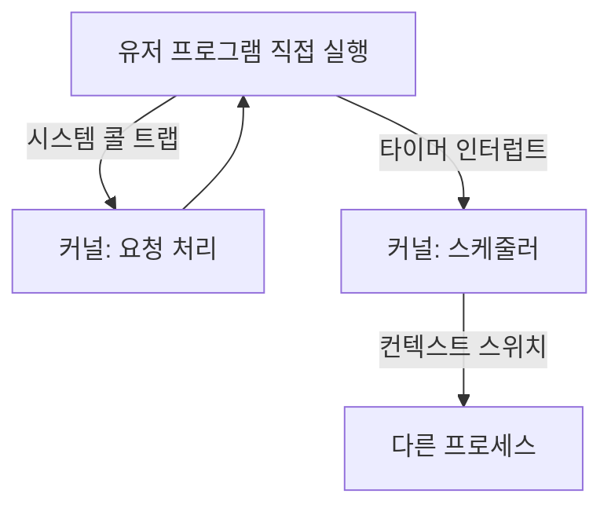

# 제한적 직접 실행 (Limited Direct Execution)

## 한 줄 요약

OS는 프로그램을 CPU에서 직접(빠르게) 돌리되, 위험한 일은 못 하게 제한한다. 이 "직접 실행 + 제한"의 두 축이 유저/커널 모드와 시스템 콜, 그리고 타이머 인터럽트다. 시스템 콜은 공짜가 아니라 실측 100배 비싸다.

## 왜 필요한가

- OS가 어떻게 성능(직접 실행)과 통제(제한)를 동시에 잡나
- 시스템 콜이 함수 호출보다 왜, 얼마나 비싼가
- OS가 어떻게 폭주하는 프로그램에서 제어권을 되찾나

## 딜레마: 빠르게 vs 안전하게

- 프로그램을 CPU에서 그냥 직접 돌리면 빠름. 하지만 아무 짓이나 할 수 있음 (디스크 포맷, 남의 메모리 접근)
- 매 명령을 OS가 검사하면 안전하지만 느려터짐

**해법 = 제한적 직접 실행**: 평소엔 직접(빠름), 위험한 순간에만 OS가 개입(안전). 두 메커니즘으로 구현:

## 제한 1: 유저 모드 vs 커널 모드

CPU가 두 특권 레벨을 하드웨어로 강제 ([[exceptions-and-interrupts]]):

- **유저 모드**: 일반 프로그램. 특권 명령(I/O, 페이지 테이블 변경) 금지
- **커널 모드**: OS. 전부 가능

유저 프로그램이 하드웨어를 쓰려면 커널에 요청 → **시스템 콜**(트랩). 정해진 진입점으로만 커널 진입 → 커널이 요청을 검증. 이 격리가 보호의 핵심.

### 시스템 콜은 비싸다 - 실측

시스템 콜은 모드 전환 + 커널 진입/복귀 오버헤드가 있음. 이 머신에서 실제 트랩하는 시스템 콜 vs 유저공간 처리:

```
raw syscall(getpid): 127.4 ns   ← 실제 커널 트랩
libc getpid()      :   1.3 ns   ← macOS가 유저공간에 캐시 (트랩 안 함)
```

**약 100배 차이.** 두 교훈:

1. 실제 시스템 콜(모드 전환)은 함수 호출(~1ns)보다 두 자릿수 비쌈 → 잦은 시스템 콜은 성능 킬러 (버퍼링, 배치로 줄임)
2. OS는 자주 쓰는 무해한 콜(getpid, gettimeofday)을 **유저공간에서 처리**해 트랩을 회피 (macOS commpage, 리눅스 vDSO). 그래서 libc getpid가 100배 빠름

이게 파일 I/O에서 `read`를 1바이트씩 부르지 말고 버퍼링하라는 이유. `printf`가 내부 버퍼에 모았다가 `write` 한 번으로 내보내는 이유도 이것.

## 제한 2: 타이머 인터럽트로 제어권 회복

문제: 프로그램이 무한 루프에 빠지거나 CPU를 안 놓으면? 협조에만 기대면 악성/버그 프로그램이 시스템을 독점.

해법: **타이머 인터럽트**. 하드웨어 타이머가 주기적(예: 1ms)으로 인터럽트 발생 → 강제로 커널 진입 → 스케줄러가 다른 프로세스로 전환 가능 ([[cpu-scheduling]]).

- 프로그램이 자발적으로 양보 안 해도 OS가 CPU를 되찾음 = **선점형(preemptive)** 멀티태스킹
- 협조형(cooperative)은 프로그램이 양보해야만 전환 → 옛 시스템, 하나가 멈추면 전체 멈춤

## 컨텍스트 스위치

제어권을 얻은 커널이 프로세스 A → B로 바꾸는 과정:

```
1. A의 레지스터 상태를 A의 커널 스택/PCB에 저장
2. B의 저장된 상태를 복원
3. B로 복귀 (유저 모드로)
```

비용:
- **직접 비용**: 레지스터 저장/복원 (수 μs)
- **간접 비용**: 캐시·TLB가 B의 데이터로 채워지며 A의 것 밀려남 → 스위치 후 캐시 미스 폭발 ([[cache-misses]], [[virtual-memory]]). 실제로 이게 더 클 수 있음

컨텍스트 스위치가 잦으면(스레드 과다, 인터럽트 폭주) 이 오버헤드가 성능을 갉아먹음.

## 종합 그림



평소 직접 실행(빠름), 트랩/인터럽트 순간에만 커널 개입(안전). 이것이 현대 OS가 성능과 보호를 동시에 얻는 법.

## 연결

- 모드 전환과 트랩 하드웨어 → [[exceptions-and-interrupts]]
- 타이머 인터럽트 후 누구를 실행할지 → [[cpu-scheduling]]
- 프로세스 상태와 PCB → [[process]]
- 컨텍스트 스위치의 캐시 비용 → [[cache-misses]], [[virtual-memory]]

## 궁금한 것 (나중에)

- [ ] vDSO/commpage가 캐시하는 콜 목록과 원리
- [ ] io_uring이 시스템 콜 오버헤드를 줄이는 법 → [[io-multiplexing]]
- [ ] 컨텍스트 스위치의 간접 비용을 실제 측정하는 법
- [ ] Meltdown 완화(KPTI)가 시스템 콜을 얼마나 느리게 했나

## 출처

- OSTEP 6장 (제한적 직접 실행)
