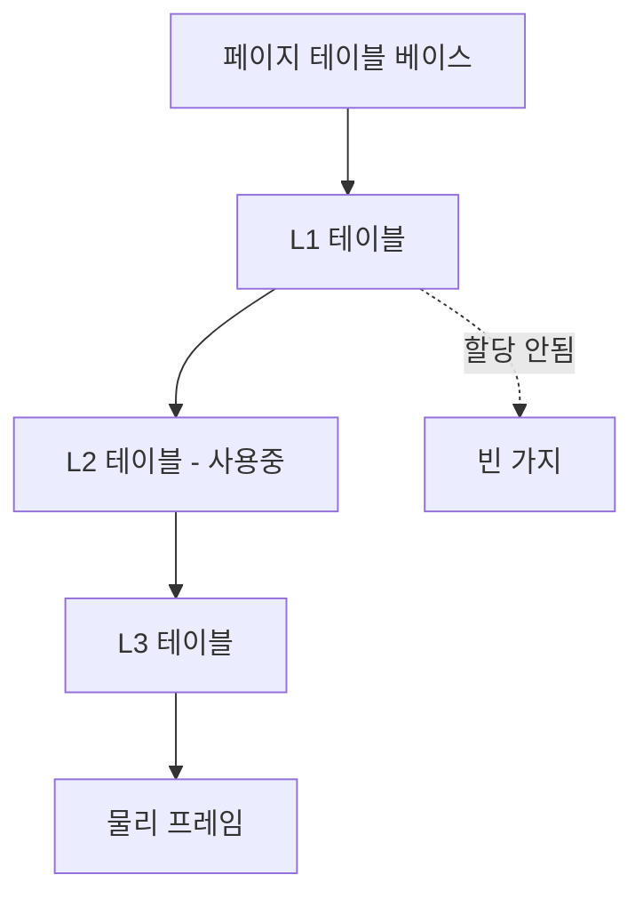

# 페이지 테이블 (Page Tables)

## 한 줄 요약

가상 페이지 번호를 물리 프레임 번호로 매핑하는 자료구조. 통짜로 만들면 거대해서 멀티레벨(트리)로 희소하게 저장한다. OS가 관리하고 하드웨어(MMU)가 순회한다.

## 왜 필요한가

- [[virtual-memory]]의 변환이 실제로 어떤 자료구조로 되나
- 64비트 주소의 페이지 테이블이 왜 문제가 되나
- OS가 각 프로세스 메모리를 어떻게 추적하나

## 기본: 선형 페이지 테이블

각 프로세스마다 배열 하나: **인덱스 = 가상 페이지 번호(VPN), 값 = 물리 프레임 번호(PPN) + 플래그**.

```
페이지 테이블[VPN] = { PPN, valid, 권한(R/W/X), dirty, accessed }
```

변환 ([[segmentation-and-paging]], [[virtual-memory]]):
```
VA = [ VPN | offset ]
PPN = 페이지테이블[VPN].PPN
PA  = [ PPN | offset ]
```

플래그:
- **valid**: 이 페이지가 매핑됐나 (아니면 페이지 폴트)
- **권한**: 읽기/쓰기/실행 (위반 시 폴트 → 세그폴트)
- **dirty**: 수정됐나 (스왑 아웃 시 디스크에 쓸지 판단 → [[swapping]])
- **accessed**: 최근 접근됐나 (교체 정책용)

## 문제: 선형 테이블은 거대하다

32비트 주소, 4KB 페이지 기준:
- VPN = 20비트 → 2²⁰ = 100만 엔트리
- 엔트리당 4B → 프로세스당 **4MB 페이지 테이블**
- 프로세스 100개면 400MB. 대부분 주소 공간은 안 쓰는데(힙-스택 사이 빈 공간) 전부 엔트리 할당

64비트면 상상 불가한 크기. 해결이 필요.

## 해결 1: 멀티레벨 페이지 테이블

VPN을 여러 조각으로 나눠 **트리**로:

```
VA = [ L1 인덱스 | L2 인덱스 | L3 인덱스 | L4 인덱스 | offset ]
```

- 최상위 테이블(L1)만 항상 존재
- 하위 테이블은 **실제 쓰는 영역에만** 할당 (안 쓰는 가지는 없음)
- x86-64는 4레벨, 최신은 5레벨

효과: 희소한 주소 공간을 희소하게 저장. 코드+힙+스택만 쓰면 그 경로의 테이블만 있으면 됨 → 4MB가 수 KB로.

대가: 변환에 여러 번 메모리 접근 (레벨 수만큼 page walk) → **TLB**가 이걸 캐싱해서 감춤 ([[virtual-memory]]). TLB 미스 시에만 전체 순회.



## 해결 2: 다른 구조들

- **역페이지 테이블(inverted)**: 물리 프레임당 하나의 엔트리 (VPN 저장). 크기가 물리 메모리에 비례 → 주소 공간 크기와 무관. 대신 VPN 검색에 해시 필요
- **해시 페이지 테이블**: VPN을 해시해 조회

멀티레벨이 가장 널리 쓰임.

## OS와 하드웨어의 분담

- **하드웨어(MMU)**: 매 접근마다 TLB 조회, 미스면 페이지 테이블 순회(x86은 하드웨어가 순회), TLB 채움
- **OS**: 페이지 테이블 생성/갱신, 페이지 폴트 처리, 프로세스 전환 시 페이지 테이블 베이스 레지스터(x86 CR3) 교체
- 컨텍스트 스위치 시 페이지 테이블이 바뀜 → TLB 무효화(또는 ASID로 구분) → 스위치 후 TLB 미스 증가 ([[limited-direct-execution]])

## 연결

- 하드웨어 변환과 TLB → [[virtual-memory]]
- 왜 페이징인가 → [[segmentation-and-paging]]
- 페이지 폴트와 교체 → [[swapping]]
- 컨텍스트 스위치 시 TLB 비용 → [[limited-direct-execution]]

## 궁금한 것 (나중에)

- [ ] ASID/PCID로 TLB를 프로세스별로 유지하는 법
- [ ] 페이지 테이블 자체도 스왑될 수 있나
- [ ] dirty/accessed 비트를 교체 정책이 실제로 쓰는 법 → [[swapping]]
- [ ] 5레벨 페이징은 언제 필요한가

## 출처

- OSTEP 18-20장 (페이징, 멀티레벨, TLB)
