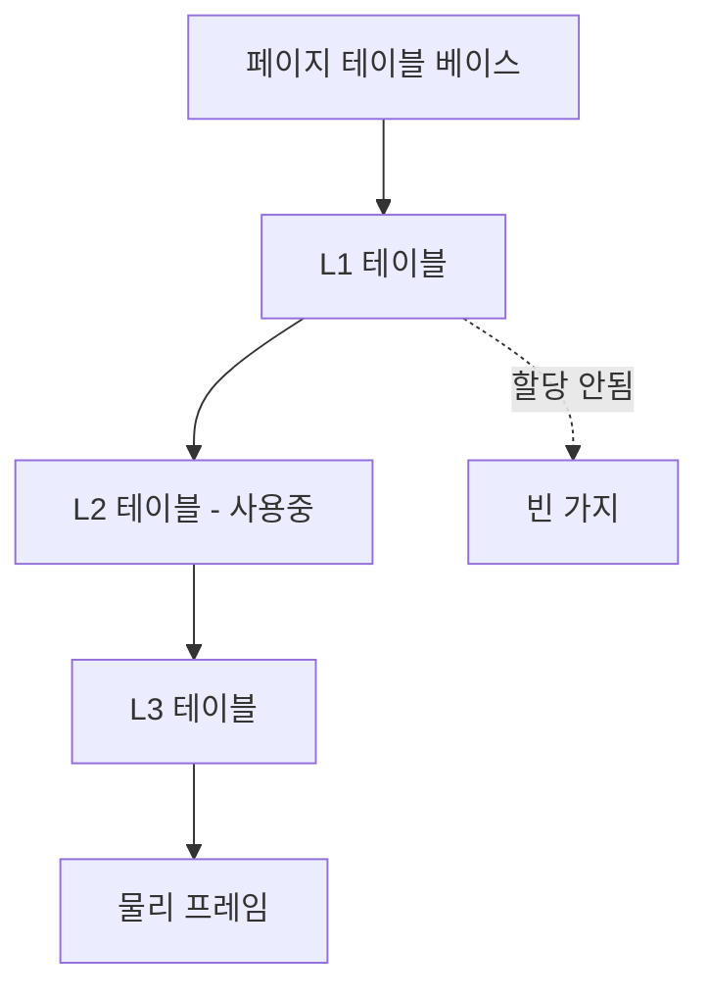

# 페이지 테이블 (Page Tables)

## 한 줄 요약

가상 페이지 번호를 물리 프레임 번호로 매핑하는 자료구조. 통짜로 만들면 거대해서 멀티레벨(트리)로 희소하게 저장한다. OS가 관리하고 하드웨어(MMU)가 순회한다.

## 왜 필요한가

- [[virtual-memory]]의 변환이 실제로 어떤 자료구조로 되나
- 64비트 주소의 페이지 테이블이 왜 문제가 되나
- OS가 각 프로세스 메모리를 어떻게 추적하나

## 기본: 선형 페이지 테이블

각 프로세스마다 배열 하나: **인덱스 = 가상 페이지 번호(VPN), 값 = 물리 프레임 번호(PPN) + 플래그**.

```
페이지 테이블[VPN] = { PPN, valid, 권한(R/W/X), dirty, accessed }
```

변환 ([[segmentation-and-paging]], [[virtual-memory]]):
```
VA = [ VPN | offset ]
PPN = 페이지테이블[VPN].PPN
PA  = [ PPN | offset ]
```

플래그:
- **valid**: 이 페이지가 매핑됐나 (아니면 페이지 폴트)
- **권한**: 읽기/쓰기/실행 (위반 시 폴트 → 세그폴트)
- **dirty**: 수정됐나 (스왑 아웃 시 디스크에 쓸지 판단 → [[swapping]])
- **accessed**: 최근 접근됐나 (교체 정책용)

## 문제: 선형 테이블은 거대하다

32비트 주소, 4KB 페이지 기준:
- VPN = 20비트 → 2²⁰ = 100만 엔트리
- 엔트리당 4B → 프로세스당 **4MB 페이지 테이블**
- 프로세스 100개면 400MB. 대부분 주소 공간은 안 쓰는데(힙-스택 사이 빈 공간) 전부 엔트리 할당

64비트면 상상 불가한 크기. 해결이 필요.

## 해결 1: 멀티레벨 페이지 테이블

VPN을 여러 조각으로 나눠 **트리**로:

```
VA = [ L1 인덱스 | L2 인덱스 | L3 인덱스 | L4 인덱스 | offset ]
```

- 최상위 테이블(L1)만 항상 존재
- 하위 테이블은 **실제 쓰는 영역에만** 할당 (안 쓰는 가지는 없음)
- x86-64는 4레벨, 최신은 5레벨

효과: 희소한 주소 공간을 희소하게 저장. 코드+힙+스택만 쓰면 그 경로의 테이블만 있으면 됨 → 4MB가 수 KB로.

대가: 변환에 여러 번 메모리 접근 (레벨 수만큼 page walk) → **TLB**가 이걸 캐싱해서 감춤 ([[virtual-memory]]). TLB 미스 시에만 전체 순회.



## 해결 2: 다른 구조들

- **역페이지 테이블(inverted)**: 물리 프레임당 하나의 엔트리 (VPN 저장). 크기가 물리 메모리에 비례 → 주소 공간 크기와 무관. 대신 VPN 검색에 해시 필요
- **해시 페이지 테이블**: VPN을 해시해 조회

멀티레벨이 가장 널리 쓰임.

## OS와 하드웨어의 분담

- **하드웨어(MMU)**: 매 접근마다 TLB 조회, 미스면 페이지 테이블 순회(x86은 하드웨어가 순회), TLB 채움
- **OS**: 페이지 테이블 생성/갱신, 페이지 폴트 처리, 프로세스 전환 시 페이지 테이블 베이스 레지스터(x86 CR3) 교체
- 컨텍스트 스위치 시 페이지 테이블이 바뀜 → TLB 무효화(또는 ASID로 구분) → 스위치 후 TLB 미스 증가 ([[limited-direct-execution]])

## 셀프 체크

> [!question]- 선형(단일 레벨) 페이지 테이블이 왜 문제가 되나?
> 인덱스가 VPN인 배열이라, 실제 안 쓰는 주소 영역(힙-스택 사이 빈 공간)까지 전부 엔트리를 할당해야 한다. 32비트·4KB 페이지면 프로세스당 4MB(100만 엔트리 × 4B)라 프로세스 100개면 400MB, 64비트면 상상 불가한 크기가 된다.

> [!question]- 멀티레벨 페이지 테이블이 공간을 절약하는 원리는?
> VPN을 여러 조각으로 쪼개 트리로 만들고, 최상위 테이블만 항상 두되 하위 테이블은 실제 매핑이 있는 경로에만 할당한다. 안 쓰는 가지는 아예 만들지 않으므로 희소한 주소 공간을 희소하게 저장한다. 코드+힙+스택만 쓰면 그 경로 테이블만 있으면 돼 4MB가 수 KB로 줄 수 있다.

> [!question]- 멀티레벨의 대가는 무엇이고 어떻게 감추나?
> 변환 한 번에 레벨 수만큼 메모리를 순회해야 한다(page walk). TLB가 VPN→PPN 변환을 캐싱해 이 비용을 감춘다. TLB 히트면 순회 없이 바로 변환되고, TLB 미스일 때만 전체 순회가 일어난다.

> [!question]- dirty 비트와 accessed 비트는 각각 무엇에 쓰이나?
> dirty는 페이지가 수정됐는지를 나타내 스왑 아웃 시 디스크에 다시 쓸지(수정 안 됐으면 그냥 버림) 판단하는 데 쓴다. accessed는 최근 접근 여부로, 교체 정책(clock 등)이 어떤 페이지를 내보낼지 고르는 데 쓴다.

> [!question]- 컨텍스트 스위치 시 TLB에 무슨 일이 생기나?
> 프로세스가 바뀌면 페이지 테이블 베이스 레지스터(x86 CR3)가 교체돼 매핑이 통째로 달라진다. 이전 프로세스의 TLB 엔트리는 무효화되거나(또는 ASID/PCID로 프로세스별 구분) 스위치 직후 TLB 미스가 늘어 변환 비용이 증가한다.

## 연습문제

> [!example]- 문제: 32비트 주소, 4KB 페이지, 엔트리 4B인 선형 페이지 테이블의 크기를 계산하고, 100개 프로세스면 총 몇 MB인지 구하라.
> **풀이**
> - offset = 12비트(4KB=2¹²), VPN = 32-12 = 20비트 → 엔트리 수 = 2²⁰ = 1,048,576.
> - 테이블 크기 = 2²⁰ × 4B = 4MiB / 프로세스.
> - 100 프로세스 = 400MiB. 대부분이 안 쓰는 영역인데도 전부 할당된다는 게 핵심 낭비 지점이다.

> [!example]- 문제: 4KB 페이지에서 가상 주소 0x00003ABC의 VPN과 offset을 구하고, 페이지 테이블[VPN].PPN = 0x5인 경우 물리 주소를 구하라.
> **풀이**
> - offset = 하위 12비트 = 0xABC (0x00003ABC & 0xFFF).
> - VPN = 0x00003ABC >> 12 = 0x3.
> - PA = (PPN << 12) | offset = (0x5 << 12) | 0xABC = 0x5000 | 0xABC = 0x5ABC. offset은 변환에서 그대로 유지된다.

> [!example]- 문제: x86-64 4레벨 페이징에서 TLB 미스가 난 접근 한 번에 데이터를 얻기까지 최대 몇 번의 메모리 접근이 필요한지 구하고, TLB가 왜 필수인지 설명하라.
> **풀이**
> page walk에 레벨당 1번씩 4번(L1→L2→L3→L4 테이블 읽기) + 실제 데이터 접근 1번 = 총 5번. 즉 TLB 미스 한 번이 메모리 접근을 5배로 부풀린다. 매 명령마다 이러면 치명적이므로, TLB가 최근 변환을 캐싱해 대부분의 접근을 히트로 만들어 순회를 건너뛰게 하는 것이 필수다.

## 파인만

> [!note]- 백지에 이 노트 핵심을 남에게 설명하듯 써보라. 막히면 그 부분만 다시.
> **점검 포인트**: 이해했다면 답할 수 있어야 하는 3가지.
> 1. VA를 VPN+offset으로 쪼개 PPN을 찾아 PA를 조립하는 변환 과정을 그림 없이 설명할 수 있는가.
> 2. 선형 테이블의 크기 문제를 멀티레벨이 어떻게(희소 저장) 푸는지, 그 대가(page walk)와 TLB의 역할까지 말할 수 있는가.
> 3. OS와 MMU의 분담(누가 테이블을 만들고, 누가 순회하고 TLB를 채우는가)을 구분할 수 있는가.

## 연결

- 하드웨어 변환과 TLB → [[virtual-memory]]
- 왜 페이징인가 → [[segmentation-and-paging]]
- 페이지 폴트와 교체 → [[swapping]]
- 컨텍스트 스위치 시 TLB 비용 → [[limited-direct-execution]]
- 멀티레벨 = 비트 접두어 트리 → data-structures/[[tries]]

## 궁금한 것 (나중에)

- [ ] ASID/PCID로 TLB를 프로세스별로 유지하는 법
- [ ] 페이지 테이블 자체도 스왑될 수 있나
- [ ] dirty/accessed 비트를 교체 정책이 실제로 쓰는 법 → [[swapping]]
- [ ] 5레벨 페이징은 언제 필요한가

## 출처

- OSTEP 18-20장 (페이징, 멀티레벨, TLB)
