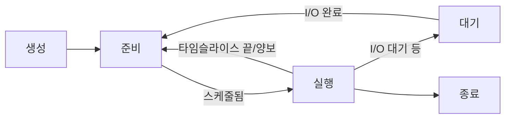

# 프로세스 (Process)

## 한 줄 요약

프로세스는 실행 중인 프로그램의 인스턴스다. OS가 각 프로세스에게 "CPU를 독점하고 메모리를 통째로 가진 것 같은" 환상을 준다. fork로 복제하고 exec로 새 프로그램을 덮어씌우는 게 유닉스 프로세스 생성의 핵심.

## 왜 필요한가

- 프로그램(디스크의 파일)과 프로세스(실행 중 인스턴스)의 차이
- 셸이 명령어를 어떻게 실행하나 (fork + exec)
- 좀비/고아 프로세스가 뭔지
- OS 가상화의 첫 단추 → 이후 스케줄링([[cpu-scheduling]]), 메모리([[address-spaces]])

## 프로세스 = 프로그램 + 실행 상태

프로그램은 디스크의 정적 파일(코드 + 데이터). **프로세스**는 그것을 실행하며 생긴 동적 실체:

- **주소 공간**: 코드, 데이터, 힙, 스택 ([[address-spaces]])
- **레지스터 상태**: PC(다음 명령), SP(스택), 범용 레지스터
- **열린 파일**: 파일 디스크립터 테이블 (stdin/out/err 포함)
- **커널 상태**: PID, 상태, 우선순위 등 (PCB)

OS는 이 전부를 **PCB(Process Control Block)**에 담아 관리. 하나의 프로그램에서 여러 프로세스가 생길 수 있음 (같은 프로그램 여러 번 실행).

## 프로세스 상태 전이



- **Running**: CPU에서 실행 중 (코어당 하나)
- **Ready**: 실행 가능, CPU 배정 대기
- **Blocked**: I/O 등 이벤트 대기 (CPU 줘도 못 함)

Running↔Ready 전환이 스케줄러의 일 ([[cpu-scheduling]]). Blocked는 타이머 인터럽트가 아니라 자원 대기 → I/O 완료 인터럽트로 깨어남 ([[exceptions-and-interrupts]]).

## fork: 프로세스 복제

`fork()`는 현재 프로세스를 **거의 그대로 복제**. 한 번 호출되는데 **두 번 반환**:

```c
pid_t p = fork();
if (p == 0) {
    // 자식: fork가 0을 반환
} else {
    // 부모: fork가 자식의 PID를 반환
}
```

이 머신 실측:

```
parent pid=32761
  child: fork ret=0, my pid=32762, parent=32761
parent: fork ret=32762 (child pid), child exited 42
```

- 부모: `fork` = 32762 (자식 PID)
- 자식: `fork` = 0, 자기 PID는 32762, 부모는 32761
- 복제 직후 둘은 독립 (자식이 변수 바꿔도 부모에 영향 없음) - 주소 공간이 분리됨. 실제로는 **copy-on-write**로 실제 복사는 쓸 때만 → [[address-spaces]]

## exec: 프로그램 교체

`exec` 계열은 **현재 프로세스의 주소 공간을 새 프로그램으로 통째 덮어씀**. PID는 유지, 내용물만 교체. 성공하면 돌아오지 않음(원래 코드가 사라짐).

### fork + exec = 유닉스 철학

셸이 `ls`를 실행하는 법:

```
1. fork() → 셸의 복제본(자식) 생성
2. 자식에서 exec("ls") → 자식이 ls로 변신
3. 부모(셸)는 wait()로 자식 종료 대기
```

**왜 두 단계로 나눴나**: fork와 exec 사이에서 자식의 환경을 조정할 수 있음 - 파일 디스크립터 리다이렉트(`>`), 파이프 연결(`|`) 등. 이 분리가 유닉스의 조합성을 만듦. → [[io-devices]]의 리다이렉션.

## wait: 자식 수확과 좀비

`wait()`/`waitpid()`로 부모가 자식의 종료를 기다리고 **종료 상태를 수확**:

- **좀비(zombie)**: 자식이 죽었는데 부모가 wait 안 함 → 종료 상태를 PCB에 남긴 채 잔존. 리소스는 거의 없지만 PID 점유
- **고아(orphan)**: 부모가 먼저 죽음 → init(PID 1)이 입양해서 대신 수확
- 서버가 자식을 계속 만들며 wait 안 하면 좀비 누적 → PID 고갈 버그

## 관련 시스템 콜 정리

| 콜 | 하는 일 |
|---|---|
| `fork()` | 프로세스 복제 (2번 반환) |
| `exec*()` | 주소 공간을 새 프로그램으로 교체 |
| `wait()`/`waitpid()` | 자식 종료 대기 + 상태 수확 |
| `exit()` | 프로세스 종료 |
| `getpid()`/`getppid()` | 자기/부모 PID |
| `kill()` | 시그널 전송 |

전부 트랩으로 커널에 진입 ([[exceptions-and-interrupts]]).

## 연결

- 프로세스가 CPU를 나눠 쓰는 법 → [[cpu-scheduling]], [[limited-direct-execution]]
- 프로세스의 메모리 → [[address-spaces]]
- 스레드 (프로세스 안의 실행 흐름) → [[process-vs-thread]]
- 시스템 콜 메커니즘 → [[exceptions-and-interrupts]]

## 궁금한 것 (나중에)

- [ ] copy-on-write가 fork를 싸게 만드는 구체적 원리 → [[address-spaces]]
- [ ] vfork, posix_spawn은 왜 따로 있나
- [ ] 시그널 처리의 복잡성 (async-signal-safe 함수)
- [ ] 컨테이너의 PID namespace는 이 그림을 어떻게 바꾸나 → [[virtualization-and-containers]]

## 출처

- OSTEP 4장 (프로세스), 5장 (fork/exec/wait)
