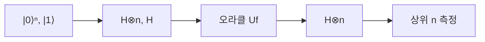

# 도이치-조사 알고리즘 (Deutsch-Jozsa Algorithm)

## 한 줄 요약

도이치-조사(Deutsch-Jozsa)는 양자 컴퓨터가 고전보다 **확실히 빠른** 첫 예시다. 함수 f가 상수(constant)인지 균형(balanced)인지를 고전은 최악 2ⁿ⁻¹+1번 호출해야 하지만, 양자는 오라클(oracle)을 **단 한 번** 호출해 판정한다. 핵심 기법은 모든 입력을 동시에 계산하는 **양자 병렬성**(quantum parallelism)과, 답을 위상에 실어 간섭시키는 **위상 킥백**(phase kickback)이다. 실용성보단 "양자 우위가 진짜 존재함"을 보인 개념 증명이다.

## 왜 필요한가

- 양자 병렬성 + 간섭이 실제로 이득을 준다는 최초의 명확한 증명
- 위상 킥백은 이후 모든 주요 알고리즘의 재료 → [[grover-search]], [[shor-algorithm]]
- 오라클 모델(query complexity)에서 양자-고전 분리를 이해하는 출발점
- 중첩([[qubits-and-superposition]])과 게이트([[quantum-gates]])가 어떻게 결합해 계산이 되는지 첫 실전 예

## 문제 정의

f: {0,1}ⁿ → {0,1} 가 둘 중 하나임을 보장(promise problem):

| 종류 | 정의 |
|---|---|
| 상수(constant) | 모든 입력에 같은 값 (전부 0 또는 전부 1) |
| 균형(balanced) | 입력의 정확히 절반은 0, 절반은 1 |

- 목표: 오라클 호출을 최소로 어느 쪽인지 판정
- **고전 최악**: 절반+1 = 2ⁿ⁻¹+1 번 (그 전까진 확신 불가)
- **양자**: 1번

## 오라클과 위상 킥백

오라클 Uf: `|x⟩|y⟩` → `|x⟩|y⊕f(x)⟩` (가역, → [[quantum-gates]])

보조 큐빗을 `|−⟩` = (`|0⟩`−`|1⟩`)/√2 로 두면:

```
Uf |x⟩|−⟩ = (−1)^f(x) |x⟩|−⟩
```

- f(x) 값이 보조 큐빗의 뒤집기 대신 **위상 (−1)^f(x)** 로 입력 큐빗에 실림
- 이것이 **위상 킥백**(phase kickback) - 값을 진폭의 부호로 변환
- 보조 큐빗은 변하지 않고 계산에서 "촉매" 역할

## 회로 흐름



1. 입력 n큐빗 `|0⟩`, 보조 1큐빗 `|1⟩`
2. 전부에 H → 입력은 2ⁿ 균등 중첩, 보조는 `|−⟩`
3. Uf 적용 → 각 기저에 (−1)^f(x) 위상 부착
4. 입력에 다시 H → 위상들이 **간섭**(interference)
5. 상위 n큐빗 측정

## 결과 해석

측정 결과로 즉시 판정:

| 측정 결과 | 결론 |
|---|---|
| `|00…0⟩` (전부 0) | **상수** |
| 그 외 (하나라도 1) | **균형** |

- 상수면 모든 위상이 같아 H 후 진폭이 `|00…0⟩`에 100% 몰림(보강 간섭)
- 균형이면 `|00…0⟩` 진폭이 정확히 상쇄(소멸 간섭)돼 0 → 절대 안 나옴
- 확률적이 아니라 **결정론적**(deterministic) 판정

## 왜 빠른가 (핵심)

- 병렬성만으론 부족: 2ⁿ 답이 진폭에 있어도 측정하면 하나만 무작위로 나옴
- **간섭**이 관건: 원하는 전역 정보(상수/균형)를 한 큐빗 패턴으로 몰아줌
- 양자 우위 = 중첩으로 펼치고, 간섭으로 답을 모으고, 측정으로 뽑기
- 이 삼단 구조가 모든 양자 알고리즘의 뼈대

## 한계와 의의

- promise problem이라 실용적 쓸모는 거의 없음(입력 보장이 비현실적)
- 오라클 모델에서만 지수 분리 - 실제 f 회로 크기는 별개
- 그러나 **BQP ≠ P 가능성**을 시사하는 초기 증거 → complexity-theory/[[beyond-np]]
- Deutsch(1985) 단일 큐빗판 → Deutsch-Jozsa(1992) 일반화 → Bernstein-Vazirani, Simon으로 발전

## 셀프 체크

> [!question]- 위상 킥백이란 무엇이고, 왜 보조 큐빗을 `|−⟩`로 두는가?
> 오라클 Uf가 `|x⟩|y⟩` → `|x⟩|y⊕f(x)⟩`로 작용할 때, 보조를 `|−⟩`로 두면 f(x)가 보조 큐빗을 뒤집는 대신 입력 큐빗에 위상 (−1)^f(x)로 실린다. 즉 함수 값이 진폭의 부호로 변환되고, 보조는 변하지 않고 촉매 역할만 한다. 이 위상 차이가 이후 간섭의 재료가 된다.

> [!question]- 상수/균형 판정에서 왜 `|00…0⟩` 측정이 상수를 의미하는가?
> 상수 함수면 모든 기저의 위상이 동일해, 마지막 H⊗n 후 진폭이 `|00…0⟩`에 100% 보강 간섭으로 몰린다. 균형 함수면 `|00…0⟩` 진폭이 정확히 소멸 간섭으로 상쇄돼 절대 나오지 않는다. 따라서 하나라도 1이 측정되면 균형이다.

> [!question]- 양자 병렬성만으로는 왜 부족하고, 무엇이 이득의 핵심인가?
> 2ⁿ개 답이 진폭에 담겨 있어도 측정하면 무작위로 하나만 나오므로 병렬성만으론 이득이 없다. 핵심은 간섭으로, 원하는 전역 정보(상수/균형)를 특정 큐빗 패턴에 몰아준다. 펼치고(중첩)-모으고(간섭)-뽑는(측정) 삼단 구조가 양자 우위의 뼈대다.

> [!question]- 도이치-조사가 실용성이 낮다고 평가받는 이유는?
> f가 상수 아니면 균형임을 보장하는 promise problem이라, 그런 입력 보장이 비현실적이다. 또 지수 분리는 오라클(query) 모델에서만 성립하고 실제 f 회로 크기는 별개다. 실용 도구라기보다 양자 우위가 존재함을 보인 개념 증명이다.

## 연습문제

> [!example]- 문제: n=1일 때 f(0)=0, f(1)=1(균형)인 경우 도이치 회로를 손계산해 측정 결과를 유도하라.
> **풀이**
> 초기 상태: `|0⟩|1⟩`. 두 큐빗에 H → (`|0⟩`+`|1⟩`)/√2 ⊗ `|−⟩`.
> 위상 킥백으로 Uf 적용 시 각 기저에 (−1)^f(x): x=0은 +, x=1은 −.
> 입력 큐빗 상태 → (`|0⟩` − `|1⟩`)/√2 = `|−⟩` (보조는 `|−⟩` 유지).
> 입력에 다시 H: H`|−⟩` = `|1⟩`.
> 측정 결과 = 1 (0이 아님) → 균형. 결정론적으로 정답.

> [!example]- 문제: `|−⟩`에 X 게이트를 적용하면 어떤 상태가 되는지 계산하고, 이것이 위상 킥백과 어떤 관련이 있는지 설명하라.
> **풀이**
> `|−⟩` = (`|0⟩` − `|1⟩`)/√2. X는 `|0⟩`↔`|1⟩` 교환.
> X`|−⟩` = (`|1⟩` − `|0⟩`)/√2 = −(`|0⟩` − `|1⟩`)/√2 = −`|−⟩`.
> 즉 `|−⟩`는 X의 고유벡터이고 고윳값이 −1이다. Uf가 f(x)=1인 항에 X를 거는 것과 같으므로, 그 항에 −1 위상이 붙는다. 이것이 위상 킥백의 정확한 메커니즘이다.

## 파인만

> [!note]- 백지에 이 노트 핵심을 남에게 설명하듯 써보라. 막히면 그 부분만 다시.
> **점검 포인트**: (1) 위상 킥백으로 f(x)가 어떻게 (−1)^f(x) 위상이 되는지 유도할 수 있는가. (2) 상수/균형이 왜 각각 보강/소멸 간섭으로 갈리는지 설명할 수 있는가. (3) 중첩-간섭-측정 삼단 구조에서 간섭이 왜 결정적인지 말할 수 있는가.

## 연결

- 중첩과 `|−⟩` 상태 → [[qubits-and-superposition]]
- H·오라클 게이트 → [[quantum-gates]]
- 같은 킥백 기법의 발전 → [[grover-search]], [[shor-algorithm]]
- 양자 복잡도 클래스(BQP) → complexity-theory/[[beyond-np]], algorithms/[[p-vs-np]]

## 궁금한 것 (나중에)

- [ ] Bernstein-Vazirani (숨은 문자열 찾기)
- [ ] Simon 알고리즘 (지수 분리, Shor의 전신)
- [ ] 오라클 없이도 지수 분리가 성립하나 (relativization 한계)
- [ ] 단일 큐빗 Deutsch 회로 손계산

## 출처

- Nielsen & Chuang 1.4.3-1.4.4 (Deutsch, Deutsch-Jozsa)
- Qiskit textbook: Deutsch-Jozsa Algorithm
