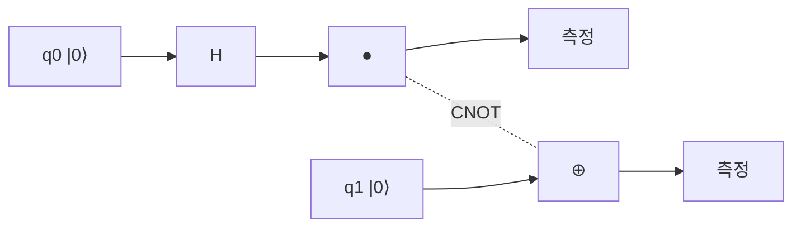

# 얽힘 (Entanglement)

## 한 줄 요약

얽힘(entanglement)은 두 개 이상의 큐빗이 **개별 상태로 분해되지 않는**(non-separable) 하나의 결합 상태에 있는 현상이다. 벨 상태(Bell state) (`|00⟩`+`|11⟩`)/√2 처럼, 한 큐빗의 측정 결과가 멀리 떨어진 다른 큐빗과 상관(correlation)을 가진다. EPR 역설과 벨 부등식(Bell inequality) 위반은 이 상관이 고전적 숨은 변수로 설명 안 됨(비국소성, non-locality)을 보인다. 텐서곱 ⊗ 로 형식화하며, 양자 우위의 핵심 자원이다.

## 왜 필요한가

- 양자 알고리즘의 계산력 원천 중 하나 - 중첩만으론 부족
- 양자 순간이동(teleportation), 초고밀도 부호화, 양자 암호(BB84)의 기반
- "왜 양자가 고전과 근본적으로 다른가"를 벨 부등식이 실험으로 확정
- 얽힘 상태의 관리가 오류 정정과 하드웨어의 핵심 난제 → [[quantum-error-correction]]

## 텐서곱과 분리 가능성

두 큐빗의 결합 상태 공간은 텐서곱 ⊗ (2×2 = 4차원):

```
|a⟩ ⊗ |b⟩ ,  기저: |00⟩, |01⟩, |10⟩, |11⟩
```

- **분리 가능**(separable): `|ψ⟩` = `|a⟩`⊗`|b⟩` 로 쓸 수 있음 → 얽힘 없음
- **얽힘**(entangled): 어떤 `|a⟩`, `|b⟩` 로도 분해 불가

| 상태 | 분해 | 얽힘? |
|---|---|---|
| `|00⟩` | `|0⟩⊗|0⟩` | 아니오 |
| (`|00⟩`+`|01⟩`)/√2 | `|0⟩⊗|+⟩` | 아니오 |
| (`|00⟩`+`|11⟩`)/√2 | 불가능 | **예** |

## 벨 상태 (Bell states)

최대 얽힘 2큐빗 상태 4개, CNOT·H로 생성:

| 이름 | 상태 |
|---|---|
| Φ⁺ | (`|00⟩` + `|11⟩`)/√2 |
| Φ⁻ | (`|00⟩` − `|11⟩`)/√2 |
| Ψ⁺ | (`|01⟩` + `|10⟩`)/√2 |
| Ψ⁻ | (`|01⟩` − `|10⟩`)/√2 |

생성 회로:



Φ⁺에서 q0을 측정해 0이 나오면 q1도 반드시 0, 1이면 q1도 1 - 100% 상관.

## EPR와 측정 상관

Einstein-Podolsky-Rosen(1935)의 문제 제기:

- Φ⁺의 두 큐빗을 멀리 떨어뜨려도 측정 상관은 즉시 유지됨
- EPR: "양자역학이 불완전하고 미리 정해진 숨은 변수(hidden variable)가 있는 것 아닌가"
- 주의: 상관은 있어도 **정보 전달은 안 됨** - 각 측정 결과 자체는 무작위 → 광속 위반 아님(no-signaling)

## 벨 부등식 (Bell inequality)

숨은 변수 이론이 만족해야 하는 부등식(CHSH 형태):

```
|S| ≤ 2      (국소 숨은 변수, local hidden variable)
```

- 양자역학 예측: S = 2√2 ≈ 2.83 → **부등식 위반**
- Aspect(1982) 이래 실험이 위반 확인, 2015년 loophole-free 실험으로 확정
- 결론: 자연은 **국소적 실재론(local realism)을 만족하지 않음** = 비국소성
- 2022 노벨 물리학상(Aspect, Clauser, Zeilinger)

## 비국소성의 의미

| 관점 | 내용 |
|---|---|
| 국소성 | 멀리 떨어진 사건은 즉시 서로 영향 못 줌 |
| 실재론 | 측정 전에도 값이 정해져 있음 |
| 벨 위반 | 둘 다 유지 불가 - 적어도 하나 포기 |

- 얽힘은 "숨은 신호"가 아니라 상관 구조 자체가 고전을 넘어섬
- no-signaling 정리: 얽힘으로 초광속 통신 불가 (측정 통계만으론 상대 조작 감지 못 함)

## 응용

- **양자 순간이동**(teleportation): 얽힘 + 고전 2비트로 미지 상태 전송(복제 아님)
- **초고밀도 부호화**(superdense coding): 1큐빗으로 2고전비트 전달
- **양자 암호**: 얽힘/중첩 기반 키 분배(도청 시 상관 붕괴 감지)
- **알고리즘**: Shor·Grover의 중간 상태가 대규모 얽힘 → [[shor-algorithm]]

## 연결

- 텐서곱·상태 벡터 → [[qubits-and-superposition]], math/[[vectors-and-matrices]]
- 얽힘 생성 게이트(CNOT) → [[quantum-gates]]
- 측정 상관과 확률 → math/[[probability-basics]]
- 알고리즘에서의 활용 → [[shor-algorithm]], [[grover-search]]
- 얽힘 보호 → [[quantum-error-correction]]

## 궁금한 것 (나중에)

- [ ] CHSH 부등식 유도와 2√2 (Tsirelson bound)
- [ ] GHZ 상태 (3큐빗 얽힘)로 벨 정리 결정론적 반박
- [ ] 얽힘 엔트로피(entanglement entropy) 정량화
- [ ] 양자 순간이동 회로 상세

## 출처

- Nielsen & Chuang 1.3.7, 2.6 (EPR, 벨 부등식)
- Qiskit textbook: Multiple Qubits and Entanglement
