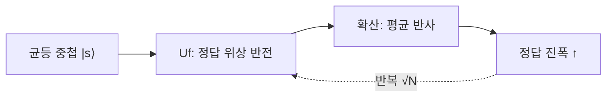

# 그로버 탐색 (Grover Search)

## 한 줄 요약

그로버(Grover) 알고리즘은 정렬 안 된 N개 항목에서 조건을 만족하는 원소를 찾는데, 고전이 평균 N/2번 봐야 하는 것을 **√N 번**으로 줄인다(제곱 가속, quadratic speedup). 핵심은 **진폭 증폭**(amplitude amplification) - 오라클로 정답에 위상을 표시하고, 확산 연산자(diffusion)로 평균 중심 반사를 반복해 정답 진폭을 키운다. 기하학적으로는 상태 벡터를 정답 방향으로 조금씩 회전시키는 것이며, √N 이 **최적**임이 증명돼 있다.

## 왜 필요한가

- 비정렬 탐색은 데이터베이스·제약 만족·NP 문제 무차별 대입 등 어디에나 있음
- 제곱 가속은 지수(Shor)만큼 극적이진 않지만 훨씬 넓게 적용됨
- 진폭 증폭은 여러 양자 알고리즘의 부품(subroutine)
- 대칭키 암호 키 크기를 실질 절반으로 위협(예: AES-128 → 64비트 안전) → security/[[crypto-basics]]

## 문제 정의

- N = 2ⁿ 개 항목, 그중 M개가 "정답"(f(x)=1)
- 오라클 f 만 주어짐 - 내부 구조 없음(unstructured)
- 목표: 정답 하나 찾기

| 방법 | 질의 횟수 |
|---|---|
| 고전(최악) | N |
| 고전(평균) | N/2 |
| 그로버 | ≈ (π/4)√(N/M) |

## 두 연산자

**오라클 (위상 반전)**: 정답의 진폭 부호만 뒤집음

```
Uf |x⟩ = (−1)^f(x) |x⟩     (위상 킥백, → deutsch-jozsa)
```

**확산 연산자 (평균 중심 반사)**: 모든 진폭을 평균에 대해 반사

```
D = 2|s⟩⟨s| − I ,  |s⟩ = 균등 중첩
```

- 정답은 아래로 뒤집혔다가 평균 반사로 위로 크게 튐 → 진폭 증가
- 오답들은 조금씩 줄어듦

## 진폭 증폭 (그로버 반복)

한 번의 반복 G = D · Uf:



- 반복 1회마다 정답 진폭이 일정량 상승
- 약 (π/4)√N 회 반복 후 측정하면 높은 확률로 정답
- 초기화(H⊗n) → G 반복 → 측정 순

## 기하학적 해석

상태를 2차원 평면에서 봄: 정답 축 `|w⟩`, 오답 축 `|w⊥⟩`.

- 초기 상태 `|s⟩`는 `|w⊥⟩`에서 작은 각 θ 만큼 기울어짐 (sin θ = √(M/N))
- Uf = `|w⊥⟩` 축 대칭(반사)
- D = `|s⟩` 축 대칭(반사)
- **두 반사 = 회전** → 매 반복마다 `|w⟩` 쪽으로 각 2θ 회전
- (π/2)/(2θ) ≈ (π/4)√(N/M) 회면 `|w⟩`에 도달

## 과회전 주의

- 반복을 너무 많이 하면 정답을 **지나쳐** 진폭이 다시 감소
- 최적 횟수 근처에서 멈춰야 함 - 무작정 반복은 역효과
- M(정답 수)을 모르면 횟수 추정이 어려움 → 양자 카운팅(quantum counting)으로 M 추정

## 최적성

- Grover는 **점근적으로 최적**: 어떤 양자 알고리즘도 Ω(√N) 질의 필요(BBBV 하한)
- 즉 비정렬 탐색에서 제곱 가속 이상은 불가능
- 지수 가속이 아닌 이유: 구조 없는 오라클에는 착취할 대칭이 없음
- 대조: Shor는 문제에 주기 구조가 있어 지수 가속 → [[shor-algorithm]]

## 응용과 함의

| 분야 | 효과 |
|---|---|
| 대칭키 암호 | 키 탐색 2ⁿ → 2^(n/2), 키 길이 2배 권장 |
| NP 무차별 대입 | 2ⁿ → 2^(n/2) (여전히 지수라 다항 아님) |
| 최솟값 찾기 | 그로버 기반 √N |
| 제약 만족 | 진폭 증폭으로 가속 |

- NP-완전을 다항으로 풀진 못함 - 제곱 가속일 뿐 → complexity-theory/[[beyond-np]]

## 연결

- 위상 킥백·오라클 → [[deutsch-jozsa]]
- 중첩·측정 → [[qubits-and-superposition]]
- 반사·회전의 선형대수 → math/[[vectors-and-matrices]], math/[[eigenvalues]]
- 암호 영향 → security/[[crypto-basics]], cryptography/[[public-key-crypto]]
- 지수 가속 대조 → [[shor-algorithm]]

## 궁금한 것 (나중에)

- [ ] BBBV 하한 증명 개요 (왜 √N 최적)
- [ ] 양자 카운팅 (M 모를 때 추정)
- [ ] 진폭 증폭의 일반화 (임의 알고리즘 성공률 증폭)
- [ ] 다중 정답일 때 과회전 회피 전략

## 출처

- Nielsen & Chuang 6장 (양자 탐색 알고리즘)
- Qiskit textbook: Grover's Algorithm
