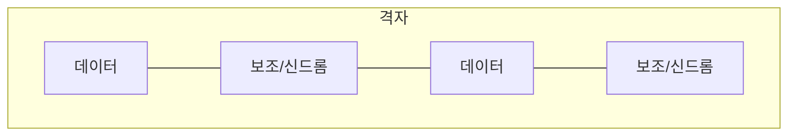

# 양자 오류 정정 (Quantum Error Correction)

## 한 줄 요약

양자 오류 정정(QEC, Quantum Error Correction)은 노이즈와 결어긋남(decoherence)으로 망가지는 큐빗을 여러 물리 큐빗에 정보를 분산해 보호하는 기법이다. 고전과 달리 **복제 불가**(no-cloning)와 **측정 붕괴** 제약이 있어, 상태를 직접 읽지 않고 **신드롬 측정**(syndrome measurement)으로 오류만 감지한다. 3큐빗 코드에서 시작해 표면 코드(surface code)로 확장하며, 물리 오류율이 **임계값**(threshold) 아래면 논리 오류를 원하는 만큼 줄이는 결함 허용(fault-tolerant) 계산이 가능하다.

## 왜 필요한가

- 큐빗은 극도로 취약 - 쇼어·그로버 같은 긴 회로는 정정 없이는 불가능 → [[shor-algorithm]]
- 현재 NISQ 하드웨어의 노이즈가 실용화의 최대 장벽 → [[nisq-and-hardware]]
- "이론적 양자 컴퓨터"와 "물리적 큐빗" 사이의 다리
- 임계값 정리는 대규모 양자 컴퓨팅이 원리적으로 가능함을 보장

## 양자 노이즈의 특수성

| 제약 | 고전 | 양자 |
|---|---|---|
| 복제 | 가능(3중화) | **불가**(no-cloning) |
| 오류 종류 | 비트 뒤집기만 | 비트(X) + 위상(Z) 뒤집기 |
| 상태 읽기 | 자유 | 측정하면 **붕괴** |
| 오류 값 | 이산 | 연속(작은 회전도 누적) |

- 결어긋남(decoherence): 환경과 얽혀 중첩·위상이 소실됨 → 큐빗이 고전화
- T1(에너지 완화), T2(위상 완화) 시간으로 수명 측정 → [[nisq-and-hardware]]

## 핵심 아이디어

직접 못 읽는데 어떻게 정정하나:

- **정보 분산**: 1 논리 큐빗을 여러 물리 큐빗의 얽힌 상태로 인코딩 → [[entanglement]]
- **신드롬 측정**: 데이터가 아닌 "패리티(parity)"만 보조 큐빗으로 측정 → 상태는 붕괴 안 시키고 오류 위치만 노출
- **오류 이산화**: 연속 오류도 측정하면 X/Z 이산 오류로 사영됨 → 이산 정정으로 충분

## 3큐빗 비트 뒤집기 코드

가장 단순한 코드, 비트 뒤집기(X 오류)만 방어:

```
|0⟩_L = |000⟩ ,  |1⟩_L = |111⟩
```

- 인코딩: CNOT 2개로 `|ψ⟩|00⟩` → α`|000⟩`+β`|111⟩`
- 신드롬: 큐빗쌍 패리티 Z₁Z₂, Z₂Z₃ 측정 (값 자체는 안 봄)

| Z₁Z₂ | Z₂Z₃ | 진단 |
|---|---|---|
| + | + | 오류 없음 |
| − | + | 큐빗1 뒤집힘 |
| − | − | 큐빗2 뒤집힘 |
| + | − | 큐빗3 뒤집힘 |

- 다수결이 아니라 패리티로 위치 특정 → 해당 큐빗에 X 적용해 복구
- 위상 뒤집기(Z)는 하다마드 기저의 같은 코드로 방어 → 둘을 합친 게 **9큐빗 쇼어 코드**

## 표면 코드 (surface code)

현재 가장 유력한 실용 코드:



- 2D 격자에 데이터 큐빗 + 신드롬 큐빗 배치, **국소 이웃끼리만** 상호작용
- 이웃 연결만 필요 → 초전도 큐빗 하드웨어에 적합 → [[nisq-and-hardware]]
- 높은 임계값(≈1%)으로 실현 가능성 큼
- **논리 큐빗 하나에 물리 큐빗 수백~수천 개** 필요 - 오버헤드가 큼
- 코드 거리 d를 키우면 논리 오류율이 지수적으로 감소

## 결함 허용과 임계값 정리

- **결함 허용**(fault-tolerant): 게이트·측정·정정 과정 자체의 오류가 퍼지지 않게 설계
- **임계값 정리**(threshold theorem): 물리 오류율 p가 임계값 p_th 아래면, 코드를 키워 논리 오류율을 임의로 낮출 수 있음

```
p < p_th  ⟹  논리 오류율 임의로 감소 (다항 오버헤드로)
```

- 표면 코드 p_th ≈ 1% - 현재 하드웨어가 근접·도달 중
- 넘으면 코드를 키울수록 오히려 나빠짐 → 하드웨어 충실도가 관건

## 오버헤드 현실

| 항목 | 규모 |
|---|---|
| 논리 큐빗당 물리 큐빗 | 10²~10³ |
| 2048비트 RSA 쇼어 | 수백만 물리 큐빗 추정 |
| 현재(2020년대 중반) | 수백~수천 물리 큐빗 |

- 그래서 쇼어 실현은 아직 멀고, NISQ 시대는 정정 없이 짧은 회로만 → [[nisq-and-hardware]]

## 셀프 체크

> [!question]- 양자 오류 정정이 고전과 근본적으로 다른 세 가지 제약은?
> (1) no-cloning: 상태를 복제해 3중화할 수 없다. (2) 측정 붕괴: 상태를 직접 읽으면 중첩이 무너진다. (3) 연속 오류: 비트 뒤집기(X)만이 아니라 위상 뒤집기(Z)와 작은 회전까지 누적된다. 그래서 직접 읽지 않고 신드롬 측정으로 오류만 감지하며, 측정이 연속 오류를 X/Z 이산 오류로 사영해준다.

> [!question]- 신드롬 측정은 어떻게 상태를 붕괴시키지 않고 오류를 감지하는가?
> 데이터 큐빗의 값 자체가 아니라 큐빗쌍의 패리티(예: Z₁Z₂, Z₂Z₃)만 보조 큐빗으로 측정한다. 패리티는 논리 정보(α, β)를 노출하지 않으면서 어느 큐빗이 뒤집혔는지 위치만 드러낸다. 따라서 인코딩된 중첩 상태는 보존되고 오류 위치만 특정돼 복구할 수 있다.

> [!question]- 임계값 정리(threshold theorem)가 보장하는 것은?
> 물리 오류율 p가 임계값 p_th 아래이면, 코드 거리를 키워 논리 오류율을 원하는 만큼 낮출 수 있다(다항 오버헤드로). 표면 코드는 p_th ≈ 1%로 현재 하드웨어가 근접 중이다. 반대로 p가 임계값을 넘으면 코드를 키울수록 오히려 나빠지므로, 하드웨어 충실도가 관건이다.

> [!question]- 표면 코드가 실용 후보로 유력한 이유와 그 대가는?
> 2D 격자에서 데이터·신드롬 큐빗이 국소 이웃끼리만 상호작용해 초전도 하드웨어의 낮은 연결성에 적합하고, 임계값이 ≈1%로 높아 실현 가능성이 크다. 대가는 큰 오버헤드로, 논리 큐빗 하나에 물리 큐빗 수백~수천 개가 필요하다. 코드 거리 d를 키우면 논리 오류율이 지수적으로 감소한다.

## 연습문제

> [!example]- 문제: 3큐빗 비트 뒤집기 코드에서 α`|000⟩`+β`|111⟩` 상태의 큐빗2에 X 오류가 났다. 신드롬 Z₁Z₂, Z₂Z₃ 값과 복구 방법을 유도하라.
> **풀이**
> 오류 후 상태: α`|010⟩`+β`|101⟩`.
> Z₁Z₂(큐빗1·2 패리티): `|010⟩`은 0,1 → 홀수 패리티 → −, `|101⟩`은 1,0 → 홀수 → −. 결과 −.
> Z₂Z₃(큐빗2·3 패리티): `|010⟩`은 1,0 → 홀수 → −, `|101⟩`은 0,1 → 홀수 → −. 결과 −.
> 신드롬 (−, −) → 표에서 큐빗2 뒤집힘으로 진단.
> 복구: 큐빗2에 X 적용 → α`|000⟩`+β`|111⟩` 복원. 논리 정보(α, β)는 측정하지 않아 보존됨.

> [!example]- 문제: 논리 큐빗당 물리 큐빗이 1000개 필요하고 2048비트 RSA 쇼어에 약 수천 논리 큐빗이 든다면, 필요한 물리 큐빗 규모를 어림하고 현재와 비교하라.
> **풀이**
> 논리 큐빗 수천 개 × 물리 큐빗 10³/논리 = 수백만 물리 큐빗 규모.
> 예: 논리 4000개 × 1000 = 4,000,000 ≈ 수백만.
> 현재(2020년대 중반) 하드웨어는 수백~수천 물리 큐빗 수준이라 3~4자릿수 부족하다.
> 그래서 쇼어 실현은 아직 멀고, NISQ 시대는 정정 없이 짧은 회로만 돌린다. PQC 전환이 병행되는 이유다.

## 파인만

> [!note]- 백지에 이 노트 핵심을 남에게 설명하듯 써보라. 막히면 그 부분만 다시.
> **점검 포인트**: (1) no-cloning·측정 붕괴 제약 아래서 어떻게 오류를 감지·정정하는지(신드롬) 설명할 수 있는가. (2) 3큐빗 코드에서 신드롬으로 오류 위치를 특정하는 과정을 유도할 수 있는가. (3) 임계값 정리가 왜 대규모 양자 컴퓨팅을 원리적으로 보장하는지 말할 수 있는가.

## 연결

- 노이즈로 무너지는 상태 → [[qubits-and-superposition]]
- 인코딩에 쓰는 얽힘·CNOT → [[entanglement]], [[quantum-gates]]
- 정정이 필요한 긴 알고리즘 → [[shor-algorithm]]
- 물리적 한계 맥락 → [[nisq-and-hardware]]
- 고전 오류 정정 대비 → information-theory/[[entropy-and-information]]

## 궁금한 것 (나중에)

- [ ] 9큐빗 쇼어 코드 전체 구조
- [ ] 표면 코드 논리 게이트 (격자 수술, lattice surgery)
- [ ] 임계값 정리 증명 스케치
- [ ] 마법 상태 증류 (T 게이트 결함 허용)

## 출처

- Nielsen & Chuang 10장 (양자 오류 정정)
- Fowler et al. (2012) Surface codes
- Qiskit textbook: Introduction to Quantum Error Correction
