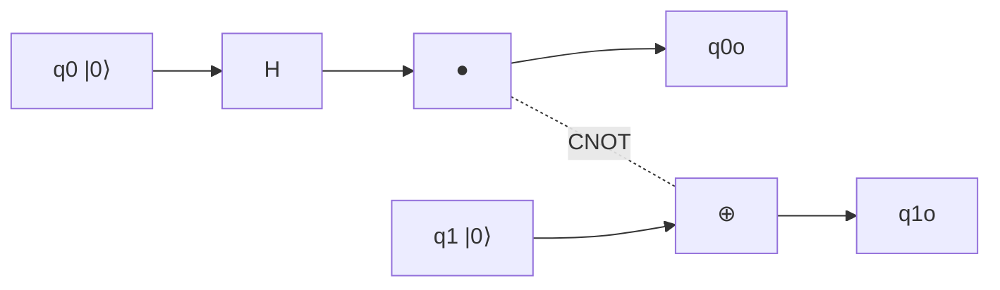

# 양자 게이트 (Quantum Gates)

## 한 줄 요약

양자 게이트는 큐빗 상태에 작용하는 **유니터리 연산**(unitary operation)으로, 행렬 곱으로 상태 벡터를 변환한다(math/[[vectors-and-matrices]]). 단일 큐빗 게이트(X, Y, Z, H, 위상)는 블로흐 구 위의 회전이고, 다중 큐빗 게이트(CNOT)는 얽힘을 만든다([[entanglement]]). 모든 게이트는 유니터리라서 **가역적**(reversible)이며, 게이트를 시간 순으로 배열한 것이 양자 회로(circuit) 모델이다.

## 왜 필요한가

- 큐빗 상태([[qubits-and-superposition]])를 실제로 조작하는 수단
- 유니터리 = 가역 = 양자 연산의 근본 제약 (측정만 예외)
- 회로 모델은 양자 알고리즘을 표현하는 표준 언어 → [[deutsch-jozsa]], [[grover-search]]
- CNOT + 단일 큐빗 게이트로 임의 연산 근사 (보편성)

## 유니터리 연산

게이트 U는 유니터리 행렬:

```
U†U = UU† = I     (U† = 켤레 전치)
```

- 길이 보존: 정규화(|α|²+|β|²=1) 유지 → 확률 총합 1 보존
- 가역: U⁻¹ = U† 항상 존재 → 입력을 항상 복원 가능
- 고전 논리 게이트(AND, OR)는 비가역(정보 손실)이라 큐빗에 직접 못 씀
- 측정만이 비유니터리·비가역 연산

## 단일 큐빗 게이트

| 게이트 | 행렬 | 효과 |
|---|---|---|
| **X** (NOT) | [[0,1],[1,0]] | `|0⟩`↔`|1⟩` 뒤집기, x축 π 회전 |
| **Y** | [[0,−i],[i,0]] | y축 π 회전 |
| **Z** | [[1,0],[0,−1]] | `|1⟩`에 위상 −1, z축 π 회전 |
| **H** (Hadamard) | (1/√2)[[1,1],[1,−1]] | 중첩 생성 `|0⟩`→`|+⟩` |
| **S** | [[1,0],[0,i]] | 위상 π/2 |
| **T** | [[1,0],[0,e^(iπ/4)]] | 위상 π/4 |

- X, Y, Z = 파울리(Pauli) 게이트, 블로흐 구의 세 축 π 회전
- H는 가장 중요 - 계산 기저를 중첩으로: `|0⟩`→(`|0⟩`+`|1⟩`)/√2
- T 게이트는 보편 집합에 필요한 "비클리퍼드" 성분, 오류 정정에서 비쌈 → [[quantum-error-correction]]

## 하다마드의 역할

```
H|0⟩ = |+⟩ = (|0⟩ + |1⟩)/√2
H|1⟩ = |−⟩ = (|0⟩ − |1⟩)/√2
H|+⟩ = |0⟩     (자기 역, H² = I)
```

- n개 큐빗에 H를 각각 걸면 `|00…0⟩` → 2ⁿ개 기저의 균등 중첩
- 이 "동시에 모든 입력"이 양자 병렬성의 시작점 → [[deutsch-jozsa]]

## 다중 큐빗 게이트: CNOT

제어 NOT(controlled-NOT), 제어 큐빗이 `|1⟩`일 때만 대상을 뒤집음:

| 입력 | 출력 |
|---|---|
| `|00⟩` | `|00⟩` |
| `|01⟩` | `|01⟩` |
| `|10⟩` | `|11⟩` |
| `|11⟩` | `|10⟩` |

```
CNOT = [[1,0,0,0],[0,1,0,0],[0,0,0,1],[0,0,1,0]]
```

- 제어 큐빗이 중첩이면 얽힘 생성: CNOT(`|+⟩|0⟩`) = (`|00⟩`+`|11⟩`)/√2 = 벨 상태 → [[entanglement]]
- Toffoli(CCNOT, 제어 2개)는 고전 가역 계산을 담을 수 있음

## 회로 모델

시간은 왼→오, 가로줄이 큐빗:



- 게이트 순서 = 행렬 곱 순서(오른쪽부터 적용). 회로 Uₙ…U₂U₁ 순
- 병렬 게이트는 텐서곱 ⊗ 로 결합
- 측정은 회로 끝에 배치, 이후는 고전 정보

## 보편성 (universality)

- **보편 게이트 집합**: 임의 유니터리를 원하는 정밀도로 근사
- 예: {H, T, CNOT} 또는 {CNOT + 모든 단일 큐빗 게이트}
- 고전의 {NAND}이 보편인 것과 대응 - 유한 집합으로 무한 연산 근사
- Solovay-Kitaev 정리: 근사에 필요한 게이트 수가 다항적으로만 늘어남

## 가역성과 고전 계산

- 모든 고전 함수 f는 가역 형태 (x,y)→(x, y⊕f(x)) 로 양자 회로에 담김
- 이 형태가 **오라클**(oracle) Uf → 양자 알고리즘의 입력 → [[deutsch-jozsa]]
- 비가역 삭제는 열을 발생(Landauer), 유니터리는 이론상 무손실

## 셀프 체크

> [!question]- 왜 모든 양자 게이트는 유니터리여야 하는가?
> 유니터리 U는 U†U = I를 만족해 벡터 길이를 보존하므로, 정규화 조건 |α|²+|β|²=1(확률 총합 1)을 유지한다. 또 U⁻¹ = U†가 항상 존재해 가역적이라 입력을 복원할 수 있다. 반면 AND/OR 같은 고전 게이트는 정보 손실이 있어 비가역이라 큐빗에 직접 못 쓴다. 측정만이 유일한 비유니터리·비가역 연산이다.

> [!question]- H 게이트가 양자 알고리즘에서 특별히 중요한 이유는?
> H는 계산 기저를 중첩으로 바꾼다: `|0⟩`→(`|0⟩`+`|1⟩`)/√2. n개 큐빗에 각각 H를 걸면 `|00…0⟩`이 2ⁿ개 기저의 균등 중첩이 되어, 모든 입력을 동시에 담는 양자 병렬성의 출발점이 된다. 또 H²=I로 자기 역이다.

> [!question]- CNOT은 어떻게 얽힘을 만드는가?
> CNOT은 제어 큐빗이 `|1⟩`일 때만 대상을 뒤집는다. 제어가 `|+⟩` 같은 중첩이면 CNOT(`|+⟩|0⟩`) = (`|00⟩`+`|11⟩`)/√2 벨 상태가 되어, 개별 큐빗 곱으로 분해 불가능한 얽힘이 생성된다. 단일 큐빗 게이트만으로는 얽힘을 만들 수 없다.

> [!question]- 보편 게이트 집합이란 무엇이고 왜 유한 집합으로 충분한가?
> 임의의 유니터리를 원하는 정밀도로 근사할 수 있는 게이트 집합으로, {H, T, CNOT}이 한 예다. 고전에서 NAND 하나가 보편인 것과 대응한다. Solovay-Kitaev 정리가 근사에 필요한 게이트 수가 다항적으로만 늘어남을 보장해, 유한 집합으로 무한한 연산을 효율적으로 근사할 수 있다.

## 연습문제

> [!example]- 문제: 상태 `|0⟩`에 H를 적용한 뒤 다시 H를 적용하면 무엇이 되는지 행렬로 계산하라.
> **풀이**
> H = (1/√2)[[1,1],[1,−1]], `|0⟩` = [1,0]ᵀ.
> H`|0⟩` = (1/√2)[1,1]ᵀ = `|+⟩`.
> 다시 H`|+⟩` = (1/√2)[[1,1],[1,−1]]·(1/√2)[1,1]ᵀ = (1/2)[1+1, 1−1]ᵀ = [1,0]ᵀ = `|0⟩`.
> 즉 H²=I이므로 원래 `|0⟩`로 돌아온다. H가 자기 역임을 행렬곱으로 확인.

> [!example]- 문제: Z 게이트를 `|+⟩`에 적용한 결과를 계산하고, 왜 X와 Z가 상보적인지 설명하라.
> **풀이**
> Z = [[1,0],[0,−1]], `|+⟩` = (1/√2)[1,1]ᵀ.
> Z`|+⟩` = (1/√2)[1,−1]ᵀ = (`|0⟩`−`|1⟩`)/√2 = `|−⟩`.
> Z는 계산 기저(`|0⟩`,`|1⟩`)에선 `|1⟩`에 위상만 주지만, X 기저(`|+⟩`,`|−⟩`)에선 `|+⟩`↔`|−⟩`를 뒤집는다. 반대로 X는 계산 기저를 뒤집고 X 기저는 그대로 둔다. 블로흐 구에서 각각 x축·z축 π 회전으로, 서로 다른 축이라 상보적이다.

## 파인만

> [!note]- 백지에 이 노트 핵심을 남에게 설명하듯 써보라. 막히면 그 부분만 다시.
> **점검 포인트**: (1) 유니터리 = 길이 보존 = 가역이 확률 보존·복원 가능성과 어떻게 연결되는지 설명할 수 있는가. (2) H로 중첩을, CNOT으로 얽힘을 만드는 과정을 행렬/기저 계산으로 보일 수 있는가. (3) 보편 게이트 집합과 Solovay-Kitaev의 의미를 말할 수 있는가.

## 연결

- 게이트가 작용하는 상태 → [[qubits-and-superposition]]
- 행렬·유니터리 배경 → math/[[vectors-and-matrices]], math/[[eigenvalues]]
- CNOT으로 만드는 얽힘 → [[entanglement]]
- 게이트로 구성한 알고리즘 → [[deutsch-jozsa]], [[grover-search]]
- 게이트 오류와 정정 → [[quantum-error-correction]]
- 비가역 삭제와 열(Landauer)의 정보량 → information-theory/[[entropy-and-information]]

## 궁금한 것 (나중에)

- [ ] Solovay-Kitaev 정리 증명 개요
- [ ] 클리퍼드 게이트와 Gottesman-Knill 정리 (고전 시뮬 가능)
- [ ] 왜 T 게이트가 오류 정정에서 비싼가 (마법 상태 증류)
- [ ] 임의 2큐빗 게이트 분해 (KAK 분해)

## 출처

- Nielsen & Chuang 1.3, 4장 (양자 회로, 보편 게이트)
- Qiskit textbook: Single & Multiple Qubit Gates
