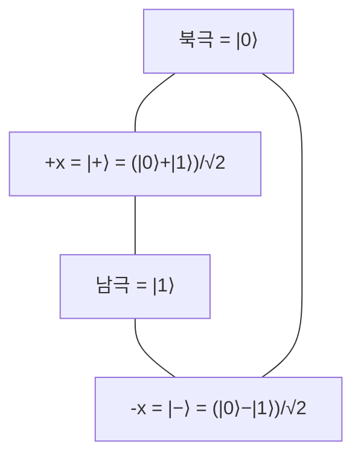

# 큐빗과 중첩 (Qubits and Superposition)

## 한 줄 요약

큐빗(qubit)은 양자 정보의 최소 단위로, 고전 비트가 0 또는 1인 것과 달리 `|0⟩`과 `|1⟩`의 **중첩**(superposition) 상태에 있을 수 있다. 상태는 복소 진폭 α, β를 가진 2차원 복소 벡터 `|ψ⟩ = α|0⟩ + β|1⟩`로 표현되며(math/[[vectors-and-matrices]]), 측정하면 확률 |α|², |β|²로 0 또는 1로 붕괴한다. 블로흐 구(Bloch sphere)로 기하학적으로 시각화한다.

## 왜 필요한가

- 양자 컴퓨팅의 모든 것이 여기서 출발 - 정보 표현의 기본 단위
- "중첩 = 여러 값을 동시에" 라는 병렬성의 근원 → [[deutsch-jozsa]]
- 측정과 붕괴가 왜 양자 알고리즘 설계를 어렵게 하는지의 뿌리
- 선형대수(벡터·복소수)로 상태를 다루는 감각 → math/[[vectors-and-matrices]]

## 고전 비트 vs 큐빗

| 구분 | 고전 비트 | 큐빗 |
|---|---|---|
| 상태 | 0 또는 1 | `α|0⟩ + β|1⟩` (중첩) |
| 표현 | 스칼라 | 2차원 복소 벡터 |
| 자유도 | 이산 2개 | 연속 (구 표면의 한 점) |
| 읽기 | 그대로 관측 | 측정 시 확률적 붕괴 |

기저 상태(computational basis)를 벡터로:

```
|0⟩ = [1, 0]ᵀ    |1⟩ = [0, 1]ᵀ
```

## 상태 벡터와 진폭

일반 큐빗 상태:

```
|ψ⟩ = α|0⟩ + β|1⟩ ,  α, β ∈ ℂ
```

- α, β는 **확률 진폭**(probability amplitude), 복소수
- **정규화 조건**: |α|² + |β|² = 1 (전체 확률 1)
- 진폭 자체는 관측 불가, 제곱한 크기만 확률로 드러남
- 복소수라서 **위상**(phase)을 가짐 → 간섭(interference)의 원천

## 측정과 붕괴

측정(measurement)은 되돌릴 수 없는 연산이다.

| 결과 | 확률 | 측정 후 상태 |
|---|---|---|
| 0 | |α|² | `|0⟩` |
| 1 | |β|² | `|1⟩` |

- 측정하면 중첩이 **붕괴**(collapse)해 하나의 기저 상태로 확정
- 한 번 측정하면 원래의 α, β 정보는 사라짐 - 여러 번 측정으로 복원 불가(복제 불가, no-cloning)
- 그래서 양자 알고리즘은 "정답의 진폭을 키우고 오답을 상쇄" 시킨 뒤 측정 → [[grover-search]]

## 전역 위상 vs 상대 위상

```
|ψ⟩ = cos(θ/2)|0⟩ + e^(iφ) sin(θ/2)|1⟩
```

- **전역 위상**(global phase) e^(iγ) 를 전체에 곱해도 측정 확률 불변 → 물리적으로 무의미
- **상대 위상**(relative phase) φ 는 의미 있음 → 간섭에서 결정적 역할
- 그래서 자유도는 복소수 2개(4실수)가 아니라 **θ, φ 두 실수** → 구 표면

## 블로흐 구 (Bloch sphere)

단일 큐빗 상태를 단위 구 위의 한 점으로:



- θ: 극각(polar), z축에서의 기울기 → |0⟩ vs |1⟩ 비율
- φ: 방위각(azimuth) → 상대 위상
- 게이트 연산 = 블로흐 구 위의 **회전** → [[quantum-gates]]
- 순수 상태(pure state)는 구 표면, 혼합 상태(mixed state)는 구 내부

## 중요한 중첩 상태들

| 상태 | 표현 | 의미 |
|---|---|---|
| `|+⟩` | (`|0⟩`+`|1⟩`)/√2 | X축 +, 하다마드로 생성 |
| `|−⟩` | (`|0⟩`−`|1⟩`)/√2 | X축 −, 상대 위상 π |
| `|i⟩` | (`|0⟩`+i`|1⟩`)/√2 | Y축 + |

`|+⟩`를 측정하면 0과 1이 각각 50%. 중첩은 "동시에 0이면서 1"이 아니라 "측정 전까지 확률 진폭으로만 존재"로 이해하는 게 정확하다.

## 연결

- 상태 벡터의 선형대수 기반 → math/[[vectors-and-matrices]]
- 측정 확률과 확률 개념 → math/[[probability-basics]]
- 상태에 작용하는 연산(회전) → [[quantum-gates]]
- 여러 큐빗의 얽힘 → [[entanglement]]
- 정보량 관점 → information-theory/[[entropy-and-information]]

## 궁금한 것 (나중에)

- [ ] 밀도 행렬(density matrix)과 혼합 상태 형식화
- [ ] no-cloning 정리의 증명
- [ ] 왜 복소 진폭인가 (실수만으론 안 되나)
- [ ] n큐빗이면 2ⁿ 차원 - 지수 폭발의 의미

## 출처

- Nielsen & Chuang 1-2장 (양자 비트, 상태 공간)
- Qiskit textbook: Representing Qubit States
