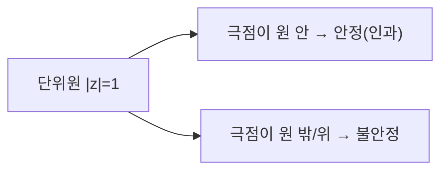

# 디지털 필터 (Digital Filters)

## 한 줄 요약

원하는 주파수 성분은 통과시키고 나머지는 감쇠시키는 LTI 시스템. 임펄스 응답이 유한하면 FIR, 피드백으로 무한하면 IIR. z-변환으로 시스템을 극점(pole)·영점(zero)으로 표현하고, 단위원 위에서 평가하면 주파수 응답이 나온다. 저역·고역·대역 통과를 설계해 신호를 정형한다.

## 왜 필요한가

- 잡음 제거, 대역 분리, 안티에일리어싱·복원([[sampling-and-aliasing]])의 실제 구현
- LTI 시스템([[signals-and-systems]])을 목적에 맞게 설계하는 공학
- 주파수 응답으로 필터를 직관적으로 이해·검증
- 오디오 이퀄라이저부터 통신 수신기까지 어디에나

## z-변환

이산 신호를 복소평면으로 확장한 변환 (DTFT의 일반화):
`X(z) = Σ_n x[n]·z^(−n)`

- `z = e^(jω)` (단위원)로 두면 DTFT와 일치
- 차분 방정식 ↔ 유리함수(rational) 시스템 함수:
```
H(z) = Y(z)/X(z) = (b₀ + b₁z⁻¹ + …) / (1 + a₁z⁻¹ + …)
```
- 분자 근 = 영점(zero, H=0), 분모 근 = 극점(pole, H=∞)
- **수렴 영역(ROC)**과 인과성·안정성이 얽힘

## FIR vs IIR

| 항목 | FIR (유한 임펄스 응답) | IIR (무한 임펄스 응답) |
|---|---|---|
| 피드백 | 없음(비재귀) | 있음(재귀) |
| 임펄스 응답 | 유한 길이 | 무한 지속 |
| 극점 | 원점에만 | 자유롭게 배치 |
| 안정성 | 항상 안정 | 극점 위치에 의존 |
| 위상 | 선형 위상 가능 | 일반적으로 비선형 |
| 차수(연산량) | 높음(탭 많음) | 낮음(효율적) |
| 설계 | 창함수, Parks-McClellan | 아날로그 프로토타입 변환 |

- **FIR**: `y[n] = Σ_k b_k·x[n−k]` (입력만)
- **IIR**: `y[n] = Σ_k b_k·x[n−k] − Σ_k a_k·y[n−k]` (출력 피드백 포함)
- 선형 위상(파형 왜곡 없음)이 중요하면 FIR, 연산 절약이 중요하면 IIR

## 극점·영점과 안정성

시스템 함수의 극점 위치가 거동을 결정:



- **인과 IIR 안정 조건**: 모든 극점이 단위원 **내부**(`|극점| < 1`)
- 영점은 안정성과 무관, 특정 주파수를 **깎는** 위치
- 극점을 단위원 근처에 두면 그 주파수에서 날카로운 피크(공진)
- FIR은 극점이 원점뿐 → 무조건 안정

## 주파수 응답

시스템 함수를 단위원에서 평가:
`H(ω) = H(z)|_{z=e^(jω)}`

- 크기 |H(ω)|: 주파수별 이득(gain) → 무엇을 통과/차단
- 위상 ∠H(ω): 주파수별 지연. 선형 위상 = 일정 군지연(파형 보존)
- 극점 가까운 ω에서 이득↑, 영점 가까운 ω에서 이득↓ (기하학적 직관)

## 필터 종류 (주파수 선택성)

| 유형 | 통과 대역 | 용도 |
|---|---|---|
| 저역통과(LPF) | 낮은 주파수 | 잡음·에일리어싱 방지, 평활화 |
| 고역통과(HPF) | 높은 주파수 | DC 제거, 엣지 강조 |
| 대역통과(BPF) | 특정 대역 | 채널 선택, 특정 톤 추출 |
| 대역저지(notch) | 특정 대역 제거 | 60 Hz 전원 잡음 제거 |
| 전역통과(allpass) | 전부(위상만) | 위상 보정, 지연 |

## 필터 설계 개요

**FIR 설계**
- 창함수법(window): 이상적 sinc를 창(해닝 등)으로 잘라냄 → 간단
- 최적법(Parks-McClellan): 등리플(equiripple), 규격 최소 차수
- 주파수 표본화법

**IIR 설계**
- 아날로그 프로토타입(Butterworth 평탄, Chebyshev 급경사, Elliptic 최소차수)을 이산화
- 쌍선형 변환(bilinear) 또는 임펄스 불변법으로 s → z 사상

| 규격 파라미터 | 의미 |
|---|---|
| 통과대역 리플 | 통과 대역 내 허용 변동 |
| 저지대역 감쇠 | 차단 대역 억제량(dB) |
| 천이대역 폭 | 통과↔저지 사이 경사 급함 |

- 규격이 빡셀수록(경사 급, 감쇠 큼) 차수↑ → 연산량·지연↑

## 구현과 실전

- **직접형/캐스케이드/병렬** 구조. IIR은 유한 워드길이에서 반올림 오차·불안정 위험 → 2차 섹션(SOS) 캐스케이드로 완화
- **고속 합성곱**: 긴 FIR은 FFT 기반 overlap-add로 O(N log N) → [[fft]]
- 오디오 EQ, 통신 정합필터, 심전도 잡음 제거 등

## 셀프 체크

> [!question]- 인과 IIR 필터가 안정할 조건은 무엇이며, 영점은 안정성에 어떤 영향을 주는가?
> 시스템 함수 H(z)의 모든 극점이 단위원 내부(|극점| < 1)에 있어야 안정하다. 영점은 안정성과 무관하며, 특정 주파수를 감쇠(깎는)시키는 역할만 한다. 극점은 이득을 키우고 영점은 이득을 낮춘다.

> [!question]- FIR과 IIR의 핵심 차이 세 가지를 말해보라.
> FIR은 피드백이 없어(비재귀) 임펄스 응답이 유한하고 항상 안정하며 선형 위상이 가능하지만 차수가 높아 연산량이 많다. IIR은 출력 피드백(재귀)이 있어 임펄스 응답이 무한하고 극점 위치에 따라 불안정할 수 있으나 낮은 차수로 효율적이다.

> [!question]- 주파수 응답 H(ω)는 시스템 함수 H(z)로부터 어떻게 얻는가?
> 단위원 위에서 z = e^(jω)로 평가한다. 즉 H(ω) = H(z)|_{z=e^(jω)}. 크기 |H(ω)|는 주파수별 이득, 위상 ∠H(ω)는 주파수별 지연을 나타낸다.

> [!question]- 60 Hz 전원 잡음만 제거하려면 어떤 필터를 쓰는가?
> 특정 대역만 제거하는 대역저지(notch) 필터를 쓴다. 60 Hz에 영점을, 그 근처 단위원 안쪽에 극점을 배치해 좁고 깊은 골을 만든다.

## 연습문제

> [!example]- 문제: 1차 IIR 필터 `y[n] = x[n] + 0.5·y[n−1]`의 시스템 함수 H(z), 극점, 안정성을 구하라.
> **풀이**
> 양변에 z-변환을 적용: `Y(z) = X(z) + 0.5·z⁻¹·Y(z)`.
> `Y(z)(1 − 0.5z⁻¹) = X(z)` → `H(z) = 1 / (1 − 0.5z⁻¹) = z / (z − 0.5)`.
> 분모의 근 = 극점: z = 0.5. 영점: z = 0(원점).
> |0.5| < 1 이므로 극점이 단위원 내부 → 인과 시스템으로서 **안정**.

> [!example]- 문제: 시스템 함수가 `H(z) = 1 − z⁻¹`인 FIR 필터의 영점과 대략적 주파수 응답 성격(저역/고역 통과)을 판정하라.
> **풀이**
> `H(z) = (z − 1)/z` → 영점 z = 1 = e^(j0), 극점 z = 0.
> 영점이 ω = 0(DC)에 있으므로 DC를 완전히 죽인다. |H(ω)| = |1 − e^(−jω)| = 2|sin(ω/2)|.
> ω=0에서 0, ω=π에서 2로 커짐 → **고역통과(HPF)** 성격. DC(평균) 제거 필터.

> [!example]- 문제: 표본화율 fs = 1000 Hz에서 200 Hz 성분을 통과시키는 저역통과 FIR을 창함수법으로 설계할 때, 이상적 임펄스 응답의 형태와 창이 필요한 이유를 서술하라.
> **풀이**
> 정규화 차단 주파수 ω_c = 2π·(200/1000) = 0.4π.
> 이상적 LPF의 임펄스 응답은 sinc: `h[n] = (ω_c/π)·sinc(ω_c·n/π) = sin(ω_c·n)/(π·n)`.
> 이 sinc는 무한 길이·비인과 → 유한 길이로 잘라야 하는데, 그냥 자르면(사각창) 부엽 때문에 통과대역 리플·저지대역 누설이 커진다.
> 해닝 등 창을 곱해 경계를 부드럽게 만들면 부엽이 억제되어 규격을 만족하는 유한 FIR을 얻는다.

## 파인만

> [!note]- 백지에 이 노트 핵심을 남에게 설명하듯 써보라. 막히면 그 부분만 다시.
> **점검 포인트**: (1) z-변환에서 극점·영점이 무엇이고 어떻게 주파수 응답으로 이어지는가, (2) FIR·IIR의 구조적 차이와 각각의 안정성·위상 특성, (3) 극점을 단위원 내부에 둬야 안정하다는 조건을 스스로 유도·설명할 수 있는가.

## 연결

- 필터는 LTI 시스템 → [[signals-and-systems]]
- 주파수 응답 = 주파수 영역 해석 → [[fourier-transform]]
- 안티에일리어싱·복원 필터 → [[sampling-and-aliasing]]
- FFT 기반 고속 필터링 → [[fft]]
- 필터로 잡음 스펙트럼 정형 → [[spectral-analysis]]
- 극점=고유값 직관 → math/[[eigenvalues]]
- 학습되는 합성곱 커널 = FIR 필터 → ai-ml/[[cnn-rnn-overview]]

## 궁금한 것 (나중에)

- [ ] 쌍선형 변환의 주파수 왜곡(warping) 보정
- [ ] 적응 필터(LMS, RLS)
- [ ] 다중률(multirate)·폴리페이즈 필터뱅크
- [ ] 유한 워드길이 효과 정량 분석

## 출처

- Oppenheim, Discrete-Time Signal Processing 5-7장
- Proakis & Manolakis, Digital Signal Processing
