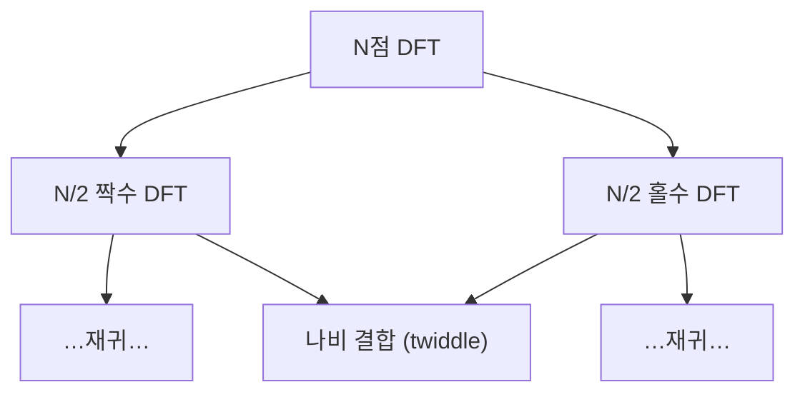

# 고속 푸리에 변환 (FFT)

## 한 줄 요약

DFT를 직접 계산하면 O(N²)이지만, Cooley-Tukey 알고리즘은 분할정복으로 O(N log N)에 계산한다. N개 점을 짝수/홀수 인덱스로 반씩 쪼개 재귀하고, 트위들 인자(twiddle factor)로 합치는 것이 핵심. 이 속도 향상 하나가 디지털 신호처리를 실용적으로 만든 결정적 도구다.

## 왜 필요한가

- DFT 나이브 계산 O(N²): N=10⁶이면 10¹² 연산 → 비현실적
- FFT O(N log N): 같은 N에 ~2×10⁷ 연산 → 5만 배 빠름
- 실시간 오디오·통신·이미지가 FFT 없이는 불가능했음
- 분할정복(divide and conquer)의 대표 성공 사례 → algorithms/[[divide-and-conquer]]

## DFT 복습과 병목

`X[k] = Σ_{n=0}^{N−1} x[n]·W_N^{nk}`, 여기서 `W_N = e^(−j·2π/N)` (트위들 인자)

- 각 X[k]마다 N번 곱셈, k가 N개 → 총 **N² 복소 곱셈**
- W_N의 주기성·대칭성(`W_N^{k+N/2} = −W_N^k`)을 안 씀 → 낭비. FFT는 이걸 활용

## Cooley-Tukey: 짝/홀 분할

N점 DFT를 짝수 인덱스와 홀수 인덱스로 분리:

```
X[k] = Σ_{짝수 n} x[n]·W_N^{nk} + Σ_{홀수 n} x[n]·W_N^{nk}
     = E[k] + W_N^k · O[k]
```

- E[k]: 짝수 표본의 N/2점 DFT
- O[k]: 홀수 표본의 N/2점 DFT
- 대칭성으로 상·하반부를 한 번에:
```
X[k]        = E[k] + W_N^k·O[k]
X[k + N/2]  = E[k] − W_N^k·O[k]
```

두 N/2 DFT를 계산해 O(N)번의 결합만 하면 됨 → 재귀.



## 복잡도 분석

점화식: `T(N) = 2·T(N/2) + O(N)`

- 마스터 정리(master theorem) → `T(N) = O(N log N)`
- 재귀 깊이 log₂N, 각 층에서 O(N) 결합
- algorithms/[[asymptotic-analysis]]의 병합정렬과 동일한 구조

| N | DFT O(N²) | FFT O(N log N) | 배율 |
|---|---|---|---|
| 1,024 | ~10⁶ | ~10⁴ | ~100× |
| 1,048,576 | ~10¹² | ~2×10⁷ | ~50,000× |

## 나비 연산과 비트 반전

- **나비(butterfly)**: `(a, b) → (a + W·b, a − W·b)`. FFT의 기본 연산 단위
- **비트 반전(bit-reversal)**: 짝/홀 재귀로 입력 순서가 인덱스 이진수를 뒤집은 순서로 재배열됨. in-place 구현 시 먼저 비트 반전 정렬
- 예: N=8에서 인덱스 1(001) ↔ 4(100), 3(011) ↔ 6(110)

## 변형과 실전 사항

| 이슈 | 내용 |
|---|---|
| N이 2의 거듭제곱 아님 | 혼합기수(mixed-radix), Bluestein(chirp-z), 또는 영 채움 |
| 실수 입력 | 켤레 대칭 이용 → 절반 계산(rfft) |
| 라딕스-4/분할기수 | 곱셈 수 더 줄임 |
| 라이브러리 | FFTW, numpy.fft, cuFFT (GPU) |

- **주의**: 영 채움은 계산용 크기 맞춤·해상도 표시용이지 정보를 추가하진 않음

## 실전 활용

- **고속 합성곱**: `y = IFFT(FFT(x)·FFT(h))` → O(N log N) 필터링. 긴 신호는 overlap-add/overlap-save → [[digital-filters]]
- **스펙트럼 분석**: 오디오 스펙트로그램, STFT의 프레임마다 FFT → [[spectral-analysis]]
- **대수 응용**: 큰 정수·다항식 곱셈을 O(N log N)으로 → algorithms/[[divide-and-conquer]]
- **통신**: OFDM(LTE/5G/WiFi)이 IFFT/FFT로 부반송파 변복조
- **압축**: JPEG(DCT), MP3 등 변환 부호화

## 셀프 체크

> [!question]- Cooley-Tukey FFT가 O(N²)을 O(N log N)으로 줄이는 핵심 아이디어는 무엇인가?
> N점 DFT를 짝수 인덱스와 홀수 인덱스 표본의 N/2점 DFT 두 개로 분할하고, 트위들 인자로 결합하는 분할정복이다. 결합은 O(N)이고 재귀 깊이가 log₂N이므로 전체가 O(N log N)이 된다.

> [!question]- 트위들 인자 W_N의 어떤 성질이 계산량 절감을 가능하게 하는가?
> 주기성과 대칭성, 특히 `W_N^(k+N/2) = −W_N^k`이다. 이 대칭성 덕에 X[k]와 X[k+N/2]를 E[k], O[k]로부터 한 번에(부호만 바꿔) 계산할 수 있어 중복을 없앤다.

> [!question]- 비트 반전(bit-reversal)은 왜 필요한가?
> 짝/홀 인덱스로 반복 분할하면 입력이 인덱스 이진수를 뒤집은 순서로 재배열된다. in-place FFT를 하려면 먼저 이 비트 반전 순서로 입력을 정렬해 놓아야 나비 연산이 제자리에서 맞아떨어진다.

> [!question]- 영 채움(zero-padding)은 주파수 해상도를 실제로 높이는가?
> 아니다. 영 채움은 FFT 크기를 2의 거듭제곱으로 맞추거나 스펙트럼을 촘촘히 보간해 표시할 뿐 새 정보를 더하지 않는다. 진짜 해상도는 관측 길이 N을 늘려야 올라간다.

## 연습문제

> [!example]- 문제: N=4, 입력 x = [1, 2, 3, 4]의 DFT X[k]를 직접 정의로 계산하라. (`W_4 = e^(−j·2π/4) = −j`)
> **풀이**
> `X[k] = Σ_{n=0}^{3} x[n]·(−j)^(nk)`.
> X[0] = 1+2+3+4 = **10**.
> X[1] = 1 + 2(−j) + 3(−j)² + 4(−j)³ = 1 − 2j − 3 + 4j = **−2 + 2j**.
> X[2] = 1 + 2(−1) + 3(1) + 4(−1) = 1 − 2 + 3 − 4 = **−2**.
> X[3] = 1 + 2(j) + 3(−1) + 4(−j)... `(−j)³=j, (−j)⁶=(−j)²... ` 정리하면 1 + 2j − 3 − 4j = **−2 − 2j**.
> 검증: X[3] = conj(X[1]) (실수 입력의 켤레 대칭) → 일치.

> [!example]- 문제: 나비 연산으로 두 값 a=E[k], b=O[k]와 트위들 W를 결합하는 식을 쓰고, N=2 DFT를 나비 하나로 계산하라.
> **풀이**
> 나비: `(a, b) → (a + W·b, a − W·b)`.
> N=2에서 W_2 = e^(−j·2π/2)... k=0에 대해 W_2^0 = 1.
> 입력 x=[x0, x1]: E=x0, O=x1.
> X[0] = x0 + 1·x1 = x0 + x1, X[1] = x0 − 1·x1 = x0 − x1.
> 즉 2점 DFT는 합·차 나비 하나로 끝난다.

> [!example]- 문제: N = 1,048,576 (=2²⁰)일 때 나이브 DFT 대비 FFT의 대략적 연산 배율을 계산하라.
> **풀이**
> 나이브: N² = (2²⁰)² = 2⁴⁰ ≈ 1.1×10¹² 복소 곱셈.
> FFT: N·log₂N = 2²⁰·20 ≈ 2.1×10⁷.
> 배율 = 2⁴⁰ / (2²⁰·20) = 2²⁰/20 ≈ 1.05×10⁶/20 ≈ **5.2만 배**.
> N이 커질수록 배율(N/log₂N)이 계속 벌어진다.

## 파인만

> [!note]- 백지에 이 노트 핵심을 남에게 설명하듯 써보라. 막히면 그 부분만 다시.
> **점검 포인트**: (1) 짝/홀 분할과 `X[k] = E[k] + W_N^k·O[k]`, `X[k+N/2] = E[k] − W_N^k·O[k]` 결합식을 유도할 수 있는가, (2) 점화식 `T(N)=2T(N/2)+O(N)`에서 O(N log N)이 나오는 이유, (3) 나비 연산·비트 반전이 in-place 구현에서 하는 역할.

## 연결

- 계산 대상 DFT 정의 → [[fourier-transform]]
- 분할정복 패러다임 → algorithms/[[divide-and-conquer]]
- 점화식·마스터 정리 → algorithms/[[asymptotic-analysis]]
- 고속 합성곱으로 필터링 → [[digital-filters]]
- 프레임별 FFT → [[spectral-analysis]]

## 궁금한 것 (나중에)

- [ ] Bluestein 알고리즘(임의 N) 상세
- [ ] 분할기수(split-radix)가 왜 곱셈이 최소인가
- [ ] 수 이론 변환(NTT)과 FFT의 차이
- [ ] GPU에서 FFT 병렬화 전략

## 출처

- Cooley & Tukey (1965), "An Algorithm for the Machine Calculation of Complex Fourier Series"
- Oppenheim, Discrete-Time Signal Processing 9장
- CLRS 30장 (다항식과 FFT)
