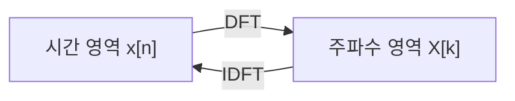

# 푸리에 변환 (Fourier Transform)

## 한 줄 요약

임의의 신호를 서로 다른 주파수의 정현파(sinusoid) 합으로 분해하는 도구. 주기 신호엔 푸리에 급수, 비주기 연속 신호엔 푸리에 변환, 이산 신호엔 DTFT, 유한 이산 신호엔 DFT를 쓴다. 시간 영역과 주파수 영역을 오가며, 합성곱을 곱셈으로 바꿔 LTI 시스템 해석을 극적으로 단순화한다.

## 왜 필요한가

- "이 신호에 어떤 주파수가 얼마나 들어있나"를 정량화 → 스펙트럼(spectrum)
- 합성곱(어려움) ↔ 곱셈(쉬움) 변환 → 필터 해석의 핵심
- 정현파는 LTI 시스템의 고유함수 → 주파수별 독립 처리
- 오디오·통신·이미지·압축 전부의 공통 언어

## 네 가지 변환 - 언제 무엇을

| 신호 유형 | 변환 | 주파수 축 |
|---|---|---|
| 연속·주기 | 푸리에 급수(FS) | 이산(고조파) |
| 연속·비주기 | 푸리에 변환(FT) | 연속 |
| 이산·비주기 | DTFT | 연속·주기(2π) |
| 이산·유한(N점) | DFT | 이산·유한(N점) |

- 규칙: **시간이 이산 → 주파수가 주기적**, **시간이 주기 → 주파수가 이산**
- 컴퓨터로 실제 계산하는 건 DFT뿐 (유한·이산) → 빠른 계산이 [[fft]]

## 푸리에 급수

주기 T인 신호를 고조파(harmonic) 정현파 합으로:
`x(t) = Σ_k c_k · e^(j·2π·k·t/T)`

계수: `c_k = (1/T) ∫_T x(t)·e^(−j·2π·k·t/T) dt`

- k=0은 DC(평균), |k|가 클수록 고주파
- 사각파 = 홀수 고조파의 합 (깁스 현상 → 불연속에서 오버슈트)

## 연속 푸리에 변환

비주기 신호로 확장 (T→∞ 극한):

```
분석:  X(ω) = ∫ x(t)·e^(−jωt) dt
합성:  x(t) = (1/2π) ∫ X(ω)·e^(jωt) dω
```

- X(ω)는 복소수: 크기 |X(ω)| = 진폭 스펙트럼, 위상 ∠X(ω) = 위상 스펙트럼

## DTFT와 DFT

**DTFT** (이산·비주기):
`X(ω) = Σ_n x[n]·e^(−jωn)` — ω에 대해 2π 주기, 연속

**DFT** (N점 유한, 실제 계산용):
```
X[k] = Σ_{n=0}^{N−1} x[n]·e^(−j·2πkn/N),   k = 0…N−1
x[n] = (1/N) Σ_{k=0}^{N−1} X[k]·e^(j·2πkn/N)
```

- DFT는 DTFT를 N개 점으로 표본화한 것
- k번째 빈(bin)의 주파수 = `k·fs/N` (Hz)
- 나이브 계산은 O(N²) → [[fft]]가 O(N log N)으로



## 주요 성질

| 성질 | 시간 영역 | 주파수 영역 |
|---|---|---|
| 선형성 | `a·x + b·y` | `a·X + b·Y` |
| 시간 이동 | `x[n−n₀]` | `X(ω)·e^(−jωn₀)` (위상만 변화) |
| 주파수 이동(변조) | `x[n]·e^(jω₀n)` | `X(ω−ω₀)` |
| **합성곱 정리** | `x ∗ h` | `X·H` (곱셈!) |
| 곱셈 | `x·h` | `X ∗ H / 2π` |
| 파스발 정리 | Σ|x[n]|² | (1/2π)∫|X(ω)|²dω (에너지 보존) |

- 합성곱 정리가 핵심: LTI 필터링을 곱셈으로 → [[digital-filters]]
- DFT의 합성곱은 **순환 합성곱(circular)** → 선형 합성곱 하려면 영 채움(zero-padding) 필요

## 쌍대성 (duality)

시간 ↔ 주파수는 대칭적. 한쪽 성질이 다른 쪽에서 뒤집힌 형태로 나타남:

| 시간 영역 | 주파수 영역 |
|---|---|
| 좁은 펄스(짧음) | 넓은 스펙트럼 |
| 넓은 펄스(김) | 좁은 스펙트럼 |
| 임펄스 δ(t) | 상수(모든 주파수 균등) |
| 사각 펄스 | sinc 함수 |
| 가우시안 | 가우시안(자기 자신) |

- 불확정성 원리: 시간과 주파수 국소성을 동시에 좁힐 수 없음 → 윈도잉([[spectral-analysis]])의 근본 제약

## 실전 유의점

- **스펙트럼 누설(leakage)**: 신호가 DFT 창 경계와 안 맞으면 에너지가 번짐 → 윈도우 함수로 완화 → [[spectral-analysis]]
- **주파수 해상도**: `Δf = fs/N`. N 키우면 해상도↑, 시간 국소성↓
- 실수 신호의 스펙트럼은 켤레 대칭 → 절반(N/2+1)만 유효

## 셀프 체크

> [!question]- 네 가지 변환(FS, FT, DTFT, DFT)은 무엇을 기준으로 나뉘는가?
> 시간이 연속/이산인지, 신호가 주기/비주기인지로 나뉜다. 규칙은 "시간이 이산이면 주파수가 주기적", "시간이 주기면 주파수가 이산"이다. 컴퓨터로 실제 계산하는 건 시간·주파수 모두 이산·유한인 DFT뿐이다.

> [!question]- 합성곱 정리가 왜 신호처리의 핵심인가?
> 시간 영역의 합성곱(x ∗ h)이 주파수 영역에서는 단순 곱셈(X·H)이 되기 때문이다. 이 덕분에 어려운 LTI 필터링을 곱셈으로 처리할 수 있고, FFT와 결합하면 고속 합성곱이 된다.

> [!question]- DFT k번째 빈의 실제 주파수(Hz)는 어떻게 구하는가?
> `k·fs/N`이다. fs는 표본화율, N은 DFT 길이. 따라서 주파수 해상도 Δf = fs/N이며, N을 키우면 해상도가 좋아지지만 시간 국소성은 나빠진다.

> [!question]- 시간-주파수 쌍대성의 예를 하나 들고 그 의미를 설명하라.
> 좁은 펄스 ↔ 넓은 스펙트럼(예: 임펄스 δ(t) ↔ 상수). 시간에서 국소적이면 주파수에서 퍼진다는 것으로, 시간과 주파수 국소성을 동시에 좁힐 수 없다는 불확정성 원리로 이어진다.

## 연습문제

> [!example]- 문제: 시간 이동 성질을 이용해 `x[n−3]`의 DTFT를 X(ω)로 표현하고, 크기 스펙트럼이 변하는지 판정하라.
> **풀이**
> 시간 이동 성질: `x[n−n₀] ↔ X(ω)·e^(−jωn₀)`. n₀=3 이므로 `x[n−3] ↔ X(ω)·e^(−j3ω)`.
> 곱해진 e^(−j3ω)는 크기가 1인 복소 지수 → |X(ω)·e^(−j3ω)| = |X(ω)|.
> 따라서 **크기 스펙트럼은 불변**, 위상에만 −3ω의 선형 항이 더해진다(선형 위상 = 순수 지연).

> [!example]- 문제: `x[n] = δ[n] + δ[n−1]`의 4점 DFT X[k]를 구하고 크기 |X[k]|를 계산하라.
> **풀이**
> `X[k] = Σ_{n} x[n]·e^(−j·2πkn/4) = 1 + e^(−j·2πk/4) = 1 + e^(−j·πk/2)`.
> X[0] = 1 + 1 = 2 → |X[0]| = 2.
> X[1] = 1 + e^(−jπ/2) = 1 − j → |X[1]| = √2.
> X[2] = 1 + e^(−jπ) = 1 − 1 = 0 → |X[2]| = 0.
> X[3] = 1 + e^(−j3π/2) = 1 + j → |X[3]| = √2.
> |X[2]|=0 은 두 임펄스가 ω=π에서 상쇄됨을 뜻한다.

> [!example]- 문제: 파스발 정리로 `x[n] = [1, −1, 2]`의 시간 영역 에너지를 구하고, 이것이 주파수 영역 에너지와 같음을 개념적으로 설명하라.
> **풀이**
> 시간 에너지 = Σ|x[n]|² = 1² + (−1)² + 2² = 1 + 1 + 4 = **6**.
> 파스발 정리(DFT판): `Σ_n |x[n]|² = (1/N)·Σ_k |X[k]|²`.
> 즉 시간 영역 총 에너지와 주파수 영역 총 에너지가 (1/N 정규화 하에) 보존된다. 변환은 기저를 바꿀 뿐 에너지를 만들거나 없애지 않는다.

## 파인만

> [!note]- 백지에 이 노트 핵심을 남에게 설명하듯 써보라. 막히면 그 부분만 다시.
> **점검 포인트**: (1) 네 변환의 분류 규칙(이산↔주기 대응)을 표 없이 재구성할 수 있는가, (2) 합성곱 정리 `x∗h ↔ X·H`가 왜 필터 해석을 단순화하는가, (3) 쌍대성·불확정성 원리로 시간-주파수 트레이드오프를 설명할 수 있는가.

## 연결

- 합성곱을 곱셈으로: 기반은 [[signals-and-systems]]
- DFT를 빠르게 → [[fft]]
- 스펙트럼 복제·표본화 → [[sampling-and-aliasing]]
- 주파수 응답으로 필터 해석 → [[digital-filters]]
- 실전 스펙트럼 추정·누설 → [[spectral-analysis]]
- 기저·직교 분해 → math/[[vectors-and-matrices]]
- 고유함수 개념 → math/[[eigenvalues]]
- QFT는 양자판 푸리에 변환 → quantum-computing/[[shor-algorithm]]

## 궁금한 것 (나중에)

- [ ] 라플라스 변환과 푸리에의 관계
- [ ] 깁스 현상 정량적 분석
- [ ] 순환 vs 선형 합성곱 영 채움 규칙
- [ ] 웨이블릿 변환은 무엇이 다른가

## 출처

- Oppenheim, Discrete-Time Signal Processing 3, 8장
- Bracewell, The Fourier Transform and Its Applications
