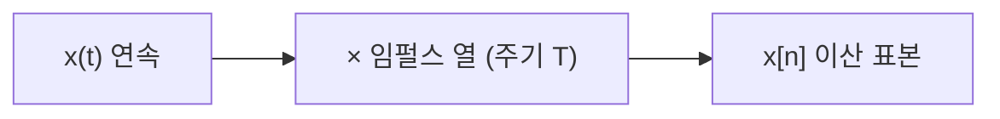
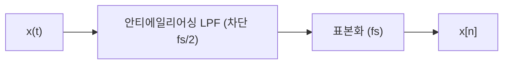

# 표본화와 에일리어싱 (Sampling and Aliasing)

## 한 줄 요약

연속 신호를 일정 간격으로 찍어 이산 신호로 바꾸는 것이 표본화(sampling). 나이퀴스트-섀넌 정리는 신호의 최고 주파수 2배보다 빠르게 표본화하면 원신호를 완벽히 복원할 수 있음을 보장한다. 이를 어기면 고주파가 저주파로 위장하는 에일리어싱(aliasing)이 발생하며, 이는 되돌릴 수 없다.

## 왜 필요한가

- 디지털 세계는 이산 신호만 다룸 → 아날로그→디지털의 필연적 관문
- "얼마나 자주 찍어야 정보를 안 잃나"의 정량적 답
- 에일리어싱은 오디오 왜곡·영상 모아레·측정 오류의 근본 원인
- 정보를 잃지 않는 표본화 = information-theory/[[source-coding-theorem]]의 연속판 직관

## 표본화의 정의

연속 신호 x(t)를 주기 T마다 찍음:
`x[n] = x(nT)`, 표본화 주파수 `fs = 1/T` (Hz)

- 수학적으로는 임펄스 열(impulse train)을 곱하는 것
- 시간 영역 곱셈 = 주파수 영역 합성곱 → 스펙트럼이 fs 간격으로 **복제(replica)**됨

## 나이퀴스트-섀넌 표본화 정리

신호가 대역제한(band-limited)되어 최고 주파수가 `f_max`라면:

> `fs > 2·f_max` 이면 x[n]으로부터 x(t)를 완벽히 복원 가능

| 용어 | 정의 |
|---|---|
| 나이퀴스트 주파수(Nyquist rate) | `2·f_max` (필요한 최소 표본화율) |
| 나이퀴스트 한계 | `fs/2` (표현 가능한 최고 주파수) |

- 예: 사람 청각 한계 ~20 kHz → CD 오디오 44.1 kHz (여유 포함 2배 초과)
- 복원 공식(sinc 보간):
  `x(t) = Σ_n x[n]·sinc((t−nT)/T)`

## 에일리어싱: 무슨 일이 벌어지나

fs가 부족하면(`fs < 2·f_max`) 스펙트럼 복제들이 겹침 → 고주파 성분이 저주파 위치로 접혀 들어옴(fold).

주파수 f인 성분은 다음 주파수들과 구별 불가능해짐:
`f_alias = |f − k·fs|` (k는 정수)

| 상황 | 결과 |
|---|---|
| `fs > 2·f_max` | 겹침 없음, 완벽 복원 |
| `fs = 2·f_max` | 경계(임계), 실전 위험 |
| `fs < 2·f_max` | 겹침 → 에일리어싱, 복원 불가 |

- **핵심**: 에일리어싱은 표본화 순간 정보가 섞여버리는 것. 사후 처리로 못 되돌림

## 실생활 에일리어싱

- **바퀴 착시(wagon-wheel)**: 영상 프레임율이 회전보다 느려 바퀴가 거꾸로 도는 듯 보임
- **모아레 무늬**: 이미지 센서 격자와 미세 패턴이 겹침
- **오디오 폴딩**: 20 kHz 초과 성분이 가청 대역으로 접혀 금속성 잡음

## 안티에일리어싱 필터

표본화 **전에** 저역통과 필터(low-pass filter, LPF)로 fs/2 초과 성분을 미리 제거:

- 표본화 후엔 이미 섞여 늦음 → 반드시 표본화 전 아날로그 단에서
- 이상적 벽돌담(brick-wall) 필터는 불가능 → 실전은 여유 대역(guard band) 두고 fs를 넉넉히

## 복원(reconstruction)

이산 → 연속 되돌리기. 이상적으로는 sinc 보간이지만 sinc는 무한 길이라 비현실적.

| 방법 | 특징 |
|---|---|
| 영차 유지(ZOH) | 계단식, DAC 기본. 계단 왜곡 |
| sinc 보간 | 이상적, 구현 불가(비인과·무한) |
| 복원 LPF | ZOH 후 저역통과로 계단 매끄럽게 |

- 실제 DAC: ZOH + 복원 필터 조합

## 오버샘플링

fs를 나이퀴스트보다 훨씬 크게(예: 4×, 8×) 잡는 기법.

- 안티에일리어싱·복원 필터 요구를 완화(여유 대역 넓어짐)
- 양자화 잡음을 넓은 대역에 퍼뜨려 가청 대역 SNR 개선
- ADC/DAC(델타-시그마)에서 표준적으로 사용

## 셀프 체크

> [!question]- 나이퀴스트-섀넌 표본화 정리를 한 문장으로 진술하라.
> 신호가 대역제한되어 최고 주파수가 f_max일 때, 표본화율 fs > 2·f_max이면 이산 표본 x[n]으로부터 원 연속 신호 x(t)를 완벽히 복원할 수 있다.

> [!question]- 에일리어싱이 왜 사후 처리로 되돌릴 수 없는가?
> 표본화 순간 fs/2를 넘는 고주파 성분이 저주파 위치로 접혀 들어와(fold) 원래 저주파 성분과 스펙트럼상에서 섞여버리기 때문이다. 이미 합쳐진 값에서 각 기여분을 분리할 정보가 없어 복원이 불가능하다.

> [!question]- 안티에일리어싱 필터는 표본화 전에 놓는가 후에 놓는가, 그리고 그 이유는?
> 반드시 표본화 전 아날로그 단에 저역통과 필터로 놓는다. 표본화 후에는 이미 에일리어싱으로 성분이 섞여 늦었기 때문에, fs/2 초과 성분을 미리 제거해야 한다.

> [!question]- 이상적 복원(sinc 보간)이 실제로 쓰이지 못하는 이유는?
> sinc 함수는 무한 길이이며 비인과적이라 실시간·유한 구현이 불가능하다. 실제 DAC는 영차 유지(ZOH)로 계단 신호를 만든 뒤 복원 LPF로 매끄럽게 만드는 방식을 쓴다.

## 연습문제

> [!example]- 문제: 최고 주파수 3.4 kHz인 전화 음성을 8 kHz로 표본화한다. 정리를 만족하는지 판정하고 나이퀴스트 한계를 구하라.
> **풀이**
> 나이퀴스트 율 = 2·f_max = 2·3.4 = 6.8 kHz. 표본화율 fs = 8 kHz > 6.8 kHz → **정리 만족**(복원 가능).
> 나이퀴스트 한계 = fs/2 = 4 kHz. 즉 4 kHz까지 에일리어싱 없이 표현 가능하며, 3.4~4 kHz는 여유 대역(guard band)이 된다.

> [!example]- 문제: fs = 1000 Hz로 표본화할 때 f = 1300 Hz 사인파는 몇 Hz로 위장(alias)되는가?
> **풀이**
> `f_alias = |f − k·fs|`에서 저주파(0~fs/2=500 Hz)로 접히는 k를 찾는다.
> k=1: |1300 − 1000| = 300 Hz. 이 값이 0~500 범위 안 → **300 Hz로 위장**.
> 즉 1300 Hz 성분이 300 Hz 성분과 구별 불가능해진다.

> [!example]- 문제: f = 600 Hz 성분을 에일리어싱 없이 표본화하려면 fs를 얼마 이상으로 잡아야 하며, 여유 대역을 고려해 4× 오버샘플링하면 fs는 얼마인가?
> **풀이**
> 최소 조건: fs > 2·600 = 1200 Hz.
> 임계(1200 Hz)는 실전 위험 → 여유가 필요.
> 4× 오버샘플링: 나이퀴스트 율 1200 Hz의 4배 = **4800 Hz**.
> fs를 넉넉히 잡으면 안티에일리어싱 LPF의 천이대역을 완만하게 설계할 수 있어 필터 요구가 완화된다.

## 파인만

> [!note]- 백지에 이 노트 핵심을 남에게 설명하듯 써보라. 막히면 그 부분만 다시.
> **점검 포인트**: (1) 표본화 = 임펄스 열 곱셈 → 주파수 영역 스펙트럼 복제라는 연결, (2) fs < 2·f_max에서 복제가 겹쳐 에일리어싱이 생기는 과정, (3) `f_alias = |f − k·fs|` 접힘 공식을 예시로 계산할 수 있는가.

## 연결

- 이산 신호가 LTI 시스템에 들어감 → [[signals-and-systems]]
- 스펙트럼 복제·합성곱 정리 → [[fourier-transform]]
- 안티에일리어싱·복원 필터 설계 → [[digital-filters]]
- 정보 손실 없는 표현 → information-theory/[[source-coding-theorem]]
- 양자화와 정보량 → information-theory/[[entropy-and-information]]

## 궁금한 것 (나중에)

- [ ] 대역통과 표본화(bandpass sampling)로 fs 줄이기
- [ ] 델타-시그마 변조 상세
- [ ] 비균일 표본화(non-uniform sampling)
- [ ] 압축 센싱(compressed sensing)은 나이퀴스트를 어떻게 우회하나

## 출처

- Oppenheim, Discrete-Time Signal Processing 4장
- Shannon, "Communication in the Presence of Noise" (1949)
