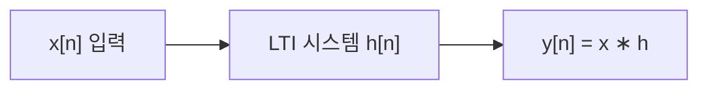

# 신호와 시스템 (Signals and Systems)

## 한 줄 요약

신호(signal)는 시간·공간에 따라 변하는 정보를 담은 함수, 시스템(system)은 신호를 입력받아 다른 신호로 변환하는 사상(mapping)이다. 이 중 선형 시불변(LTI) 시스템은 임펄스 응답 하나로 완전히 특징지어지고, 임의 입력의 출력은 합성곱(convolution)으로 계산된다. 신호처리 전체의 출발점.

## 왜 필요한가

- 오디오·영상·통신·센서 데이터를 다루는 수학적 언어
- LTI 가정 하나로 복잡한 시스템을 임펄스 응답 하나로 환원
- 이후 주파수 해석([[fourier-transform]]), 필터([[digital-filters]]) 전부 이 틀 위에 세워짐

## 신호의 분류

| 축 | 종류 | 예 |
|---|---|---|
| 시간 | 연속(continuous) x(t) / 이산(discrete) x[n] | 아날로그 음성 / 샘플링된 오디오 |
| 값 | 아날로그 / 디지털(양자화) | 전압 / 8비트 PCM |
| 주기성 | 주기(periodic) / 비주기 | 사인파 / 잡음 |
| 대칭 | 우(even) / 기(odd) | cos / sin |
| 에너지 | 에너지 신호 / 전력 신호 | 펄스 / 지속 사인파 |

- 이산 신호는 연속 신호의 표본화([[sampling-and-aliasing]])로 얻음
- 표기: 연속 `x(t)`, 이산 `x[n]` (n은 정수 인덱스)

## 기본 신호

| 신호 | 이산 정의 | 역할 |
|---|---|---|
| 단위 임펄스 δ[n] | n=0에서 1, 나머지 0 | 시스템 분석의 기저 |
| 단위 계단 u[n] | n≥0에서 1 | 켜짐/꺼짐 |
| 지수 신호 | `a^n` 또는 `e^(jωn)` | LTI의 고유함수(eigenfunction) |

핵심: 임의 신호는 이동된 임펄스의 합으로 분해됨.
`x[n] = Σ_k x[k]·δ[n−k]`

## 시스템의 성질

| 성질 | 정의 | 의미 |
|---|---|---|
| 선형성(linearity) | 중첩(superposition) 성립: `a·x₁+b·x₂ → a·y₁+b·y₂` | 입력 분해 → 출력 합산 |
| 시불변성(time-invariance) | 입력 지연 = 출력 동일 지연 | 시간에 따라 규칙 안 바뀜 |
| 인과성(causality) | 출력이 현재·과거 입력에만 의존 | 실시간 구현 가능 |
| 안정성(stability, BIBO) | 유계 입력 → 유계 출력 | 발산 안 함 |
| 메모리 | 과거 값 저장 여부 | 적분기 vs 순수 증폭기 |

- **LTI** = 선형 + 시불변. 이 둘이 붙으면 임펄스 응답 h[n] 하나로 완결

## 임펄스 응답과 합성곱

시스템에 δ[n]을 넣었을 때 나오는 출력이 임펄스 응답 `h[n]`.

LTI라면 입력을 임펄스 합으로 분해 → 각 임펄스가 h를 (이동·스케일해서) 낳음 → 전부 합산:

```
y[n] = Σ_k x[k]·h[n−k] = (x ∗ h)[n]
```

이것이 합성곱(convolution). 연속판:
`y(t) = ∫ x(τ)·h(t−τ) dτ`



## 합성곱의 성질

| 성질 | 식 |
|---|---|
| 교환 | `x ∗ h = h ∗ x` |
| 결합 | `(x ∗ h₁) ∗ h₂ = x ∗ (h₁ ∗ h₂)` |
| 분배 | `x ∗ (h₁ + h₂) = x∗h₁ + x∗h₂` |

- 결합성 → 시스템 직렬 연결 = 임펄스 응답 합성곱
- 분배성 → 병렬 연결 = 임펄스 응답 덧셈
- 주파수 영역에선 합성곱이 **곱셈**으로 바뀜 (합성곱 정리 → [[fourier-transform]])

## 인과성·안정성 판정

- **인과성**: `h[n] = 0 (n < 0)` 이면 인과 시스템. 미래 입력 안 씀
- **BIBO 안정성**: 임펄스 응답이 절대 합산 가능(absolutely summable):
  `Σ_n |h[n]| < ∞`
- 예: `h[n] = a^n·u[n]` 은 |a|<1 이면 안정, |a|≥1 이면 불안정

## 왜 LTI가 중심인가

- 대부분의 물리 시스템이 근사적으로 LTI (선형 회로, 음향 공간 등)
- 지수 `e^(jωn)`가 LTI의 고유함수 → 주파수별로 독립 처리 가능
- 이 덕분에 시간 영역 합성곱 대신 주파수 영역 곱셈으로 해석 가능해짐

## 연결

- 이산 신호의 출처 → [[sampling-and-aliasing]]
- 합성곱 → 곱셈 변환, 주파수 해석 → [[fourier-transform]]
- LTI 시스템 설계 = 필터 → [[digital-filters]]
- 고속 합성곱 계산 → [[fft]]
- 선형성·벡터공간 기반 → math/[[vectors-and-matrices]]
- 고유함수 개념 → math/[[eigenvalues]]

## 궁금한 것 (나중에)

- [ ] 상관(correlation)과 합성곱의 차이
- [ ] 상태공간(state-space) 표현과 LTI의 관계
- [ ] 비선형·시변 시스템은 어떻게 다루나
- [ ] 다차원 신호(이미지)로의 확장

## 출처

- Oppenheim, Signals and Systems 1-2장
- Oppenheim, Discrete-Time Signal Processing 2장
