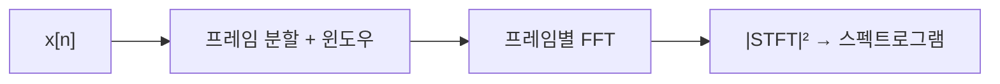

# 스펙트럼 분석 (Spectral Analysis)

## 한 줄 요약

실제 신호에서 "어떤 주파수가 얼마나, 언제" 들어있는지 추정하는 실전 기술. 유한 길이로 잘라 DFT를 쓰면 스펙트럼 누설(leakage)이 생기므로 윈도우(window) 함수로 완화하고, 시간에 따라 변하는 신호는 STFT로 잘라 스펙트로그램(spectrogram)을 만든다. 파워 스펙트럼으로 잡음 속 신호 세기를 정량화한다.

## 왜 필요한가

- 이론 DFT([[fourier-transform]])와 달리 실제 신호는 유한·잡음 포함·시변
- 누설·해상도·분산을 다뤄야 쓸모 있는 스펙트럼이 나옴
- 오디오(음정·포먼트), 통신(채널·간섭), 진동 진단, 뇌파 분석의 핵심 도구

## 스펙트럼 누설

무한 신호를 유한 창으로 자르는 것 = 사각창(rectangular window)을 곱하는 것.

- 시간 영역 곱셈 = 주파수 영역 합성곱 → 스펙트럼이 창의 스펙트럼(sinc)과 번짐
- 신호 주파수가 DFT 빈(bin) 중심과 안 맞으면 에너지가 이웃 빈으로 새어 나감(leakage)
- 사각창의 sinc 부엽(sidelobe)이 크고 느리게 감쇠 → 약한 성분이 강한 성분에 묻힘

## 윈도우 함수

경계에서 부드럽게 0으로 가는 창을 곱해 부엽을 억제:

| 창 | 주엽 폭 | 부엽 억제 | 특징 |
|---|---|---|---|
| 사각(rectangular) | 가장 좁음 | ~13 dB | 해상도 최고, 누설 최악 |
| 해닝(Hann) | 중간 | ~31 dB | 범용 기본값 |
| 해밍(Hamming) | 중간 | ~43 dB | 첫 부엽 억제 우수 |
| 블랙만(Blackman) | 넓음 | ~58 dB | 누설 최소, 해상도 희생 |
| 카이저(Kaiser) | 조절 가능 | β로 조절 | 유연한 트레이드오프 |

- **근본 트레이드오프**: 주엽 폭(해상도) ↔ 부엽 높이(누설). 동시에 좋게 못 함 (불확정성 원리)
- 가까운 두 톤 구별 → 좁은 주엽(사각·해닝), 약한 톤 검출 → 낮은 부엽(블랙만)

## 주파수 해상도

- 해상도 `Δf = fs/N` (관측 길이가 길수록 미세 구별)
- **영 채움(zero-padding)**은 빈 간격을 촘촘히 보간할 뿐 진짜 해상도는 안 올림
- 진짜 해상도는 오직 더 긴 관측(N↑)으로만
- 여기서 시간-주파수 트레이드오프: 길게 볼수록 주파수는 정밀, 시간 국소성은 상실

## STFT와 스펙트로그램

시변 신호(음성, 음악)는 전체 DFT가 무의미 → 짧은 창으로 옮겨가며 DFT:

```
STFT(m, k) = Σ_n x[n]·w[n − mR]·e^(−j·2πkn/N)
```
- w: 윈도우, R: 홉 크기(hop), m: 프레임 인덱스
- 프레임마다 [[fft]] → 시간축 × 주파수축 2D

**스펙트로그램** = |STFT|²을 색으로 표시 (가로 시간, 세로 주파수, 밝기 세기)



| 창 길이 | 시간 해상도 | 주파수 해상도 |
|---|---|---|
| 짧음 | 좋음(빠른 변화 포착) | 나쁨 |
| 긺 | 나쁨(뭉개짐) | 좋음(정밀 음정) |

- 겹침(overlap, 예 50~75%)으로 시간 연속성 확보

## 파워 스펙트럼 추정

랜덤·잡음 신호는 결정적 스펙트럼이 없음 → 파워 스펙트럼 밀도(PSD)를 **추정**.

| 방법 | 아이디어 | 특징 |
|---|---|---|
| 피리오도그램 | \|DFT\|²/N | 간단하나 분산 큼(들쭉날쭉) |
| Bartlett | 구간 나눠 평균 | 분산↓, 해상도↓ |
| **Welch** | 겹친 구간 + 윈도우 + 평균 | 실전 표준, 분산·해상도 균형 |
| 파라메트릭(AR) | 모델 적합 | 짧은 데이터에 유리 |

- 피리오도그램은 N을 키워도 분산이 안 줄어듦(불일치 추정량) → 평균화가 필수
- 통계적 관점 → math/[[random-variables]], math/[[statistics-basics]]

## 실전 응용

- **오디오**: 음정 검출, 포먼트 분석, 노이즈 게이트, 음악 시각화
- **통신**: 점유 대역·간섭 탐지, 반송파 주파수 오프셋 추정
- **진동/기계**: 베어링 결함 주파수로 고장 진단
- **생체신호**: EEG 대역별(알파·베타) 파워

## 연결

- 이론적 DFT·누설의 뿌리 → [[fourier-transform]]
- 프레임별 계산 엔진 → [[fft]]
- 표본화율 fs가 해상도·나이퀴스트 결정 → [[sampling-and-aliasing]]
- 잡음 정형·대역 분리 필터 → [[digital-filters]]
- 파워 추정의 통계 기반 → math/[[random-variables]], math/[[statistics-basics]]
- 정보량과 스펙트럼 → information-theory/[[entropy-and-information]]

## 궁금한 것 (나중에)

- [ ] 다중테이퍼(multitaper) 스펙트럼 추정
- [ ] 웨이블릿 vs STFT (가변 해상도)
- [ ] 켑스트럼(cepstrum)과 음성 분석
- [ ] MUSIC/ESPRIT 초해상 기법

## 출처

- Oppenheim, Discrete-Time Signal Processing 10장
- Harris (1978), "On the Use of Windows for Harmonic Analysis"
- Welch (1967), 파워 스펙트럼 추정
