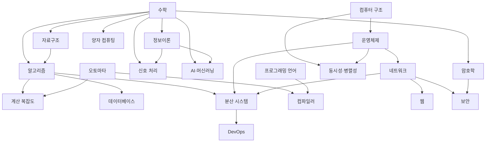

# 학습 가이드 (Study Guide)

이 저장소를 "읽고 끝"이 아니라 **실제로 습득**하기 위한 사용 설명서. 무엇을 어떤 순서로, 어떻게 공부하고, 어떻게 복습하는가.

## 공부법 - 3가지 원칙

증거 기반 학습법만 추림. 순서대로 돌린다.

1. **능동 회상 (active recall)**: 다시 읽지 말고 **덮고 떠올린다**. 각 노트 하단 `## 셀프 체크`의 질문을 먼저 스스로 답하고, 그 다음 접힌 답을 펼쳐 확인. 재읽기보다 기억 정착률이 훨씬 높다.
2. **간격 반복 (spaced repetition)**: 한 번에 몰아서가 아니라 **점점 긴 간격**으로 반복. 아래 Leitner 스케줄 참고.
3. **파인만 기법 (Feynman)**: 한 노트를 다 봤으면 **아무것도 안 보고 남에게 설명하듯** 백지에 재구성. 막히는 지점 = 아직 모르는 지점 → 그 부분만 다시.

> 규칙: 노트를 눈으로 훑는 건 "공부한 느낌"만 줄 뿐 습득이 아니다. 반드시 셀프 체크를 손/입으로 통과해야 한 노트를 "끝"으로 친다.

## 간격 반복 스케줄 (Leitner)

노트(또는 셀프 체크 카드)를 5개 박스로 관리. 맞히면 다음 박스로, 틀리면 1번 박스로.

| 박스 | 복습 주기 | 의미 |
|---|---|---|
| 1 | 매일 | 새로 배웠거나 틀린 것 |
| 2 | 2일 | 한 번 맞힘 |
| 3 | 4일 | 두 번 |
| 4 | 9일 | 익숙 |
| 5 | 3주 | 거의 장기기억 |

- 틀리면 무조건 박스 1로 강등 (냉정하게)
- 박스 5를 한 번 더 통과하면 "졸업"
- 노트 단위 간격 반복은 자동화돼 있음: `mark-studied.sh`로 기록하면 [학습 대시보드](dashboard.md)가 복습 예정일 계산 (아래 "진도 추적" 참고)

## 학습 순서 - 선수과목 지도

화살표 = "먼저 보면 좋음". 위에서 아래로.

## 추천 트랙

관심사별로 끊어서. 각 트랙 안은 왼쪽→오른쪽 순서.

| 트랙 | 순서 |
|---|---|
| **기초 필수** | 수학 → 자료구조 → 알고리즘 → 오토마타 |
| **시스템** | 컴퓨터 구조 → 운영체제 → 네트워크 → 분산 시스템 → DevOps |
| **언어·이론** | 오토마타 → 프로그래밍 언어 → 컴파일러 → 계산 복잡도 |
| **보안·암호** | 수학 → 암호학 → 보안 (+ 네트워크) |
| **데이터·웹** | 알고리즘 → 데이터베이스 → 네트워크 → 웹 |
| **AI·수리** | 수학 → 정보이론 → AI·머신러닝 |
| **석사급 심화** | 동시성·병렬성 · 정보이론 · 계산 복잡도 · 양자 컴퓨팅 · 신호 처리 |

- 완전 처음이면 **기초 필수**부터. 여기 없이 나머지는 사상누각.
- 각 과목 `index.md`가 그 과목의 세부 syllabus + 체크박스 진도표.

## 복습 도구

- **[진도 대시보드](dashboard)** - 전 과목 완료율을 한 페이지에서. 빌드 시 각 `index.md` 체크박스로 자동 집계 (완료율 낮은 과목이 위로).
- **Anki 덱 다운로드** - 각 노트의 셀프 체크·연습문제를 뽑아 만든 간격 반복 덱: [cs-notes.apkg](https://nini4746.github.io/cs/cs-notes.apkg). Anki 앱에서 열면 FSRS 스케줄러로 매일 복습. 빌드마다 갱신되며, 카드 id가 고정이라 다시 받아도 진도(복습 이력)는 유지된다.
- 두 도구 모두 사이트 빌드 때 자동 생성. 노트를 고치면 다음 배포에서 반영.

## 진도 추적

- 진실의 원천은 각 노트 frontmatter: `studied: YYYY-MM-DD` (첫 학습), `reviewed: [날짜, ...]` (복습 이력).
- 기록은 클릭 한 번: [비공개 사이트](https://notes.nini4746.uk)에서 노트를 공부한 뒤 우하단 **✅ 학습/복습 완료** 버튼. 첫 클릭이면 `studied`, 이후엔 `reviewed`에 오늘 날짜가 커밋되고 사이트가 자동 리빌드됨. (CLI 대안: `bash scripts/mark-studied.sh os/process`)
- 매일 자동 생성되는 4개 페이지 (새벽 크론 빌드로 갱신):
  - [오늘의 레슨](today.md) - 다음 미학습 노트 자동 지정 + 밀린 복습 + 완료 조건
  - [데일리 퀴즈](quiz.md) - 셀프체크 5문제 랜덤 출제 (학습 3 + 미학습 2)
  - [학습 경로](path.md) - 선수과목 60% 이상 학습해야 다음 유닛 해제 (듀오링고식)
  - [학습 대시보드](dashboard.md) - 복습 큐 (간격 1일 → 3일 → 7일 → 21일 → 60일) + XP/레벨/스트릭 + 과목별 학습률
- 홈 화면 배너에 스트릭/XP/밀린 복습이 박제됨. 학습 +10 XP, 복습 +5 XP, 100 XP당 레벨업.
- 과목 `index.md`의 체크박스는 표시용 - 빌드 시 `studied` 있는 노트만 자동 `[x]`. 손으로 체크하지 말 것.
- 한 노트를 "학습함"으로 치는 기준: 셀프 체크를 막힘 없이 통과 + 파인만으로 재설명 가능. 노트를 읽기만 한 건 학습이 아님.

## 한 주 루틴 예시

- **월~금**: 새 노트 1개 (능동 회상까지) + Leitner 박스 1~2 복습
- **토**: 그 주 노트들 파인만 재설명, 막힌 것 다시
- **일**: Leitner 상위 박스(3~5) 복습, 다음 주 트랙 확인
